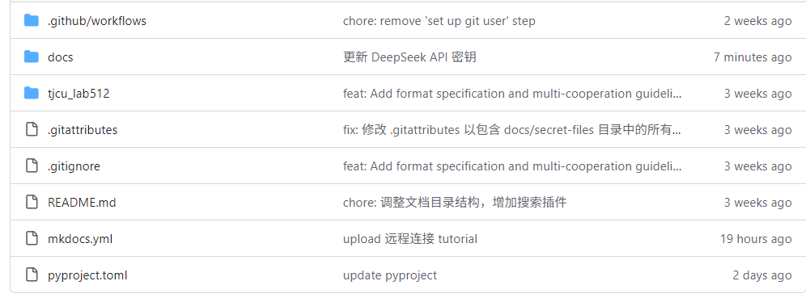
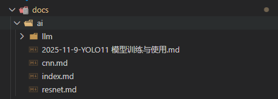
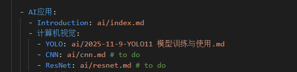

---lab
date: 2025-11-9
author: CCChiJi
category: 技术笔记
tags: 规范
---

## 网站文档（.md 文章）格式规范

为保证网站排版统一，所有文章需遵循以下格式：

### 1. 文章头部信息（必须包含，用于网站识别）

每篇 `.md` 文档的开头需要有以下内容 *（可直接复制修改对应内容即可）*，示例：


  
```text
---lab
date: 当前日期
author: 作者名称
category: 目录
tags: 标签
---
```

其中 `category` 和 `tasg` 为空时将不显示， `date` 为空时将取当前日期


### 2. 正文格式规范

### （1）标题层级


* 用 `#` 表示标题，层级从 `#`（一级标题，文章大标题）到 `######`（六级标题），示例：


```
# 一级标题（建议一篇文章只一个，与title一致）

## 二级标题（章节标题）

### 三级标题（子章节标题）
```

### （2）正文内容


* 段落：直接输入文字，段落间空一行分隔。

* 列表：


  * 无序列表：用 `-` 或 `*` 开头，如：


```
- 第一点

- 第二点

  - 子点（前面加2个空格）
```


* 有序列表：用 `数字.` 开头，如：


```
1. 步骤一

2. 步骤二
```


* 代码块：


  * 单行代码：用 单个` 包裹，如  
  `print("hello")`

  * 多行代码：用 ``` 包裹，并指定语言（自动高亮），如：


```python
#python
def add(a, b):

   return a + b
```


* 链接：格式 `[显示文本](链接地址)`，如 `[GitHub官网](``https://github.com/``)`。

* 图片：格式 ``，建议将图片放在仓库的 `source/images` 文件夹，路径写相对路径，如：


```

```


* 引用：用 `>` 开头，如：


```
> 重要提示：提交前请预览文章格式是否正确。
```

### 3. 文件名规范


* 文件名建议：`日期-标题关键词.md`（英文 / 数字 + 连字符），如：


  * 正确：`2025-11-09-linear-regression-tutorial.md`

  * 错误：`线性回归教程.md`（避免中文乱码）、`11.09教程.md`（日期格式不统一）


### 4. 文件存放位置和命名规范

* 在写作过程中可能有需要添加图片或者附件的情况，这些文件存放的位置详见 **基础指南 -> Markdown 语法 -> 九、项目优化：添加图片、附件与导航**

* 命名规范:
  * 图片: 在对应的目录中创建images文件夹，并将该文章所用到的所有图片都存放在其中
  * 附件: 在对应的目录中创建files文件夹，并将该文章所用到的所有附件都存放在其中

### 5. 简易写作方法

假如你之前是使用的Word或者别的东西写好了，你可以直接将文件交给AI，并让它修改为markdown格式的文件，之后你只需要在VScode中将**文章头部信息**加上并修改好即可。

如果你不想改的话可以直接创建一个空的markdown文件，内容只需要加上**文章头部信息**和标题，再将你的原文件（比如PDF）作为链接附上即可，添加附件详见 **基础指南 -> Markdown 语法 -> 九、项目优化：添加图片、附件与导航 -> 添加附件（如PDF）**


## 文档存放规范

### 文档目录结构

文档的目录结构参考如下：




> 更详细的说明

<style>
.directory-tree {
    font-family: 'Consolas', 'Monaco', 'Menlo', monospace;
    font-size: 14px;
    line-height: 1.5;
    padding: 15px;
    background: #f8f9fa;
    border-radius: 8px;
    border-left: 4px solid #4CAF50;
    margin: 20px 0;
}

.directory-tree ul {
    list-style-type: none;
    padding-left: 20px;
    margin: 0;
}

.directory-tree li {
    margin: 8px 0;
    position: relative;
}

.directory-tree li::before {
    content: "├── ";
    color: #6c757d;
    position: absolute;
    left: -20px;
}

.directory-tree li:last-child::before {
    content: "└── ";
}

.directory-tree .root {
    font-weight: bold;
    color: #2c3e50;
    margin-bottom: 10px;
}

.directory-tree .category {
    margin-top: 15px;
    padding: 8px 12px;
    border-radius: 4px;
    font-weight: bold;
}

.directory-tree .category-automation {
    background-color: #e8f5e9;
    border-left: 3px solid #4CAF50;
    color: #2e7d32;
}

.directory-tree .category-docs {
    background-color: #e3f2fd;
    border-left: 3px solid #2196F3;
    color: #1565c0;
}

.directory-tree .category-code {
    background-color: #fff3e0;
    border-left: 3px solid #FF9800;
    color: #e65100;
}

.directory-tree .category-config {
    background-color: #fce4ec;
    border-left: 3px solid #E91E63;
    color: #ad1457;
}

.directory-tree .category-secret {
    background-color: #fff8e1;
    border-left: 3px solid #FFC107;
    color: #ff8f00;
}

.directory-tree .category-main {
    background-color: #e8eaf6;
    border-left: 3px solid #3F51B5;
    color: #283593;
}

.directory-tree .item {
    padding: 4px 8px;
    border-radius: 3px;
    transition: background-color 0.2s;
}

.directory-tree .item:hover {
    background-color: rgba(0,0,0,0.05);
}

.directory-tree .comment {
    color: #6c757d;
    font-style: italic;
    margin-left: 10px;
}

.directory-tree .file-icon::before {
    content: "📄 ";
    margin-right: 4px;
}

.directory-tree .folder-icon::before {
    content: "📁 ";
    margin-right: 4px;
}

.directory-tree .key-icon::before {
    content: "🔑 ";
    margin-right: 4px;
}

.directory-tree .config-icon::before {
    content: "⚙️ ";
    margin-right: 4px;
}

.directory-tree .readme-icon::before {
    content: "📖 ";
    margin-right: 4px;
}
</style>

<div class="directory-tree">
    <div class="root">512Docs/</div>
    <ul>
        <li><span class="item folder-icon">.github/</span>
            <ul>
                <li><span class="item folder-icon">workflows/</span>
                    <span class="comment"># Github Actions 的工作流文件目录，用于自动化操作</span>
                </li>
            </ul>
        </li>
    </ul>
    
    <ul>
        <li><span class="item folder-icon">docs/</span>
            <span class="comment"># 存放所有文档文件的目录，包含类似如下的子目录 </span>
            <ul>
                <li><span class="item folder-icon">basic/</span>
                    <span class="comment"># 基础指南文档 </span>
                </li>
                <li><span class="item folder-icon">software/</span>
                    <span class="comment"># 软件文档 </span>
                </li>
                <li><span class="item folder-icon">hardware/</span>
                    <span class="comment"># 硬件文档 </span>
                </li>
                <li><span class="item folder-icon">secret-files/</span>
                    <span class="comment"># 敏感文件存放目录 </span>
                </li>                
                <li><span class="item folder-icon">.../</span>
                    <span class="comment"># 更多模块 </span>
                </li>                
            </ul>
        </li>
    </ul>
    
    <ul>
        <li><span class="item folder-icon">tjcu_lab512/</span>
            <span class="comment"># 文档的插件，使用 Python 编写</span>
        </li>
    </ul>
    
    <ul>
        <li><span class="item config-icon">.gitattributes</span>
            <span class="comment"># Git 属性文件，指定文件的处理方式，非进阶操作无需理会</span>
        </li>
        <li><span class="item config-icon">.gitignore</span>
            <span class="comment"># Git 忽略文件列表，指定不需要上传到 Github 的文件类型</span>
        </li>
        <li><span class="item config-icon">mkdocs.yml</span>
            <span class="comment"># MkDocs 的配置文件，定义网站的结构和设置</span>
        </li>
        <li><span class="item config-icon">pyproject.toml</span>
            <span class="comment"># Python 项目的配置文件，定义项目的元数据和依赖关系</span>
        </li>
    </ul>
    
    <ul>
        <li><span class="item key-icon">.labsecret</span>
            <span class="comment"># 在 Github 上不可见，用于本地项目解密的密钥文件，需要找 cgy 获取</span>
        </li>
    </ul>
    
    <ul>
        <li><span class="item readme-icon">README.md</span>
            <span class="comment"># 项目的说明文件，在 Github 仓库会直接显示</span>
        </li>
    </ul>
</div>


### 存放规范

你所编写的文档，放到对应的模块文件夹下即可。不要直接放在根目录 `docs/` 下。

比如你要写的 **Unity** 的安装配置，就放到 `docs/software/` 目录下，如果你希望在此模块下再继续分层，那可以再建一个`software/unity/`的子文件夹来存放。同时记得在 `mkdocs.yml` 中添加对应的导航目录，这样才能在网站上显示出来。

**以下是一个示例：**



> 然后在`mkdocs.yml`中添加对应的导航：




图片和附件也是一样的，放到对应模块的 `images/` 和 `files/` 文件夹下（如`docs/software/images/unity/unityGuide.png`等等）；

**不建议直接放在`docs/images/`中，这样不利于管理**

### 敏感文件存放

在配置了`git-crypt`的情况下，文档能够自动加密和解密敏感文件；

详细阅读 [敏感文件处理](secret-note.md)，在没有确保 `git-crypt` 初始化和正常工作的情况下，不要随意添加敏感文件到文档目录，叫其他懂的人帮你处理！
