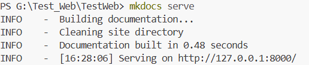
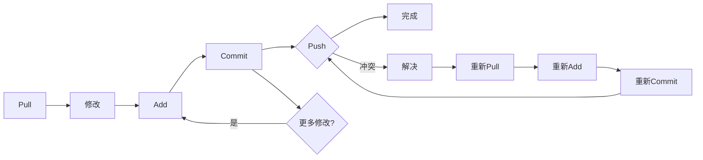
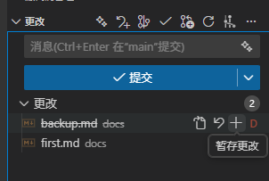
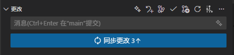

---lab
date: 2025-11-8
author: CCChiJi、龙龙
category: 技术笔记
tags: 环境配置
---

!!! tip ""
    以下步骤如果哪里出现问题，直接问AI就行 ，执行命令有关都是直接打开终端（cmd 或 powershell）在项目根目录下执行，VSCode 里是按下 <kbd>Ctrl</kbd> + <kbd>`</kbd> 打开终端

=== "软件清单"

- **Python 3.10+**
- **git**
- **git-crypt**
- **MkDocs MkDocs-Material**
- **文本编辑器**（推荐 VSCode）

## 安装步骤

cgy或者你们的学姐学长会提供一个压缩包，里面包含了上述所有环境的安装包，安装包文件直接一路点击确认安装就行。（不包括 python 噢，pip依赖问题自己解决） :smile:

!!! tip "环境变量配置"
    把以上如 `git`, `git-crypt` 的安装目录添加到`PATH`里就行（不会就去问AI）

## 配置 Git 

- **Git** 是版本控制工具

- **Github** 是基于 Git 技术的代码托管平台，一般我们叫它为远程仓库，每个仓库存放的都是不同的项目代码

**前者用于控制代码版本清晰，后者是主流的托管代码的平台，请勿混淆**

### 注册 Github 账号
如果你还没有 Github 账号，先去 [Github 官网](https://github.com/join) 注册一个新账号

!!! warning 网络问题
    中国大陆网络可能有点慢或受限，建议使用 VPN 或者加速器解决

### 配置 Git 用户信息

打开命令行终端，执行以下命令配置

```bash
git config --global user.name "你的Github用户名"
git config --global user.email "你的Github注册邮箱"
```

## 配置 VS Code 和 本地预览

安装并打开 VSCode，按下 <kbd>Ctrl</kbd> + <kbd>Shift</kbd> + <kbd>X</kbd> 打开扩展市场，搜索并安装以下扩展：

- **Markdown All in One**
- **Markdown Preview Enhanced** (可选，用于增强 Markdown 预览功能)
- **Python**

安装完成后，重启 VS Code 以确保扩展生效。

### 初始化目录

!!! warning
    确保 cgy 已经把你拉入了仓库的 Collaborators 中，否则以下操作会受限！


新建一个目录，比如`D:/lab512`，在该目录下右键空白处，选择 **“使用终端打开”**（或者在VS Code中直接打开该目录），执行以下命令初始化我们的文档项目：

```bash
git clone https://github.com/gailunzhou/512Docs
```

执行完成后，`D:/lab512` 目录下会多出一个 `512Docs` 目录。

进入这个目录，用pip安装mkdocs和本地的插件

```bash
pip install -e .
```

使用VSCode打开这个目录（或者在这个目录下执行 `code .` 命令），接下来就可以愉快地编写文档啦！

### 本地预览

在 VSCode 页面，按下 <kbd>Ctrl</kbd> + <kbd>`</kbd> 打开终端，执行以下命令启动本地预览服务器：

```bash
mkdocs serve
```

等待运行成功后，应该会看到类似如下的输出：


直接用鼠标点击这个**url** (http://127.0.0.1:xxxx) 或者复制到浏览器打开，就可以看到本地预览的文档网站惹 :moon:

### 纯Markdown预览

点击工作区右上角的 **“打开预览”** 图标，或者按下 <kbd>Ctrl</kbd> + <kbd>K</kbd> 然后再按 <kbd>V</kbd>，即可在侧边打开 Markdown 文件的预览窗口。

## Git 操作

### 新手教程

推荐如下教程：

- [Visual Studio Code自带Git工具使用教程](https://www.bilibili.com/video/BV1FYaAzgEsk)

- [给傻子的Git教程](https://www.bilibili.com/video/BV1Hkr7YYEh8)

- 你的忠诚的AI伙伴 🤭

!!! tips ""
    记得先在 VSCode 上使用 Github 登录，这样你的一些操作才会自动配置好身份信息。

### 流程

如果你看完上面的新手教程，应该对 Git 的基本操作有了一定了解，下面是一个简单的工作流程：

1. **Pull** 最新代码到本地（因为别人可能提交了新的更改）
2. 本地修改文件或新增文件
3. **Commit** 你的修改（可以多次提交，用了 Git 的暂存区功能，命令行里是 `git add `）
4. **Push** 提交到远程仓库



对应的bash命令如下：

```bash
# 1. 开始工作前拉取最新代码
git pull origin main

# 2. 进行本地修改...

# 3. 将修改添加到暂存区
git add file1.txt file2.txt
# 或添加所有修改
git add .

# 4. 提交到本地仓库
git commit -m "描述你的修改"

# 5. 推送修改到远程仓库
git push origin main

# 6. 如果遇到冲突...
git pull origin main  # 拉取最新代码
# 手动解决冲突后
git add .
git commit -m "解决冲突"
git push origin main
```

以上步骤缺一不可，用VSCode自带的版本控制图形化工具会方便很多，如果你觉得每次手动pull麻烦，可以在 VSCode 里设置自动同步。详细可以看这个[Issue](https://github.com/gailunzhou/512Docs/issues/1)

### 第一次提交

!!! tip ""
    建议先自己创建一个新的仓库，然后随便写点东西提交上去练练手，熟悉流程后再操作正式仓库。


做好更改后，直接在左侧的源代码管理面板（快捷键 <kbd>Ctrl</kbd> + <kbd>Shift</kbd> + <kbd>G</kbd>）里，对更改好的文件选择 `+`号按钮提交更改。



然后再输入提交信息（信息可以简单描述你做了什么更改，具体规范可以参考[Git commit 提交规范](https://codeewander.github.io/docs/git-commit)），点击 `✓` 号按钮提交。

提交完成后按钮会变成 `同步更改` 按钮，


点击它就可以把你的更改推送到远程仓库了喵，如果有冲突的话，Git 会提示你解决冲突，这部分内容在教程视频里有讲到。


