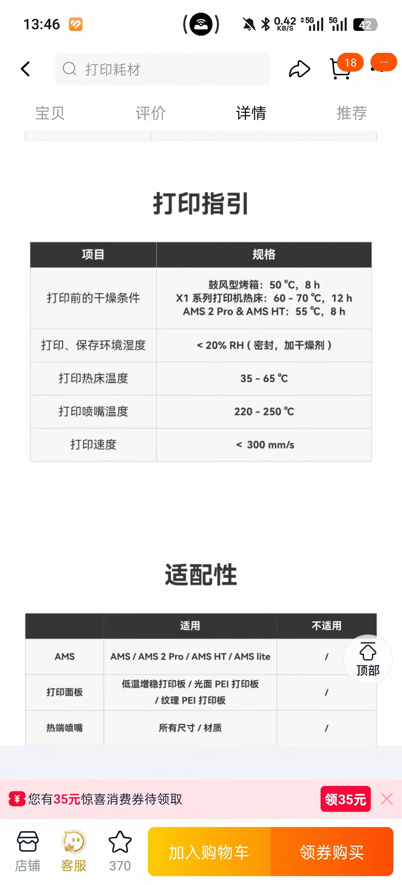
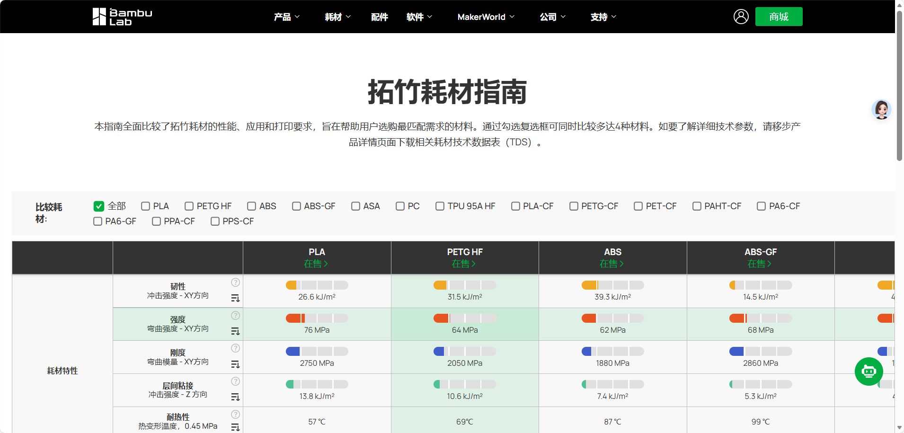
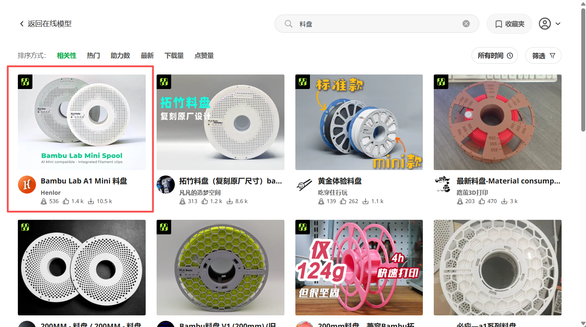
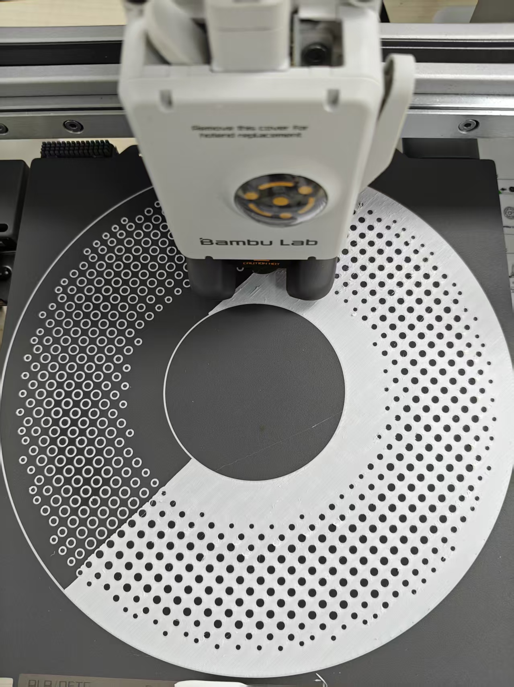
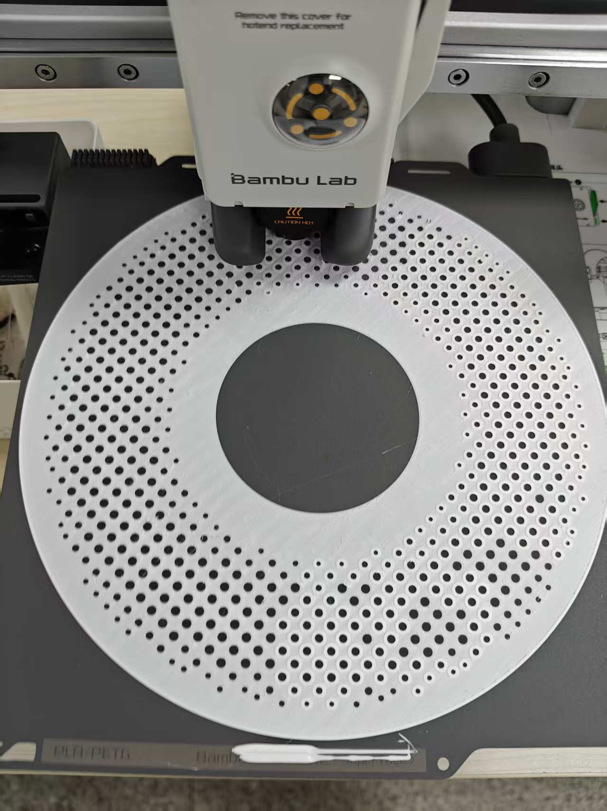
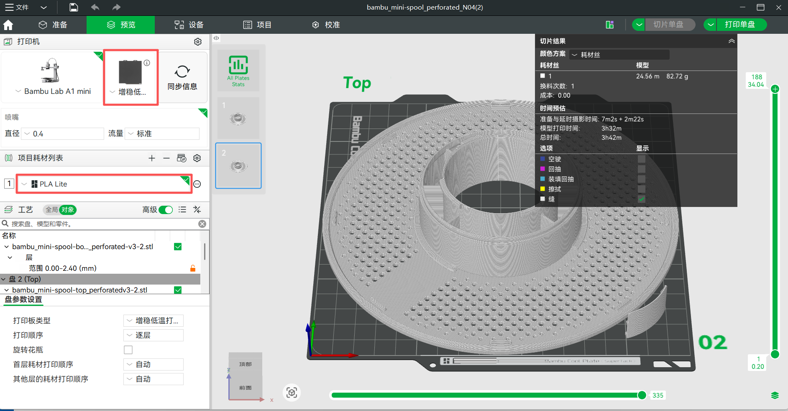
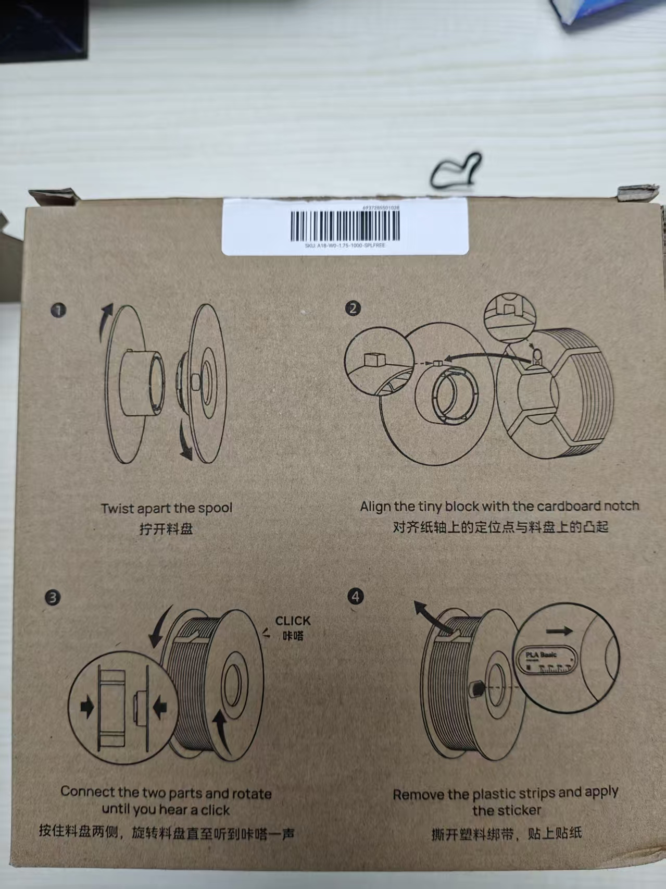

---lab
date: 2025-12-27
author: CCChiJi
category: 硬件
tags: 3D打印机
---

# 3D打印机耗材相关

打印机料用完了(快用完了)😐换一卷新的吧😋

!!! tip ""
    鉴于实验室多次出现换料失误的问题，换料有部分注意事项需要知晓

## 1. 耗材购买

实验室打印机有创想三维的和拓竹的，二者的切片软件中都有耗材丝的设置，但是都是以自家耗材为主，因此为了减少新耗材参数设置问题，个人建议创想三维就买创想三维的料，拓竹就买拓竹的料👌

!!! warning "注意"
    购买前需要先查看该料是否可用于实验室的打印机，和该耗材是否会导致当前使用的喷嘴发生堵头现象

以拓竹为例

购买页面会有打印指引，也可以问客服

也可以去拓竹官方网站查看: [拓竹耗材指南](https://bambulab.cn/zh-cn/filament-guide)

## 2. 关于料盘

购买的时候有 **无料盘** 和 **含料盘** 两种选项，其中料盘也可以单独购买

以拓竹为例

拓竹的料盘当前时间（2025-12-27）淘宝价格是 **￥15/个** 高温料盘和低温料盘同价

!!! tip "喜报！"
    然鹅在拓竹的Bambu Haddy软件以及Maker World里都有开源的料盘打印文件，类别很多，打印很方便，但需要确认是否适配实验室的打印机，如尺寸和耗材类别等

如果打印料盘的话，单从成本来讲比购买是会便宜几块，在众多的打印料盘中，个人推荐下图中的模型，因为其可适配AMS多色供料系统并且也支持A1mini进行打印

若打印该模型，个人实际测试使用冷打印板效果更好

若使用冷打印板，需要在打印设置里进行修改打印板，并将耗材改为你所使用的耗材

!!! note "说明"
    不管是使用什么打印板，打印板清洁和保护是非常重要的！！！

打印完成后按照作者说明进行安装即可

## 3. 关于换料

含料盘耗材换料直接换了就用

**关键在于无料盘耗材的更换**

!!! warning "注意！！！"
    - 官方在耗材盒的背面明确写了耗材的更换步骤，请一定按照步骤操作！！！
    - 官方在耗材盒的背面明确写了耗材的更换步骤，请一定按照步骤操作！！！
    - 官方在耗材盒的背面明确写了耗材的更换步骤，请一定按照步骤操作！！！

若没有放到料盘上就先拆开固定带，耗材就会散开，很难固定，散开时如果耗材乱了，就很难很难很难再整理好😭😭😭，因此请一定一定一定要按照步骤操作