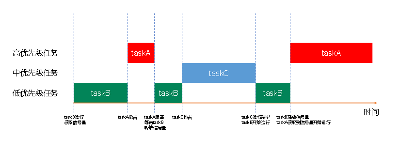
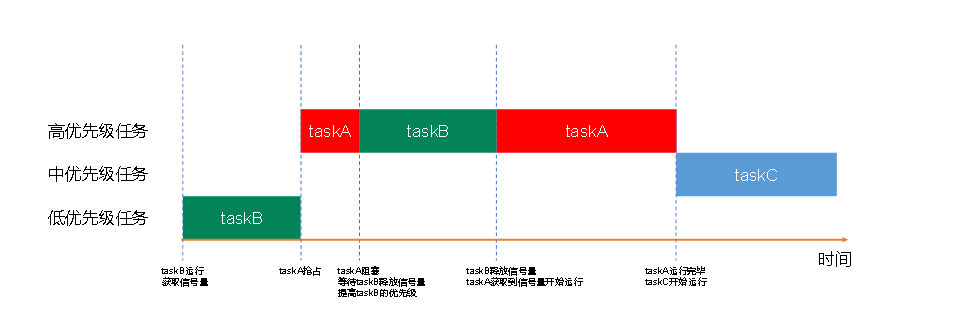

---lab
date: 2026-5-18
author: CCChiJi
category: 软件

tags: FreeRTOS
---

# FreeRTOS

## 信号量

FreeRTOS中的信号量是一种用于任务间**同步**和**资源管理**的机制。信号量可以是二进制的（只能取0或1）也可以是计数型的（可以是任意正整数）。信号量的基本操作包括“获取”和“释放”。

设想情况：

一共有100张机票

三个任务都卖票，卖票逻辑：获取当前票数，票数>0，卖票，票数-1

基础代码`freeRTOS_demo.c`如下：

```c
#include "stm32f10x.h"                  // Device header

#include "free_demo.h"

#include "myusart.h"
#include "Led.h"
#include "Key.h"

#include "FreeRTOS.h"
#include "task.h"
#include "queue.h"
#include "semphr.h"

TaskHandle_t start_task_Handler;

TaskHandle_t task1_Handler;
TaskHandle_t task2_Handler;
TaskHandle_t task3_Handler;

void start_Task(void *param);
void Task1(void *param);
void Task2(void *param);
void Task3(void *param);

void freeRTOS_Start(void)
{
	BaseType_t res = xTaskCreate(start_Task ,"create_allTasks" ,256 ,NULL ,2 ,&start_task_Handler);
	
	if(res == pdPASS)
	{
		Usart1_printf("startTask_create success \r\n");
	}
	
	vTaskStartScheduler();
}

void start_Task(void *param)
{
	taskENTER_CRITICAL();
	
	xTaskCreate(Task1 ,"myTask1" ,256 ,NULL ,2 ,&task1_Handler);
	xTaskCreate(Task2 ,"myTask2" ,256 ,NULL ,2 ,&task2_Handler);
	xTaskCreate(Task3 ,"myTask3" ,256 ,NULL ,2 ,&task3_Handler);
	
	vTaskDelete(NULL);
	
	taskEXIT_CRITICAL();
}

static int8_t tickets = 100;

void Task1(void *param)
{
	while(1)
	{
        if(tickets > 0)//防止超卖
        {
            Usart1_printf("12306 tickets num : %d \r\n" ,tickets);
            tickets --;
        }
        vTaskDelay(100);
	}
}

void Task2(void *param)
{
	while(1)
	{
        if(tickets > 0)
        {
            Usart1_printf("Feizhu tickets num : %d \r\n" ,tickets);
            tickets --;
        }
        vTaskDelay(100);
	}
}

void Task3(void *param)
{
	while(1)
	{
        if(tickets > 0)
        {
            Usart1_printf("XieChen tickets num : %d \r\n" ,tickets);
            tickets --;
        }
        vTaskDelay(100);
	}
}

```

运行后会发现

- 第一次卖：票数为100

- 第二次卖：票数为97

因为三个任务操作的资源是共享资源，所以会导致同时-1，连续减3次，但是期望的是有任务卖的时候其他的任务不要动，一张一张卖（虽然前面那个情况看似合理，但是这里就不要杠，期望的结果是100，99，98这样的），这里就需要使用信号量

### 二值信号量

二值信号量（Binary Semaphore）是一种特殊类型的信号量，它只有两个可能的值：0和1。这种信号量主要用于实现对共享资源的互斥访问或者任务之间的同步。

- 两个状态： 二值信号量只能处于两个状态之一，通常用0和1表示。当信号量的值为0时，表示资源不可用；当值为1时，表示资源可用。

- 互斥访问： 常用于控制对共享资源的互斥访问，确保在同一时刻只有一个任务可以访问共享资源。任务在访问资源之前会尝试获取信号量，成功则继续执行，失败则等待。

- 任务同步： 也可以用于任务之间的同步，例如一个任务等待另一个任务完成某个操作。

信号量 API 函数允许指定阻塞时间。 阻塞时间表示当一个任务试图“获取”信号量时， 如果信号量此时被别的任务使用，那么该任务可以延时等待的最长时间（进入阻塞状态）。 

如果多个任务在同一个信号量上阻塞，那么具有**最高优先级的任务**将在下次信号量可用时**最先解除阻塞** 。

可将二进制信号量视为仅能**容纳一个项目的队列**。 因此，队列只能为空或满（因此称为二进制）。 使用队列的任务和中断不在乎队列容纳的是什么——它们只想知道队列是空的还是满的。 可以 利用该机制来同步任务和中断。

#### 二值信号量要使用到的API

API详解参见[FreeRTOS官网](https://freertos.org/)

| **函数**                       | **描述**                   |
| ------------------------------ | -------------------------- |
| xSemaphoreCreateBinary()       | 使用动态方式创建二值信号量 |
| xSemaphoreCreateBinaryStatic() | 使用静态方式创建二值信号量 |
| xSemaphoreGive()               | 释放信号量                 |
| xSemaphoreGiveFromISR()        | 在中断中释放信号量         |
| xSemaphoreTake()               | 获取信号量                 |
| xSemaphoreTakeFromISR()        | 在中断中获取信号量         |

**使用信号量时需要包含对应的头文件`include "semphr.h"`**

前面就提到二值信号量可以被看做是一个容纳单个项目的队列，因此创建也需要句柄

**当操作共享资源时，获取信号量，让其他要操作资源的任务等待，操作完后，释放信号量，让等待的任务可以使用资源**

使用信号量后的`freeRTOS_demo.c`代码：

```c
#include "stm32f10x.h"                  // Device header

#include "free_demo.h"

#include "myusart.h"
#include "Led.h"
#include "Key.h"

#include "FreeRTOS.h"
#include "task.h"
#include "queue.h"
#include "semphr.h"

TaskHandle_t start_task_Handler;

TaskHandle_t task1_Handler;
TaskHandle_t task2_Handler;
TaskHandle_t task3_Handler;
//信号量句柄
SemaphoreHandle_t mySemphr_Handler;

void start_Task(void *param);
void Task1(void *param);
void Task2(void *param);
void Task3(void *param);

void freeRTOS_Start(void)
{
	BaseType_t res = xTaskCreate(start_Task ,"create_allTasks" ,256 ,NULL ,2 ,&start_task_Handler);
	
	if(res == pdPASS)
	{
		Usart1_printf("startTask_create success \r\n");
	}
	
	vTaskStartScheduler();
}

void start_Task(void *param)
{
	taskENTER_CRITICAL();
	
	//创建二值信号量
	mySemphr_Handler = xSemaphoreCreateBinary();
	if(mySemphr_Handler != NULL)
	{
        //创建好之后先释放，不然直接就是0，有任务想获取信号量就会被卡死
		xSemaphoreGive(mySemphr_Handler);
		Usart1_printf("Semphr_Binary create success \r\n");
	}
	
	xTaskCreate(Task1 ,"myTask1" ,256 ,NULL ,2 ,&task1_Handler);
	xTaskCreate(Task2 ,"myTask2" ,256 ,NULL ,2 ,&task2_Handler);
	xTaskCreate(Task3 ,"myTask3" ,256 ,NULL ,2 ,&task3_Handler);
	
	vTaskDelete(NULL);
	
	taskEXIT_CRITICAL();
}

static int8_t tickets = 100;

void Task1(void *param)
{
	while(1)
	{
		if(tickets > 0)//有票才进行信号量操作
		{
			//获取信号量
			xSemaphoreTake(mySemphr_Handler ,portMAX_DELAY);
			if(tickets > 0)//防止超卖
			{
				Usart1_printf("12306 tickets num : %d \r\n" ,tickets);
				tickets --;
			}
			//释放信号量
			xSemaphoreGive(mySemphr_Handler);
			vTaskDelay(100);
		}
	}
}

void Task2(void *param)
{
	while(1)
	{
		if(tickets > 0)
		{
			//获取信号量
			xSemaphoreTake(mySemphr_Handler ,portMAX_DELAY);
			if(tickets > 0)
			{
				Usart1_printf("Feizhu tickets num : %d \r\n" ,tickets);
				tickets --;
			}
			//释放信号量
			xSemaphoreGive(mySemphr_Handler);
			vTaskDelay(100);
		}
	}
}

void Task3(void *param)
{
	while(1)
	{
		if(tickets > 0)
		{
			//获取信号量
			xSemaphoreTake(mySemphr_Handler ,portMAX_DELAY);
			if(tickets > 0)
			{
				Usart1_printf("XieChen tickets num : %d \r\n" ,tickets);
				tickets --;
			}
			//释放信号量
			xSemaphoreGive(mySemphr_Handler);
			vTaskDelay(100);
		}
	}
}

```

说明：

代码中任务函数有两个判断，且获取和释放信号量在第一层判断内

1. 第一层判断：当有票才进行售卖，如果没有票就不卖，同时也不用继续获取和释放信号量

2. 第二层判断：防止超卖，可能会想为什么不像下面这样写：

   1. ```c
      void TaskX(void *param)
      {
      	while(1)
      	{
              if(tickets > 0)
              {
                  //获取信号量
                  xSemaphoreTake(mySemphr_Handler ,portMAX_DELAY);
                  Usart1_printf("XieChen tickets num : %d \r\n" ,tickets);
                  tickets --;
                  //释放信号量
                  xSemaphoreGive(mySemphr_Handler);
              }
              vTaskDelay(100);
      	}
      }
      ```

      如果上面这样写，**假设现在票数为1，进入if内后，刚好切换到另外一个任务了，另外一个任务判断也通过，另外一个卖完，现在票数为0，切换回现在的任务，还是卖，结果就是输出票数为0，票数变成-1**

### 计数型信号量

正如二进制信号量可以被认为是长度为 1 的队列那样，计数信号量也可以被认为是长度大于 1 的队列。 

#### 计数型信号量使用的情况

计数信号量通常用于两种情况：

（1）事件计数：在此使用方案中，每次事件发生时，事件处理程序将“给出”一个信号量（信号量计数值递增） ，处理程序任务每次处理事件时“获取”一个信号量（信号量计数值递减）。因此，计数值是已发生的事件数与已处理的事件数之间的差值。在这种情况下，**创建信号量时计数值可以为零**。

（2）资源管理：在此使用情景中，计数值表示可用资源的数量。要获得对资源的控制权，任务必须首先获取一个信号量——同时递减信号量计数值。当计数值达到零时，表示没有空闲资源可用。当任务使用完资源时， “返还”一个信号量——同时递增信号量计数值。在这种情况下， **创建信号量时计数值可以等于最大计数值**。

#### 计数型信号量相关API

计数型信号量的获取和释放与二值型型号量一致，主要是计数型信号量的创建以及获取计数型信号量的值

API详解参见[FreeRTOS官网](https://freertos.org/)

| **函数**                         | **描述**                     |
| -------------------------------- | ---------------------------- |
| xSemaphoreCreateCounting()       | 使用动态方法创建计数型信号量 |
| xSemaphoreCreateCountingStatic() | 使用静态方法创建计数型信号量 |
| uxSemaphoreGetCount()            | 获取信号量的计数值           |

#### 实例

还是使用上述案例

`freeRTOS_demo.c`代码如下：

```c
#include "stm32f10x.h"                  // Device header

#include "free_demo.h"

#include "myusart.h"
#include "Led.h"
#include "Key.h"

#include "FreeRTOS.h"
#include "task.h"
#include "queue.h"
#include "semphr.h"

TaskHandle_t start_task_Handler;

TaskHandle_t task1_Handler;
TaskHandle_t task2_Handler;
TaskHandle_t task3_Handler;
//信号量句柄
SemaphoreHandle_t mySemphr_Handler;

void start_Task(void *param);
void Task1(void *param);
void Task2(void *param);
void Task3(void *param);

void freeRTOS_Start(void)
{
	BaseType_t res = xTaskCreate(start_Task ,"create_allTasks" ,256 ,NULL ,2 ,&start_task_Handler);
	
	if(res == pdPASS)
	{
		Usart1_printf("startTask_create success \r\n");
	}
	
	vTaskStartScheduler();
}

void start_Task(void *param)
{
	taskENTER_CRITICAL();
	
	//创建计数型信号量 - 初始给值为1
	mySemphr_Handler = xSemaphoreCreateCounting(1 ,1);
	if(mySemphr_Handler != NULL)
	{
		Usart1_printf("Semphr_Binary create success \r\n");
	}
	
	xTaskCreate(Task1 ,"myTask1" ,256 ,NULL ,2 ,&task1_Handler);
	xTaskCreate(Task2 ,"myTask2" ,256 ,NULL ,2 ,&task2_Handler);
	xTaskCreate(Task3 ,"myTask3" ,256 ,NULL ,2 ,&task3_Handler);
	
	vTaskDelete(NULL);
	
	taskEXIT_CRITICAL();
}

static int8_t tickets = 100;

void Task1(void *param)
{
	while(1)
	{
		if(tickets > 0)//有票才进行信号量操作
		{
			//获取信号量
			xSemaphoreTake(mySemphr_Handler ,portMAX_DELAY);
			if(tickets > 0)//防止超卖
			{
				Usart1_printf("12306 tickets num : %d \r\n" ,tickets);
				tickets --;
			}
			//释放信号量
			xSemaphoreGive(mySemphr_Handler);
			vTaskDelay(100);
		}
	}
}

void Task2(void *param)
{
	while(1)
	{
		if(tickets > 0)
		{
			//获取信号量
			xSemaphoreTake(mySemphr_Handler ,portMAX_DELAY);
			if(tickets > 0)
			{
				Usart1_printf("Feizhu tickets num : %d \r\n" ,tickets);
				tickets --;
			}
			//释放信号量
			xSemaphoreGive(mySemphr_Handler);
			vTaskDelay(100);
		}
	}
}

void Task3(void *param)
{
	while(1)
	{
		if(tickets > 0)
		{
			//获取信号量
			xSemaphoreTake(mySemphr_Handler ,portMAX_DELAY);
			if(tickets > 0)
			{
				Usart1_printf("XieChen tickets num : %d \r\n" ,tickets);
				tickets --;
			}
			//释放信号量
			xSemaphoreGive(mySemphr_Handler);
			vTaskDelay(100);
		}
	}
}

```

可以看出来这里其实是事件触发类型，并且是把计数型信号量当成二值型信号量来使用

### 互斥型信号量

互斥信号量是包含优先级继承机制的二进制信号量。二进制信号量能更好实现实现同步（任务间或任务与中断之间）， 而互斥信号量有助于更好实现简单互斥（即相互排斥）。

先了解两个概念优先级反转和优先级继承。

#### 优先级反转

设想一种情况：

有一台电脑，校长要用，学生要用，老师要用。

学生优先级最低，老师优先级中等，校长优先级最高。

此时学生正在用电脑，校长来了，校长想用，但发现学生还没用完就说等一会儿来，然后老师来了，老师要用，老师用完后，校长还没来，学生继续用，学生用完了，校长来了，校长用。

所以优先级最高的校长是最后完成他的任务，而优先级中等的老师是最先完成任务（**仅举例子，无任何其他含义**），这种情况就是优先级反转，如下图：



#### 优先级继承

互斥量可以实现优先级继承

优先级继承是一种解决实时系统中任务调度引起的优先级翻转问题的机制。在具体的任务调度中，**当一个高优先级任务等待一个低优先级任务所持有的资源时，系统会提升低优先级任务的优先级，以避免高优先级任务长时间等待的情况。**



**优先级继承无法完全解决优先级翻转**，只是在某些情况下将影响降至最低。

**不能在中断中使用互斥信号量**，原因如下：

1. 互斥信号量使用的优先级继承机制要求从任务中（而不是从中断中）获取和释放互斥信号量。
2. 中断无法保持阻塞来等待一个被互斥信号量保护的资源。

#### 互斥型信号量使用的API

和计数型类似，互斥型信号量的获取和释放API和二值型一致，区别在于互斥型信号量的创建

API详解参见[FreeRTOS官网](https://freertos.org/)

| **函数**                      | **描述**                     |
| ----------------------------- | ---------------------------- |
| xSemaphoreCreateMutex()       | 使用动态方法创建互斥信号量。 |
| xSemaphoreCreateMutexStatic() | 使用静态方法创建互斥信号量。 |
