---lab
date: 2025-11-30
author: CCChiJi
category: 软件
tags: ROS
---

# Ubuntu20.04系统镜像烧录&基础配置

!!! tip "tips"
    所有指令的输入不需要全部敲，只用输入前几个字母再按Tab就会自动补齐或列出可选项

## 1. 镜像烧录
### 1.1 镜像文件

镜像文件可以直接去官方下载

或者在[清华大学开源软件镜像站进行下载](https://blog.csdn.net/weixin_45912291/article/details/108900602) 

注意要下载的文件为


### 1.2 使用”balenaEtcher”烧录

balenaEtcher可以替换为别的烧录软件但个人推荐用该软件

把给树莓派使用的TF卡插入读卡器并连接上电脑，打开balenaEtcher

左侧选择要烧录的镜像文件，中间为要烧录的目的盘，右侧为烧录开始按钮

!!! warning "警告"
    一定要检查选择的盘，若选错会清空你选错的盘中的所有数据！

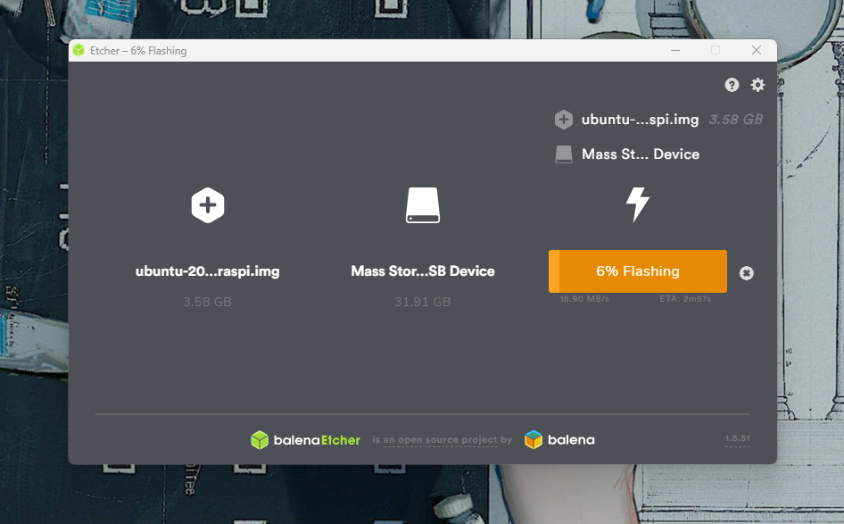

### 1.3 基础设置

#### 1.3.1 显示设置

烧录完成后弹出TF卡再插上电脑会显示一个boot盘

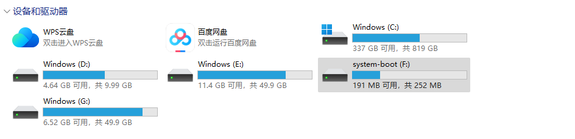

打开boot盘中的config.txt，可直接用记事本或VScode

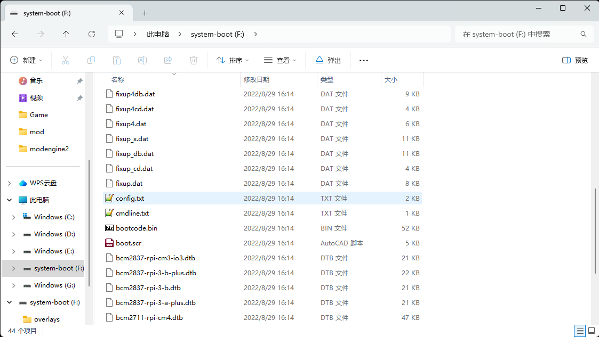

找到橙色线所画位置，红色框为需要加入的代码

```txt
hdmi_force_hotplug=1
hdmi_mode=16
```

加入后<kbd>Ctrl</kbd> + <kbd>s</kbd>保存

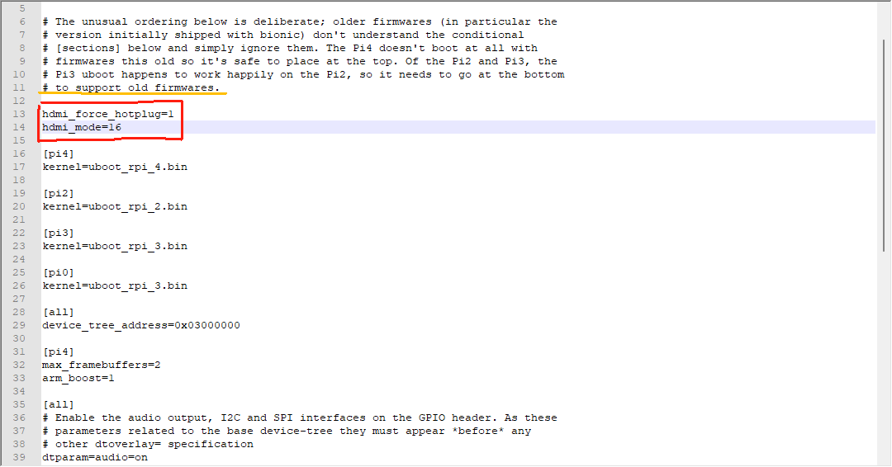

#### 1.3.2 WLAN设置（连接个人热点/个人WiFi方法）

找到network-config文件使用VScode打开

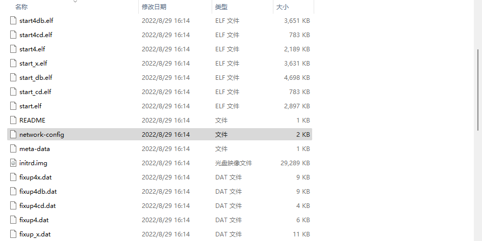

图中灰色选中部分，改为自己的WIFI和密码（第一排的“myhomewifi”是WIFI名，前后要加引号（英文输入情况下），第二排的“S3kr1t”是密码）

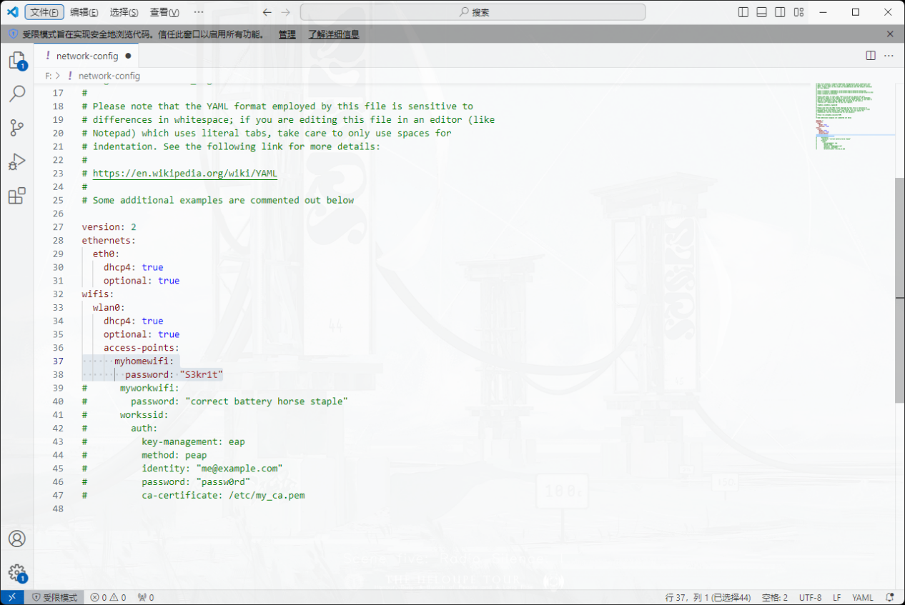

!!! tip "tips"
    如果你的WIFI名中有空格，例如`xiao mi123456`则设置里的WIFI名称应该为
    `"xiao-mi123456"`

设置完成后<kbd>Ctrl</kbd> + <kbd>s</kbd>保存

#### 1.3.3 WLAN设置（用笔记本作为路由器并使用网线连接树莓派方法）

参考: [用笔记本作为路由器并使用网线连接树莓派方法](https://blog.csdn.net/Mr_zhubao/article/details/135876595)

!!! tip "tips"
    目前没有设置为静态ip树莓派开关机一次ip可能就会变一次，先继续

    这种方法后面还是可以通过下文**2.3 更改WIFI配置**回到使用热点进行联网的方式

    因为我使用网线配好网络以后发现还是需要接上网线才能ssh，目前还没弄清楚

## 2. 第一次开机

给树莓派接上屏幕并插入烧好系统的TF卡，再把键盘给接上USB口，接好电源开机。

### 2.1 初始密码&进入系统

根据user.data文件里的内容可知初始账号和密码都是
`
ubuntu
`
并且进入后需要立即更换


登录后会提示要求修改密码：再输入一次原来的密码`ubuntu`后可输入新密码，例如`123456`，会要求再输入一次新密码，输入以后就可以进入系统

### 2.2 检查自己是否连接上WIFI方法

输入
```bash
sudo su
```
进入root模式

输入
```bash
ping www.baidu.com
```
（如果是连接自己手机的热点可直接在手机上查看是否连接上）

如果返回
`Temporary failure in name resolution`
说明没有连接上，按照后面步骤检查wifi设置并重试以上操作

### 2.3 更改WIFI配置

输入
```bash
cd /etc/netplan
```

输入
```bash
ls
```
查看，会列出一个`50-cloud-init.yaml`的文件

这里保险起见先将原来的文件复制一份

输入
```bash
cp 50-cloud-init.yaml /etc/netplan/50-cloud-init.yaml.1
```
完成复制

输入
```bash
vi 50-cloud-init.yaml
```
使用Vim查看/编辑`50-cloud-init.yaml`文件
!!! tip ""
    这个镜像是默认安装了vim编辑器，如果没有的话可以用nano编译器，也可以直接安装vim，系统会提示安装指令`sudo apt install....`

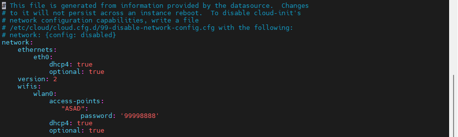

按一下键盘<kbd>i</kbd>键进入输入模式，修改自己的wifi和密码，修改完成后键盘输入一个`:`号会在屏幕左下角看见`:`然后再输入`wq!`即强制保存并退出（只退出就是q，保存退出是wq，加`!`表示强制）

输入
```bash
netplan --debug apply
```
让系统检查一遍

检查完成后输入
```bash
reboot
```
重启一遍，之后登录完再
```bash
ping www.baidu.com
```
一次看是否连接上 *（连接上会看到ping到多少byte，就代表连接上WiFi了）*

## 3. 电脑SSH远程连接

我使用的是MobaXterm，电脑和树莓派要在同一wifi下

### 3.1 树莓派IP查看

输入
```bash
ip add
```
即可查看树莓派的ip地址

!!! note ""
    图中画红线的部分就是树莓派的IP地址，先记下来

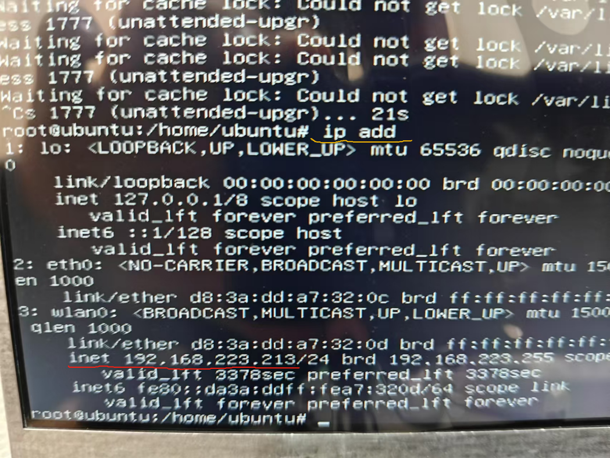

### 3.2 添加root用户

输入指令
```bash
sudo passwd root
```

再输入两次密码即可

### 3.3 MobaXterm操作


↓

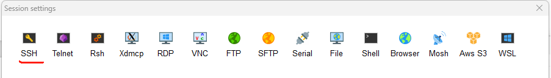

↓

第一个地方就是树莓派的IP地址，第二个地方打勾然后填`ubuntu`最后选OK就行了

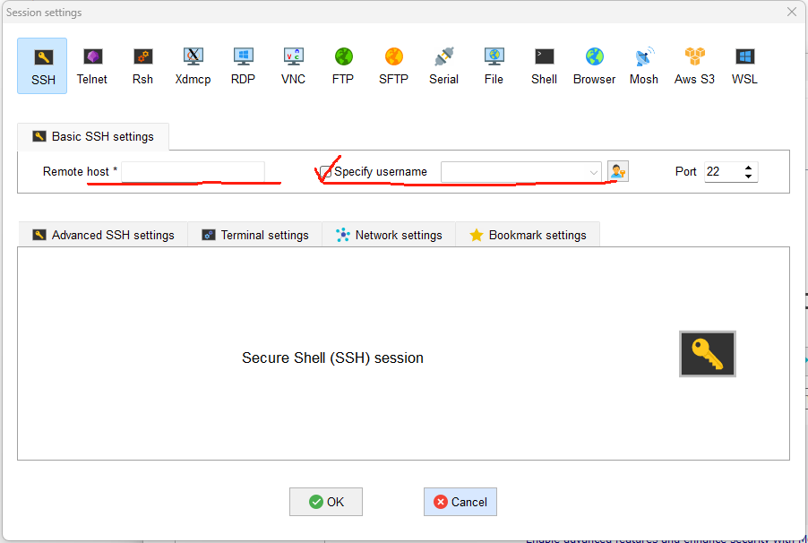

连接上后输入账号`ubuntu`和你之前设置的密码

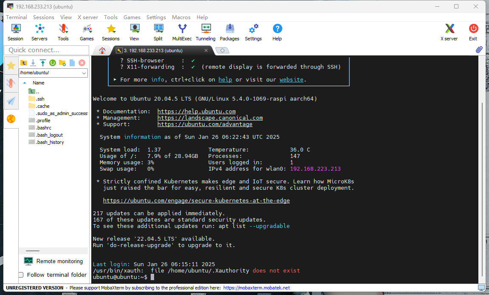

!!! success "成功"
    如果看到以上界面说明配置正确，基础部分已完成，后续按个人需要可不用给树莓派连接显示屏幕、键盘和鼠标