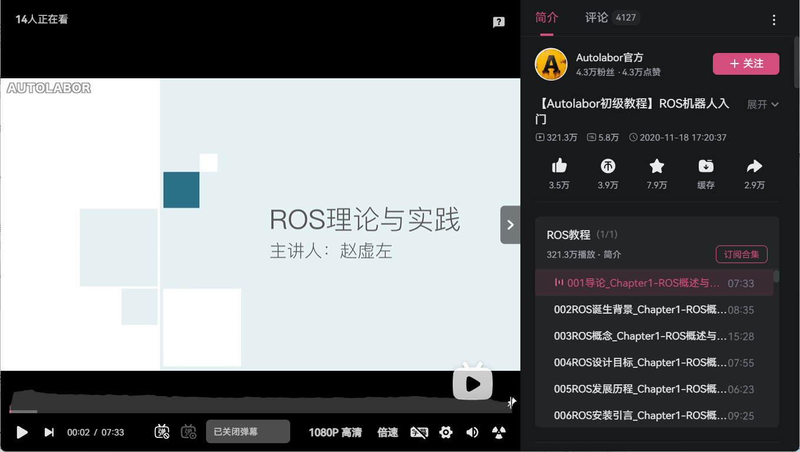

---lab
date: 2025-11-30
author: CCChiJi
category: 软件
tags: ROS
---

# ROS1

该部分为基于实验室中部分使用到ROS的作品的流程记录，使用的是ROS1系统

硬件材料如下:

- 树莓派4B *（可替换）*
- 一张树莓派可使用的TF卡 *（推荐32G）*
- 树莓派可连接的显示屏 *（可选）*
- 键盘
- Arduino Mega2560
- TB6612电机驱动板 *（可替换）*
- 霍尔编码器电机
- 普通的轮子
- 万向轮两个
- 车板是3D打印的
- N10雷达 *（可替换）*

软件:

- 树莓派使用Ubuntu20.04系统
- 电脑安装MobaXterm
- balenaEtcher烧录软件

!!! tip "tips"
    - 流程中“雷达使用注意事项”是配合N10激光雷达资料中的使用手册->N10雷达上位机软件及ROS环境中使用一起看
    - test_ws是更换雷达后的一个测试工作空间，主要实现内容和catkin_ws中相同，因为雷达不同，因此使用的雷达功能包不同
  
## 附录

参考文档教程: [ROS机器人入门课程](http://www.autolabor.com.cn/book/ROSTutorials/)

参考视频教程：

!!! tip ""
    第八、九章视频教程在UP主：赵虚左 的投稿中