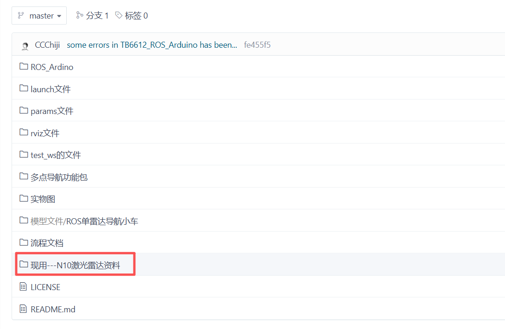
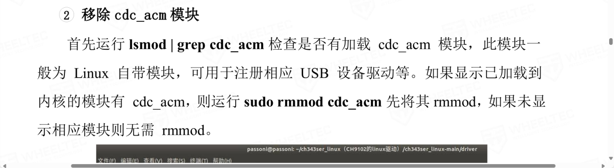
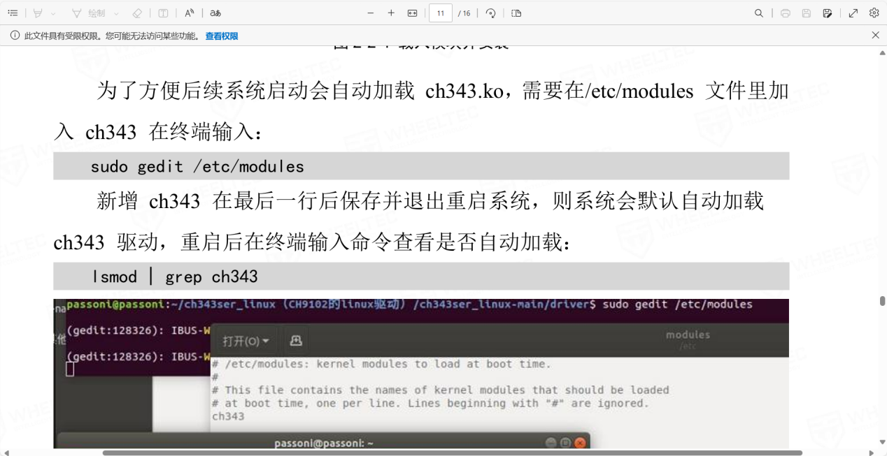
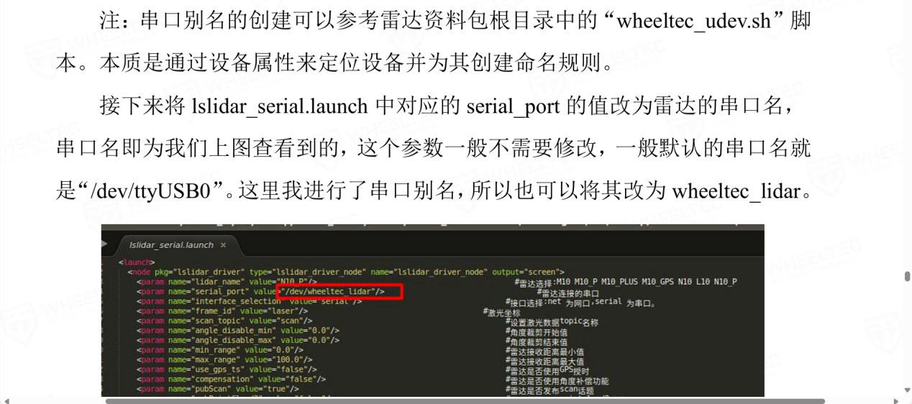
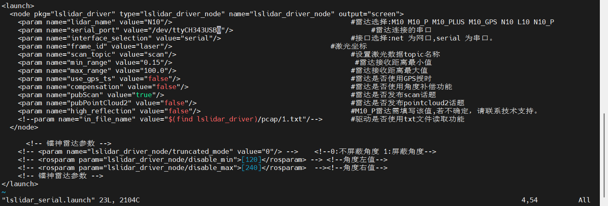
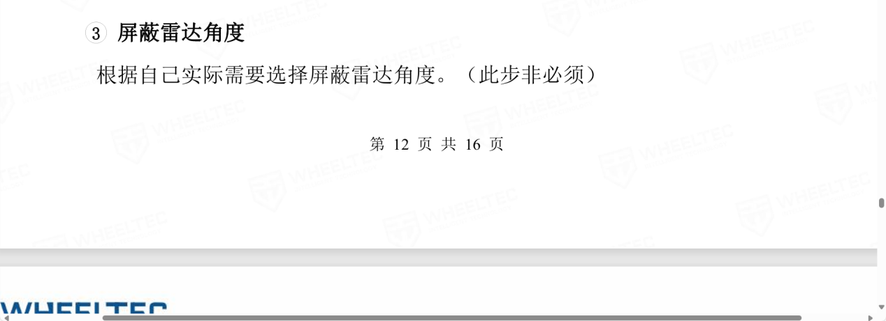
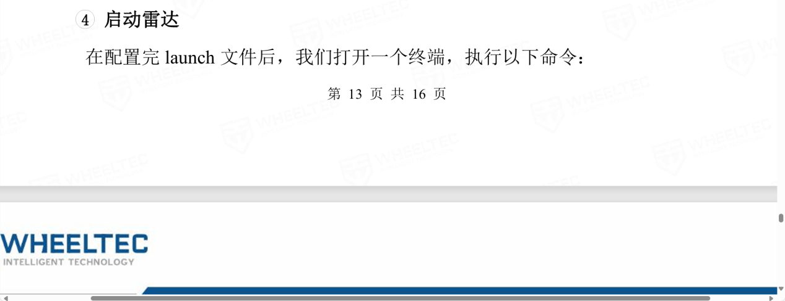
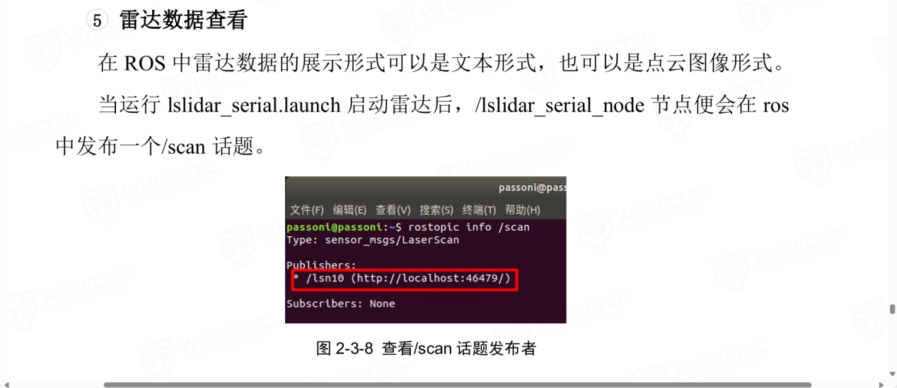
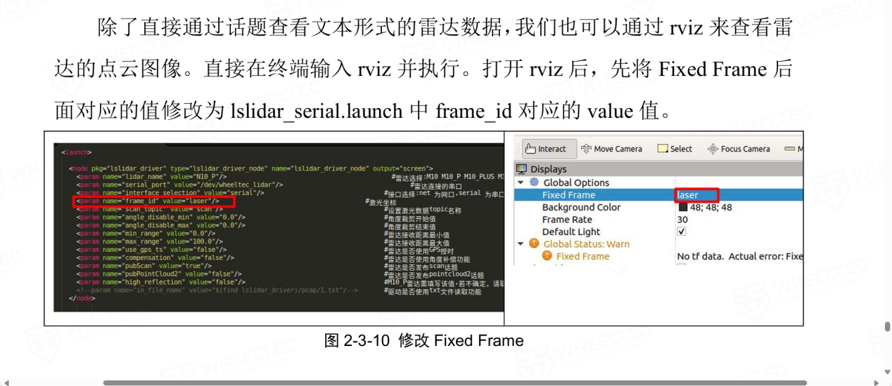

---lab
date: 2025-12-11
author: CCChiJi
category: 软件
tags: ROS
---

# 雷达使用注意事项

!!! tip "tips"
    如果你使用的是镭神的N10雷达，该部分是为你准备的，你需要搭配雷达资料一起看

    但如果不同样的雷达或者版本不同，基本思路也是一致的，仔细查看自己所使用雷达的用户手册即可

如果使用的是N10雷达，资料仓库中也附上了



## 1. 雷达功能包放到工作空间下

!!! note "前情提要"
    工作空间的创建：

    - `mkdir -p (工作空间的名字)/src`
    - `cd (工作空间的名字)`
    - `catkin_make`

!!! warning "注意"
    使用手册里说的把雷达的功能包放到工作空间的src目录下，建议就直接放到ros_arduino_bridge所在的那个工作空间的src目录中

## 2. cdc_acm 模块

如果Ubuntu和我下载的是同一个版本的话，这一步跟着操作后面应该会发现原本就是没有该模块的，如果有，则按照教程删除即可



## 3. 添加CH343



这一步里面说的“gedit”就是Ubuntu里面的一种文本编辑器：gedit 

我们之前安装时下载了Vim，那么有Vim就使用Vim，所以上面的第一个指令要改为
```bash
sudo vim /etc/modules
```

进去查看以后会发现里面已经在最后一行添加了“CH343”所以不需要再额外添加


## 4. 修改Port名

这一步说的改port名，不建议改成他那个，改成第二张图的（lslidar_serial.launch的配置可以参考我给的那张图）





## 5. 雷达屏蔽角度

这一步按照自己需求操作



## 6. 雷达的启动



执行雷达的启动命令之前，还要额外做一个步骤：声明

在你放lsx10的那个工作空间的根目录(如果和我一样则是在catkin_ws下进行指令操作)执行该指令
```bash
source ./devel/setup.bash
```

然后可跳过这一步 **⇓**



直接执行这一步 **⇓**



如果正常则应该是有点云图
