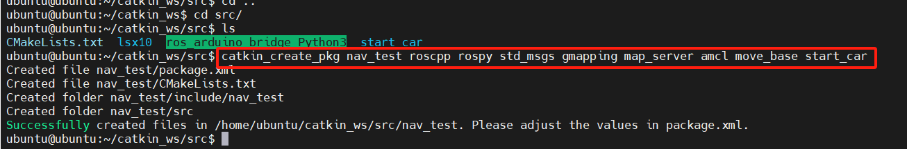
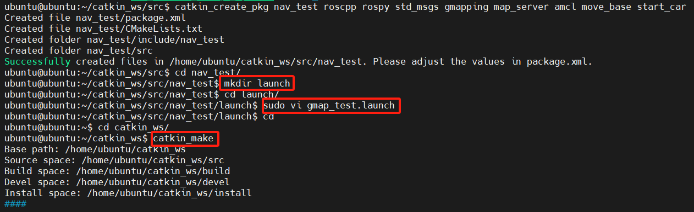
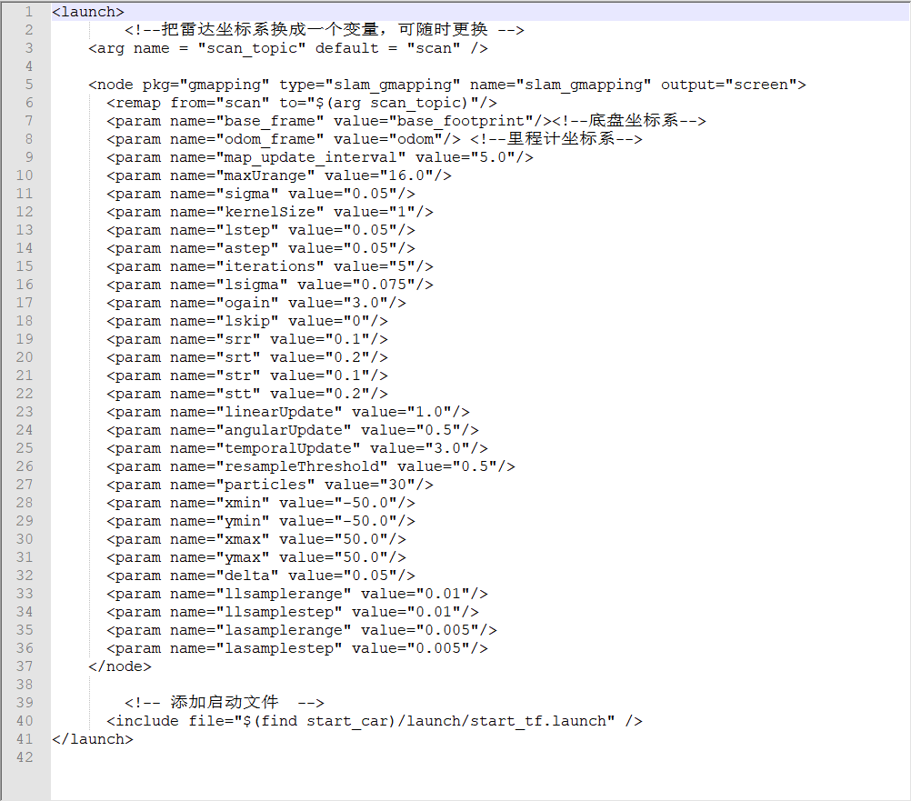
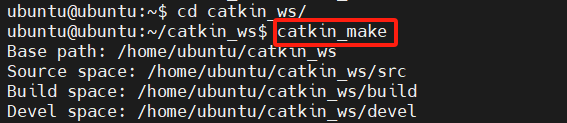
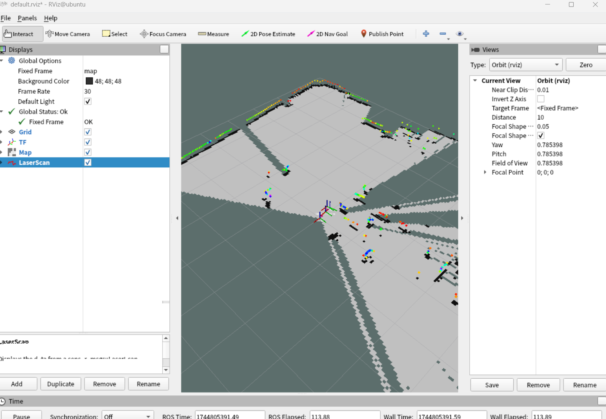

---lab
date: 2025-12-13
author: CCChiJi
category: 软件
tags: ROS
---

# Gmapping建图

完成建图前的准备工作后（机器人启动、机器人部件的坐标变换、rviz的添加），就可以开始使用gmapping建图了

## 1. 安装相关功能包
建图前还需要安装几个功能包，使用以下指令安装：<br>
安装 gmapping 包(用于构建地图)
```bash
sudo apt install ros-<ROS版本>-gmapping
```

安装地图服务包(用于保存与读取地图)
```bash
sudo apt install ros-<ROS版本>-map-server
```

安装 navigation 包(用于定位以及路径规划)
```bash
sudo apt install ros-<ROS版本>-navigation
```

不同Ubuntu版本和ROS版本的对应关系参考下表

| ROS版本 | Ubuntu版本 |
| :------ | :--------- |
| ROS 1 Indigo | 14.04 (Trusty) |
| ROS 1 Jade | 15.04 (Vivid) |
| ROS 1 Kinetic | 16.04 (Xenial) | 
| ROS 1 Lunar | 17.04 (Zesty) |
| ROS 1 Melodic | 18.04 (Bionic) |
| ROS 1 Noetic | 20.04 (Focal) |
| ROS 2 Ardent | 16.04 (Xenial) |
| ROS 2 Bouncy | 18.04 (Bionic) |
| ROS 2 Crystal | 18.04 (Bionic) |
| ROS 2 Dashing | 18.04 (Bionic) |
| ROS 2 Eloquent | 18.04 (Bionic) |
| ROS 2 Foxy | 20.04 (Focal) |
| ROS 2 Galactic | 20.04 (Focal) |
| ROS 2 Humble | 22.04 (Jammy) |
| ROS 2 Iron | 22.04 (Jammy) |
| ROS 2 Jazzy | 24.04 (Noble) |
| ROS 2 Kilted | 24.04 (Noble) |

我用的是20.04，因此是
```bash
sudo apt install ros-Focal-gmapping

sudo apt install ros-Focal-map-server

sudo apt install ros-Focal-navigation
```

## 2. 创建建图功能包

### 2.1 

!!! note "前情提要"
    - 功能包的创建在 **建图前的准备工作** 章节中有讲，这里就不重复
    - 功能包创建指令:
        - `catkin_create_pkg`创建功能包，其后必要的参数为：
        - 功能包名 
        - 所需要的依赖 

参考下图创建建图功能包:



!!! note "说明"
    创建功能包的指令和位置之前讲过不再赘述，这次需要包含的除了roscpp那些以外还需要包含gmapping、map_server、amcl、move_base和之前创建的start_car(自己创建的启动功能包)

### 2.2 

在创建的功能包中创建launch文件夹并创建launch文件



`gmap_test.launch`中按如下图编写（建议直接复制），其中`gmap_test`是文件名称，自定义即可



```XML
<launch>
    <!--把雷达坐标系换成一个变量，可随时更换 -->
    <arg name = "scan_topic" default = "scan" />

    <node pkg="gmapping" type="slam_gmapping" name="slam_gmapping" output="screen">
      <remap from="scan" to="$(arg scan_topic)"/>
      <param name="base_frame" value="base_footprint"/><!--底盘坐标系-->
      <param name="odom_frame" value="odom"/> <!--里程计坐标系-->
      <param name="map_update_interval" value="5.0"/>
      <param name="maxUrange" value="16.0"/>
      <param name="sigma" value="0.05"/>
      <param name="kernelSize" value="1"/>
      <param name="lstep" value="0.05"/>
      <param name="astep" value="0.05"/>
      <param name="iterations" value="5"/>
      <param name="lsigma" value="0.075"/>
      <param name="ogain" value="3.0"/>
      <param name="lskip" value="0"/>
      <param name="srr" value="0.1"/>
      <param name="srt" value="0.2"/>
      <param name="str" value="0.1"/>
      <param name="stt" value="0.2"/>
      <param name="linearUpdate" value="1.0"/>
      <param name="angularUpdate" value="0.5"/>
      <param name="temporalUpdate" value="3.0"/>
      <param name="resampleThreshold" value="0.5"/>
      <param name="particles" value="30"/>
      <param name="xmin" value="-50.0"/>
      <param name="ymin" value="-50.0"/>
      <param name="xmax" value="50.0"/>
      <param name="ymax" value="50.0"/>
      <param name="delta" value="0.05"/>
      <param name="llsamplerange" value="0.01"/>
      <param name="llsamplestep" value="0.01"/>
      <param name="lasamplerange" value="0.005"/>
      <param name="lasamplestep" value="0.005"/>
    </node>

    <!-- 添加启动文件  -->
    <include file="$(find start_car)/launch/start_tf.launch" />
</launch>

```

!!! note "说明"
    - 第一句:
        - `pkg="gmapping"`：指定节点所属的功能包为gmapping。
        - `type="slam_gmapping"`：指定要运行的可执行文件名称，即gmapping的核心 SLAM 程序。
        - `name="slam_gmapping"`：设置节点的名称，在 ROS 网络中唯一标识该节点。
        - `output="screen"`：将节点的日志信息输出到终端（屏幕），方便调试。
    - 第二句:
        - `from="scan"`：节点默认订阅的激光雷达话题名称为scan。
        - `to="$(arg scan_topic)"`：将默认话题重映射到外部传入的参数scan_topic，提高配置灵活性（比如激光雷达实际话题是`/lidar/scan`时，可通过参数指定）
    - 参数说明:
        - `param name="base_frame" value="base_footprint"`：机器人底盘坐标系，作为激光雷达、里程计的参考基座，通常位于机器人轮轴中心。
        - `param name="odom_frame" value="odom"`：里程计坐标系，用于提供机器人的运动估计，odom到base_footprint的变换由里程计发布。
        - `param name="map_update_interval" value="5.0"`：地图的更新周期，单位秒（s）。每隔 5 秒才会根据粒子滤波结果更新一次栅格地图，避免高频更新占用资源。
        - `param name="maxUrange" value="16.0"`：激光雷达的有效最大测距范围，单位米（m）。超过 16m 的激光数据会被忽略（防止无效远距噪声干扰）。
        - `param name="sigma" value="0.05"`：激光数据的噪声标准差，单位米（m）。用于描述激光测量值的不确定性，数值越大表示激光噪声越高。
        - `param name="kernelSize" value="1"`：似然场计算的核函数大小，一般设为 1 即可，无需调整。
        - `param name="lstep" value="0.05"`：粒子位姿搜索的线性步长，单位米（m）。每次迭代粒子沿 x/y 方向移动的步长，步长越小精度越高但速度越慢。
        - `param name="astep" value="0.05"`：粒子位姿搜索的角度步长，单位弧度（rad）。每次迭代粒子旋转的步长。
        - `param name="iterations" value="5"`：粒子位姿优化的迭代次数。次数越多，粒子位姿越精准，但计算量越大。
        - `param name="lsigma" value="0.075"`：似然场的标准差，用于衡量激光数据与地图的匹配程度。
        - `param name="ogain" value="3.0"`：似然场的增益系数，放大匹配得分的权重，提高匹配的灵敏度。
        - `param name="lskip" value="0"`：激光数据的下采样间隔。设为 0 表示使用所有激光点；设为 n 表示每 n 个点取 1 个，降低计算量。
        - `param name="srr" value="0.1"`：旋转运动导致的旋转噪声系数。
        - `param name="srt" value="0.2"`：旋转运动导致的平移噪声系数。
        - `param name="str" value="0.1"`：平移运动导致的旋转噪声系数。
        - `param name="stt" value="0.2"`：平移运动导致的平移噪声系数。
        - `param name="linearUpdate" value="1.0"`：线性运动更新阈值，单位米（m）。机器人平移距离超过 1m 时，触发粒子更新。
        - `param name="angularUpdate" value="0.5"`：角度运动更新阈值，单位弧度（rad）。机器人旋转角度超过 0.5rad（约 28.6°）时，触发粒子更新。
        - `param name="temporalUpdate" value="3.0"`：强制更新时间阈值，单位秒（s）。即使机器人运动未达阈值，每隔 3 秒也会强制更新一次粒子。
        - `param name="resampleThreshold" value="0.5"`：重采样阈值。当粒子集的有效粒子数占比低于 0.5 时，触发重采样。
        - `param name="particles" value="30"`：粒子数量。粒子越多，位姿估计越精准，但计算量呈线性增长（小场景建议 30-50，大场景可增至 100）。
        - `param name="xmin" value="-50.0"`：地图x 轴方向的最小 / 最大值，单位米（m）。初始地图在 x 轴范围是 - 50m 到 50m。
        - `param name="ymin" value="-50.0"`：地图y 轴方向的最小 / 最大值，单位米（m）。初始地图在 y 轴范围是 - 50m 到 50m。
        - `param name="xmax" value="50.0"`：地图x 轴方向的最小 / 最大值，单位米（m）。初始地图在 x 轴范围是 - 50m 到 50m。
        - `param name="ymax" value="50.0"`：地图y 轴方向的最小 / 最大值，单位米（m）。初始地图在 y 轴范围是 - 50m 到 50m。
        - `param name="delta" value="0.05"`：地图栅格分辨率，单位米（m）。每个栅格边长为 0.05m，数值越小地图越精细，但内存占用越大。
        - `param name="llsamplerange" value="0.01"`：似然场线性采样范围，单位米（m）。
        - `param name="llsamplestep" value="0.01"`：似然场线性采样步长，单位米（m）。
        - `param name="lasamplerange" value="0.005"`：似然场角度采样范围，单位弧度（rad）。
        - `param name="lasamplestep" value="0.005"`：似然场角度采样步长，单位弧度（rad）。
    - **提示：采样步长越小，匹配精度越高，但计算耗时越长。**

保存退出后<br>
cd到工作空间的根目录下编译一次



编译不报错的话就可以直接roslaunch运行该launch文件了

### 2.3 

1. cd到工作空间根目录
2. 先source ./devel/setup.bash
3. 再roslaunch nav_test gmap_test.launch
4. 在rviz中添加map，TF，laserscan组件，将`Fixed Frame`修改为`map`完成后如下图

!!! tip "tips"
    如果没有启动`roscore`也是可以的，因为`roslaunch`会检查当前是否有`roscore`，没有就会自动启动`roscore`


