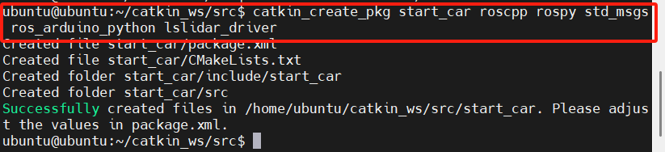
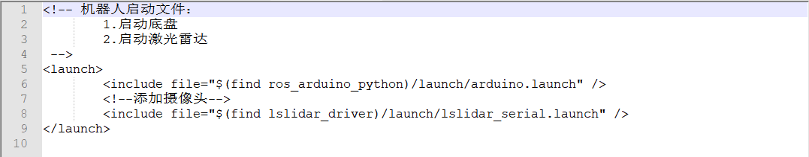
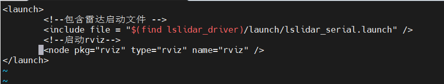
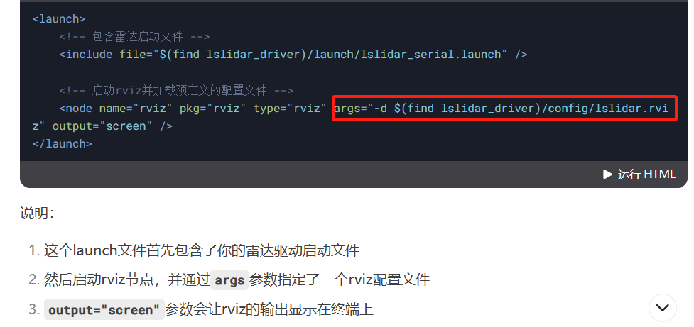
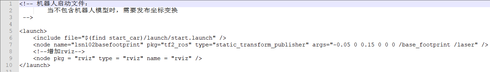
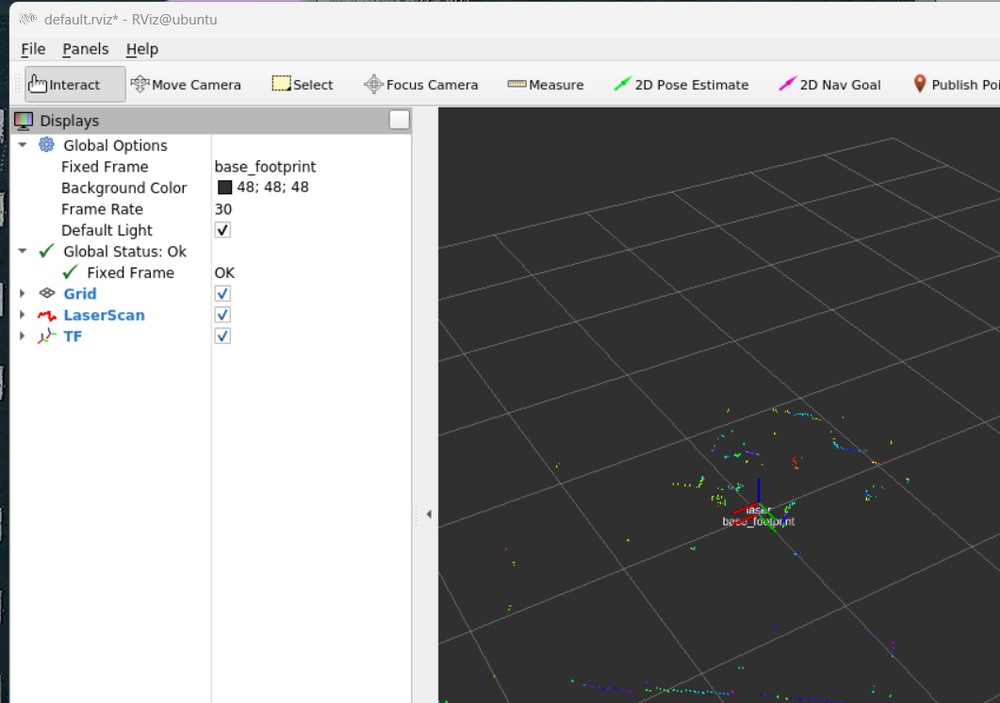
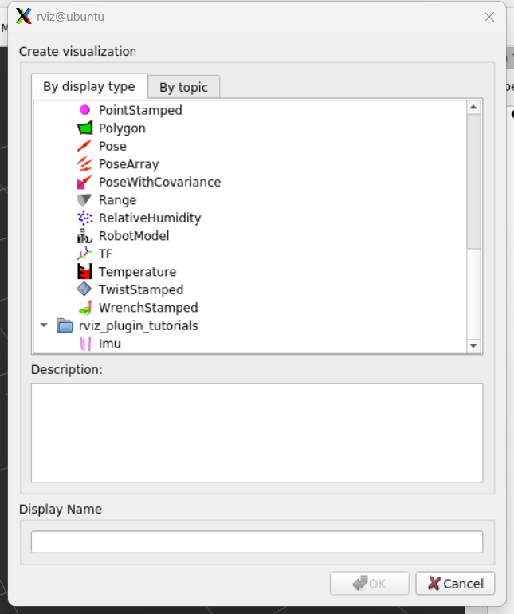
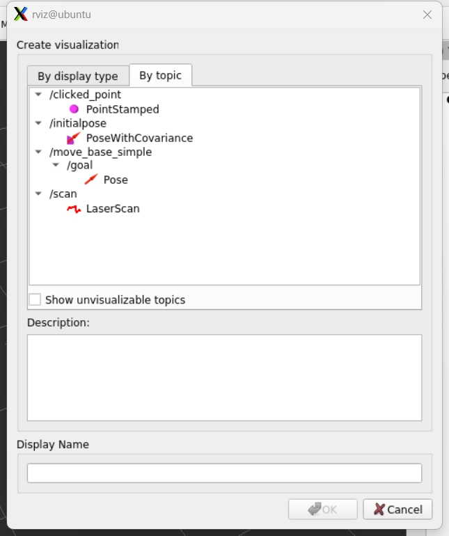

---lab
date: 2025-12-13
author: CCChiJi
category: 软件
tags: ROS
---

# 进行雷达建图的准备工作

地图的构建使用的是SLAM技术

目前有多种建图的方法：cartographer、gmapping... ...等，我下面采用的建图是gampping

!!! note ""
    - 首先要了解的是雷达建图中使用到的ROS系统所提供的通信方式是 **“话题通信”**：A发布一个话题C，B通过订阅该话题C知道A的情况，再采取对应行动
    - 而Gmapping所订阅的话题是：
        - 1.tf 
        - 2.scan
    - 也就是说要想运行gmapping建图，就应该提供其所需要的话题：
        - 1.你所设计的机器人各个部件之间的坐标变换（tf）
        - 2.雷达的扫描数据（scan）

## 1. 新建功能包

在你雷达所在工作空间中的src目录新建功能包，例如：



!!! note "说明"
    - **"catkin_ws"**是我建的工作空间
    - **"lsx10"**是雷达的官方功能包
    - **"start_car"**是我给SLAM建图所建的功能包
  
### 1.1 如何创建自己的功能包

#### 1.1.1 创建功能包指令及相关说明

指令格式:
```bash
catkin_create_pkg (自己设定的功能包名字) roscpp rospy std_msgs ros_arduino_python lslidar_driver
```

!!! note "说明"
    `catkin_create_pkg`创建功能包，其后必要的参数为：
    1. 功能包名 
    2. 所需要的依赖
   
由于我们这里是测试SLAM建图功能，并没把雷达放到机器人上，也没有机器人实体，所以我们启动机器人的时候只是启动雷达的扫描功能

查看雷达官方的资料包可知

雷达扫描功能的launch文件在 **ROS1-SDK->lsx10->lslidar_driver->launch** 中

因此可知lslidar_driver是lsx10中的一个功能包，所以要启动雷达的扫描功能需要把lslidar_driver功能包包含到我们创建的功能包中，也就是为什么我在依赖里面最后加入了“lslidar_driver”

!!! tip "tip"
    launch 文件是 ROS（机器人操作系统） 中用于批量启动多个节点、设置节点参数、配置 ROS 系统环境的核心配置文件，后缀为 .launch，基于 XML 语法编写

!!! note "说明"
    - roscpp：c++
    - rospy：python
    - std_msgs：消息的标准类型
    - 一般我们创建功能包都默认添加这三个依赖，帮助我们编写执行文件（launch文件）

如果你已经做好了底盘，那么`ros_arduino_python`是底盘的功能包，这里也加进去，方便后续一起启动

#### 1.1.2 创建launch文件夹
在创建好的功能包中创建launch文件夹

指令:
```bash
mkdir launch
```

#### 1.1.3 创建相关的launch文件

在launch文件夹中创建相关的launch文件

指令:
```bash
sudo vi strat.launch
```

其中 **start** 是文件名，自定义即可

该启动文件具体内容参考以下内容:



图中注释有误，代码可直接复制以下内容:

```XML
<!--
    机器人启动文件:
    1.启动底盘 （当前可选）
    2.启动激光雷达
-->

<launch>
        <!-- 如果你做好了底盘则添加底盘启动文件，如果没有就不添加，只添加雷达 -->
        <include file = "$(find ros_arduino_python)/launch/arduino.launch" />
        <!-- 添加雷达启动文件 -->
        <include file = "$(find lslidar_driver)/launch/lslidar_serial.launch" />
</launch>

```

!!! note "说明"
    - `<launch>`和`</launch>`是launch文件固定的格式，即开头和结尾必须是这个
    - `<include file="$(find lslidar_driver)/launch/lslidar_serial.launch" />`该句中find后面就是让ros系统在该功能包(`lslidar_driver`)去找所对应需要执行的文件(`lslidar_serial.launch`)

该步完成后你会在你创建的功能包的launch文件夹下看到你的这个strat.launch文件（假设你文件名和我一样）

#### 1.1.4 测试

然后你可以测试一下这个文件（先单独测试雷达官方功能包的launch文件）

1. cd (直接回到最开始的目录)
2. roscore
3. 新开终端，`cd (你所创建的工作空间名)`
4. source ./devel/setup.bash   (刷新环境变量)
5. roslaunch (你所创建的功能包名) (你所创建的launch文件名)

!!! note ""
    正常情况下你会看到和运行雷达官方功能包的同样的输出，如果报错就把报错复制去搜或问AI，一般应该是语法（拼写、缩进）有问题

## 2. 使用优化

这个文件只是启动了雷达，但是具体的可视化需要打开rviz，就可以通过单独新开终端并输入“rviz”开启，该过程较为繁琐，因此可以在launch文件中添加该节点直接启动

### 2.1 修改launch文件

参考下图:


即在添加雷达启动文件后添加启动rviz

```XML
<!--
    机器人启动文件:
    1.启动底盘 （当前可选）
    2.启动激光雷达
-->

<launch>
        <!-- 如果你做好了底盘则添加底盘启动文件，如果没有就不添加，只添加雷达 -->
        <include file = "$(find ros_arduino_python)/launch/arduino.launch" />
        <!-- 添加雷达启动文件 -->
        <include file = "$(find lslidar_driver)/launch/lslidar_serial.launch" />
        <!-- 启动rviz -->
        <node pkg = "rviz" type = "rviz" name = "rviz" />
</launch>
```

!!! note "关于node"
    - 在 ROS 1 的 launch 文件里，`<node>` 标签的核心格式是 `<node name="节点名" pkg="功能包名" type="可执行文件名" [可选参数] />`。
    - 以下三个参数是必填项:
        - name ：是节点在 ROS 网络的唯一标识，会覆盖程序内的节点名
        - pkg ：是节点所属的功能包
        - type ：是功能包里要运行的可执行文件或脚本
    - 常用可选参数有:
        - output="screen"，能把节点打印信息输出到终端
        - respawn="true" 让节点意外退出后自动重启
        - required="true" 标记节点为必需，它退出则所有节点都终止
        - ns="命名空间" 给节点划分命名空间避免冲突
        - args 用来传递命令行参数

运行launch文件后会直接启动rviz，但是配置是默认配置，因为这里还只是测试，就不专门配一个配置，如果有需要可以自己配置一个，如下图:



下面的launch文件也可以增加rviz节点，不再单独说明

## 3. 整合

### 3.1 创建启动+坐标变换（tf）文件

在launch文件夹下创建启动+坐标变换（tf）文件

输入
```bash
sudo vi start_tf.launch
```
`start_tf`是我给这个launch文件设定的名字，自定义即可

内容参考下图:



```XML
<!-- 
启动文件：
当不包含机器人模型时，需要发布静态坐标变换
-->

<launch>
    <!-- 添加启动文件 -->
    <include file="$(find start_car)/launch/start.launch" />
    <!-- 添加静态坐标变换 -->
    <node name = "lsn102basefootprint" pkg = "tf2_ros" type = "static_transform_publisher" args = "-0.05 0 0.15 0 0 0 /base_footprint /laser" />
    <!-- 添加rviz -->
    <node pkg = "rviz" name = "rviz" type = "rviz" />
</launch>

```

!!! note "说明"
    - 开头和结尾不再赘述<br>
    - 第二行为包含我们刚才创建的雷达启动launch文件，这样我们启动坐标变换就可以顺便启动雷达<br>
    - 第三行为雷达和我们所设定的机器人基坐标系之间的tf变换：<br>
    - `node name=lslidartobasefootprint`关键在于
        - `node name`即“节点名称”（ros里面的各种任务都是靠各个节点的运行和各个节点之间的通信完成），节点名称自己定义；
        - `pkg`是你这个节点所使用的功能包“tf2_ros”是ros内置的坐标转换功能包
        - `type`是功能包所使用的类型“static_transform_publisher”即静态坐标发布，也就是说你所设定的机器人部件之间的坐标关系是静态的，不会改变
        - `args`是该功能包执行所需要的参数
    - `-0.05 0 0.15` ：雷达相对于底盘坐标系的xyz偏移（x = -0.05, y = 0, z = 0.15 单位：m）
    - `0 0 0` ：雷达相对于底盘坐标系的欧拉角偏移（roll = 0, pitch = 0, yaw = 0单位：弧度）
    - `/base_footprint` :第一个坐标系（底盘的）
    - `/laser`:第二个坐标系（雷达的）

### 3.2 测试

1. 第一个终端输入`roscore`
2. 开启第二个终端并输入`cd (你所创建的工作空间)`
3. 再输入`source ./devel/setup.bash`刷新环境变量
4. 再输入`roslaunch (你所创建的功能包名) (你所创建的tf的launch文件)`
5. 在开启的rviz中按照如下配置

主要添加：
1. TF   
2. Laserscan
   
其中Fixed Frame需要设置为：**base_footprint**



#### 3.2.1 添加组件

rviz的左下会有一个 **add**按钮，点击添加组件

TF所在位置:



scan是雷达发布的一个话题，因此需要从`By topic`中添加
scan所在位置:

