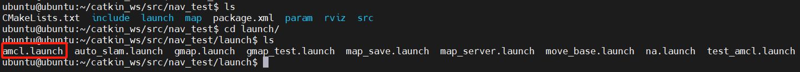
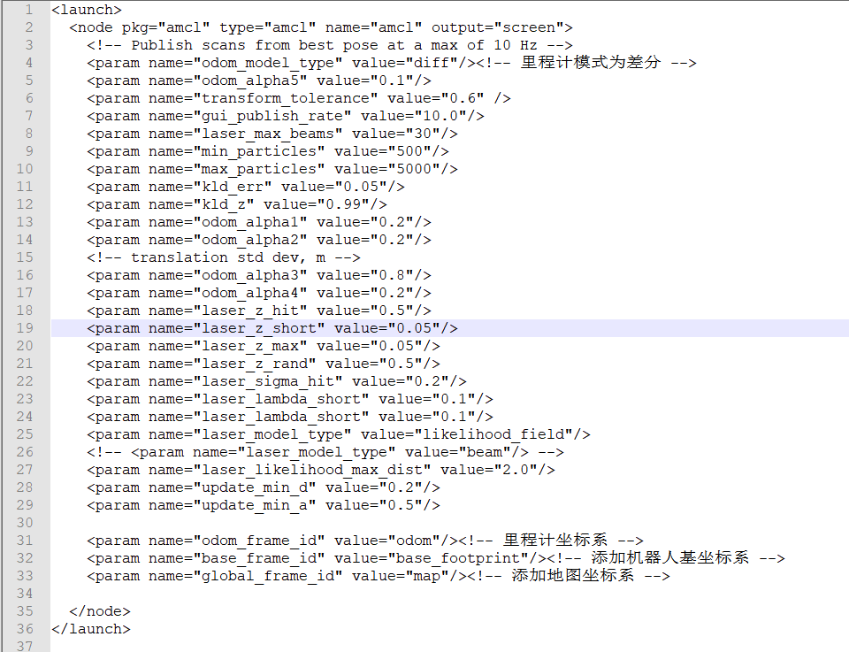
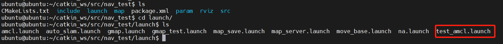
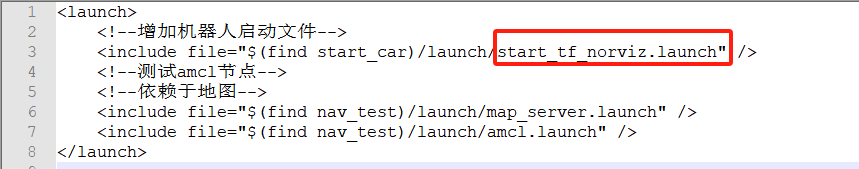
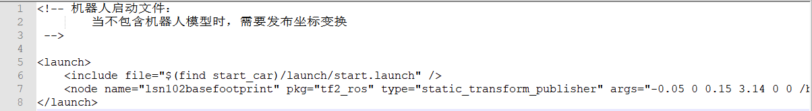
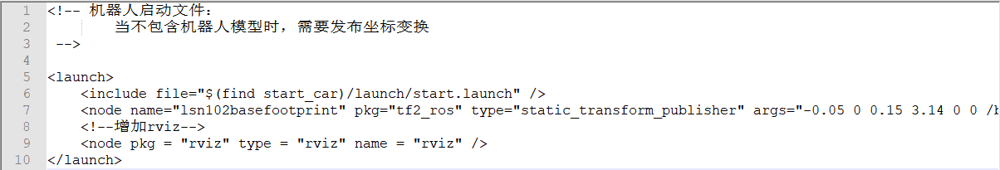
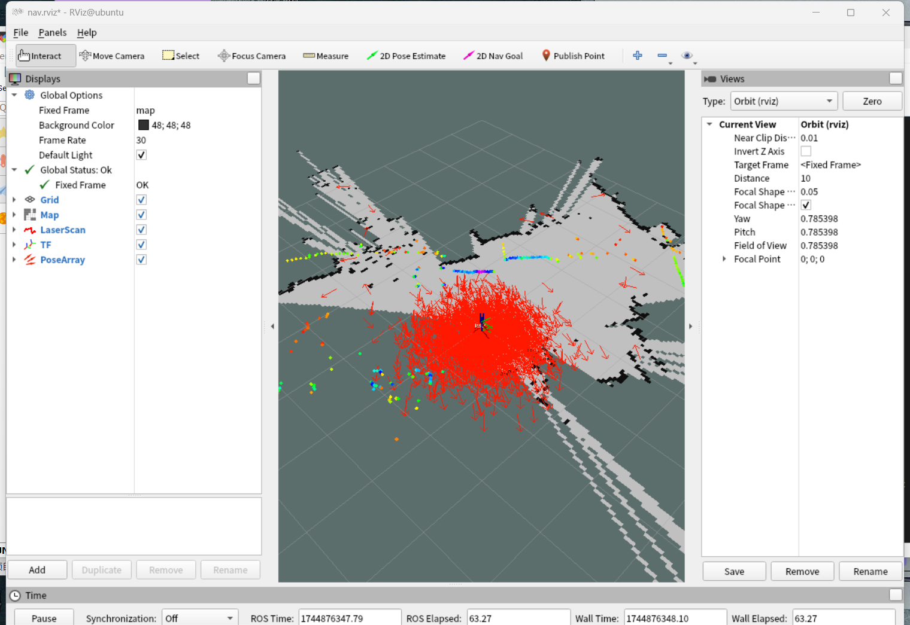
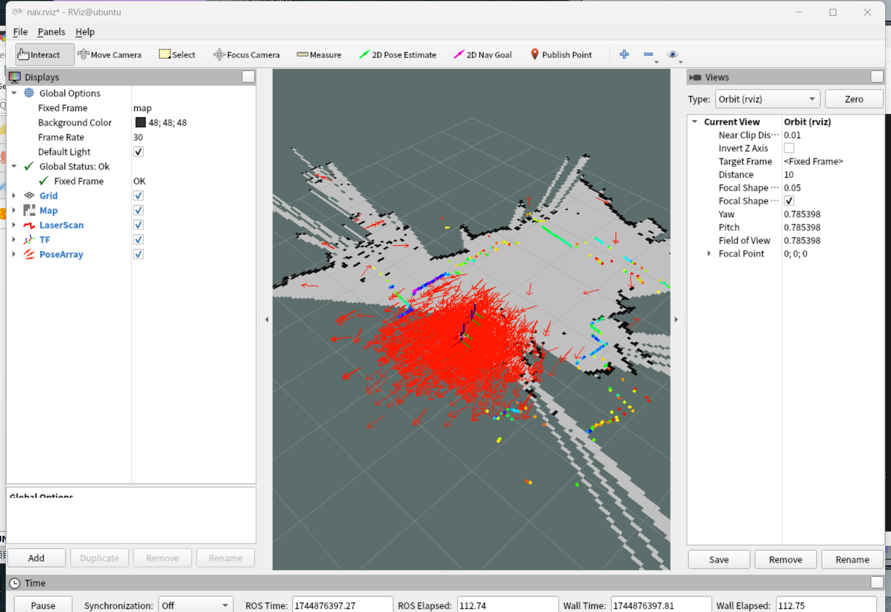

---lab
date: 2025-12-14
author: CCChiJi
category: 软件
tags: ROS
---

# AMCL定位

!!! tip "tips"
    目前感觉amcl定位没有一个纠正的功能，即如果实体车在移动时，外力推动了一下车体，导致车体发生偏移，此时amcl并不会纠正车体的定位，后续会改为使用雷达判断车体在地图中的位置。

## 1. amcl实现

### 1.1 amcl.launch文件

在nav_test功能包的launch文件夹下创建amcl.launch文件
```bash
sudo vi amcl.launch
```



launch文件中内容如下（可直接复制）

```XML
<launch>
  <node pkg="amcl" type="amcl" name="amcl" output="screen">
    <!-- Publish scans from best pose at a max of 10 Hz -->
    <param name="odom_model_type" value="diff"/><!-- 里程计模式为差分 -->
    <param name="odom_alpha5" value="0.1"/>
    <param name="transform_tolerance" value="0.6" />
    <param name="gui_publish_rate" value="10.0"/>
    <param name="laser_max_beams" value="30"/>
    <param name="min_particles" value="500"/>
    <param name="max_particles" value="5000"/>
    <param name="kld_err" value="0.05"/>
    <param name="kld_z" value="0.99"/>
    <param name="odom_alpha1" value="0.2"/>
    <param name="odom_alpha2" value="0.2"/>
    <!-- translation std dev, m -->
    <param name="odom_alpha3" value="0.8"/>
    <param name="odom_alpha4" value="0.2"/>
    <param name="laser_z_hit" value="0.5"/>
    <param name="laser_z_short" value="0.05"/>
    <param name="laser_z_max" value="0.05"/>
    <param name="laser_z_rand" value="0.5"/>
    <param name="laser_sigma_hit" value="0.2"/>
    <param name="laser_lambda_short" value="0.1"/>
    <param name="laser_lambda_short" value="0.1"/>
    <param name="laser_model_type" value="likelihood_field"/>
    <!-- <param name="laser_model_type" value="beam"/> -->
    <param name="laser_likelihood_max_dist" value="2.0"/>
    <param name="update_min_d" value="0.2"/>
    <param name="update_min_a" value="0.5"/>

    <param name="odom_frame_id" value="odom"/><!-- 里程计坐标系 -->
    <param name="base_frame_id" value="base_footprint"/><!-- 添加机器人基坐标系 -->
    <param name="global_frame_id" value="map"/><!-- 添加地图坐标系 -->

  </node>
</launch>
```



然后保存退出

### 1.2 测试amcl

还是在nav_test的launch文件夹下新建test_amcl.launch文件
```bash
sudo vi test_amcl.launch
```



launch文件中内容如下（可直接复制）
```XML
<launch>
	<!--增加机器人启动文件-->
	<include file="$(find start_car)/launch/start_tf_norviz.launch" />
	<!--测试amcl节点-->
	<!--依赖于地图-->
	<include file="$(find nav_test)/launch/map_server.launch" />
	<include file="$(find nav_test)/launch/amcl.launch" />
</launch>

```



!!! note "说明"
    注意这里是直接把tf变换、雷达启动和底盘启动一起包含了，但是原来的文件中还添加了启动rviz，这里选择手动启动rviz配置相关组件，也可以选择就使用原来的启动文件（包含启动rviz）

start_tfnorviz.launch内容如下
```XML
<!-- 
机器人启动文件：
    当不包含机器人模型时，需要发布坐标变换
 -->

<launch>
    <include file="$(find start_car)/launch/start.launch" />
    <node name="lsn102basefootprint" pkg="tf2_ros" type="static_transform_publisher" args="-0.05 0 0.15 3.14 0 0 /base_footprint /laser" />
</launch>

```



对比start_tf.launch文件：



只是去掉了启动rviz

test_amcl.launch文件写完后保存退出，可以在catkin_ws中catkin_make编译一下（可选）

编译完成后:

1. source ./devel/setup.bash声明一下环境变量
2. 再roslaunch nav_test test_amcl.launch
3. 新开终端输入rviz
4. 在添加中选择by topic添加map，laserscan，tf，posearray如下图



移动一下轮子可以看到箭头方向发生变化



