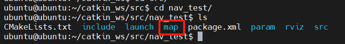
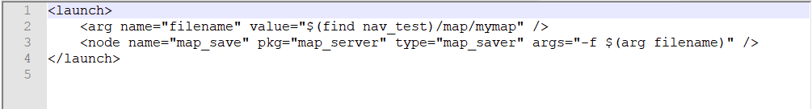
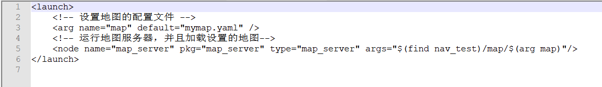
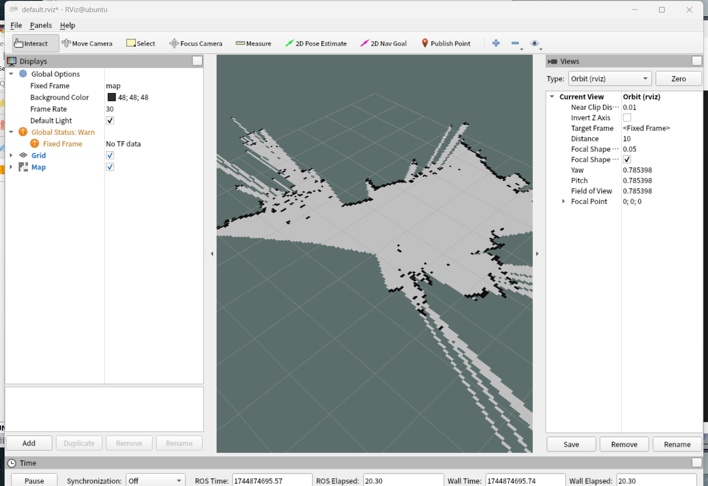

---lab
date: 2025-12-14
author: CCChiJi
category: 软件
tags: ROS
---

# 地图保存与地图服务

导航工作需要使用到建好的地图，因此需要把建图的地图进行保存，并可服务于导航的使用

## 1. 地图保存实现

!!! note "前提条件"
    需要有Map话题的发布，因此可以在保持开启gmapping建图时使用地图保存。

### 1.1 创建存储地图的文件夹

在nav_test文件夹下创建map文件夹用来保存地图

*nav_test是上一章节 ***Gmapping建图*** 中创建的功能包，有关导航的所有文件都存放在该功能包中*

`cd`到nav_test(你创建的导航功能包)中后输入:
```bash
sudo mkdir map
```



### 1.2 地图保存launch文件

在导航功能包的launch目录下新建文件：map_save.launch

`cd`到launch目录下后输入指令:
```bash
sudo vi map_save.launch
```



可直接复制
```XML
<launch>
    <!-- 将保存路径作为参数，方便更改 -->
    <arg name="filename" value="$(find nav_test)/map/mymap" />
    <!-- 地图服务节点 -->
    <node name="map_save" pkg="map_server" type="map_saver" args="-f $(arg filename)" />
</launch>
```

!!! note "说明"
    - 注意这里的第二句末尾`args="-f $(arg filename)"`这里就指定了保存的路径和文件名称
    - 第一句就是指定的保存路径和文件名称
    - 路径：nav_test/map（可自定义）
    - 名称：mymap（可自定义）

保存退出后可以在工作空间的根目录下`catkin_make`编译一下

当gmapping在运行时，新开终端运行`map_save.launch`就可以保存地图到map文件夹中，并以mymap（可自定义）命名

1. 运行建图
2. 新开终端
3. `cd`到工作空间
4. `source ./devel/setup.bash`刷新环境变量
5. `roslaunch nav_test map_save.launch`
6. 到map文件夹中查看是否有保存的地图

## 2. 地图服务实现

在已有地图的情况下，使用地图服务可以查看地图

### 2.1 地图服务launch文件
在nav_test的launch文件夹中新建map_server.launch:
```bash
sudo vi map_server.launch
```



可直接复制
```XML
<launch>
    <!-- 设置地图来源 -->
    <arg name="map" default="mymap.yaml" />
    <!-- 运行地图服务器，并且加载设置的地图-->
    <node name="map_server" pkg="map_server" type="map_server" args="$(find nav_test)/map/$(arg map)"/>
</launch>
```

!!! note "说明"
    这个launch文件会加载名称为map的ymal文件，默认加载mymap.ymal的文件，
    名称是可以自定义的，但是要确保default后面的文件的确存在，否则无法加载地图

保存退出后可以在工作空间的根目录下`catkin_make`编译一下

运行这个文件时不需要运行建图，运行这个文件后可以手动开启rviz（也可以在launch文件中添加`<node pkg = “rviz”...  />`来一起启动）添加by topic中的map组件会显示保存的地图

1. `cd`到工作空间根目录
2. `source ./devel/setup.bash`刷新环境变量
3. `roslaunch nav_test map_server.launch`
4. 输入`rviz`打开rviz
5. 添加`map`组件

正常会显示你之前建图所保存的地图

