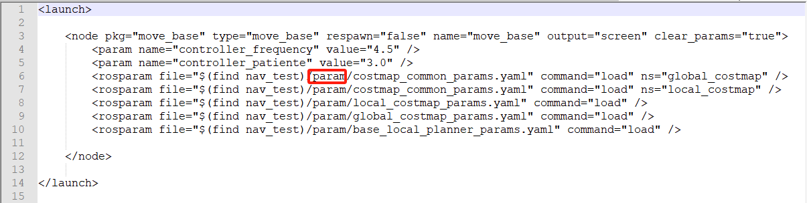
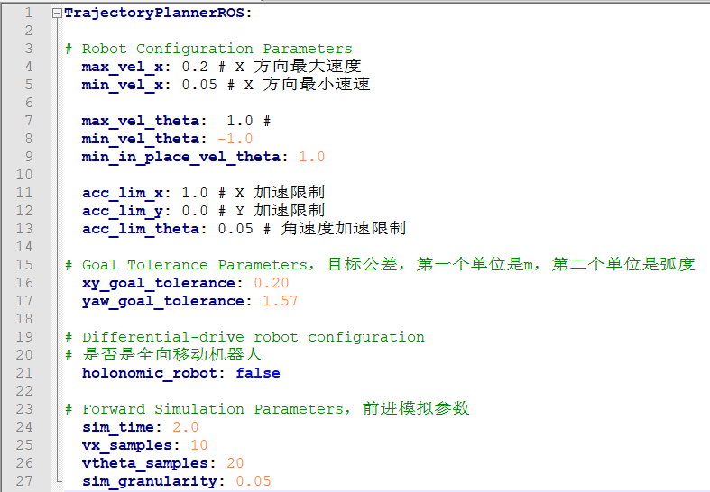
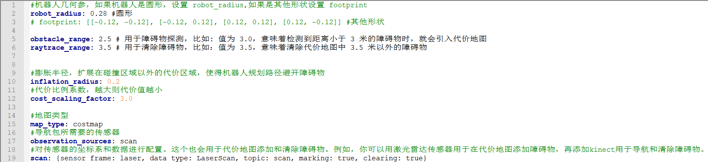
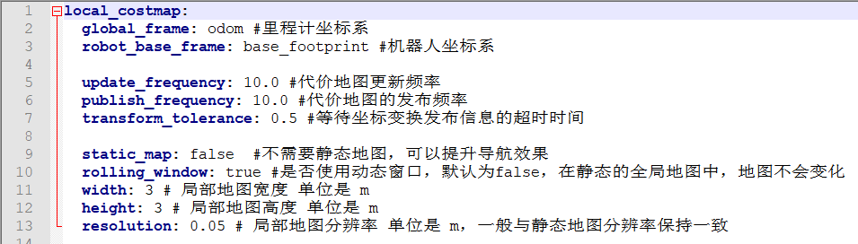
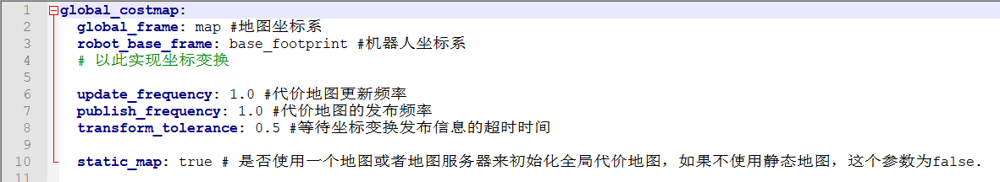
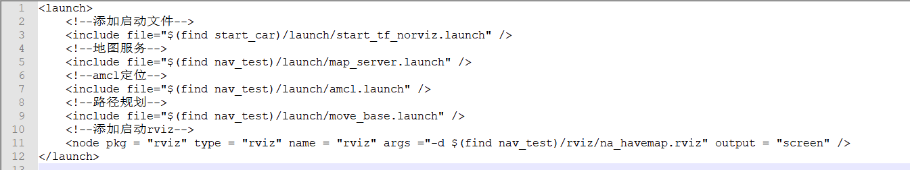
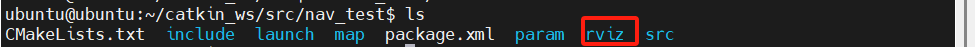
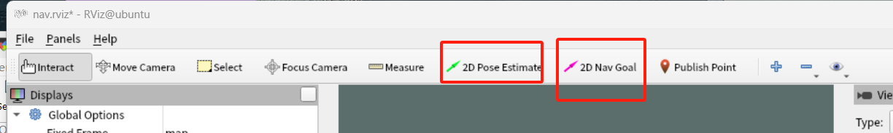

---lab
date: 2025-12-16
author: CCChiJi
category: 软件
tags: ROS
---

# 路径规划

路径规划主要依靠move_base

## 1. move_base文件实现

### 1.1 

在nav_test功能包的launch文件夹下新建move_base.launch文件
```bash
sudo vi move_base.launch
```

内容参考如下(可直接复制):

```XML
<launch>

    <node pkg="move_base" type="move_base" respawn="false" name="move_base" output="screen" clear_params="true">
		<param name="controller_frequency" value="4.5" />
		<param name="controller_patiente" value="3.0" />
        <rosparam file="$(find nav_test)/param/costmap_common_params.yaml" command="load" ns="global_costmap" />
        <rosparam file="$(find nav_test)/param/costmap_common_params.yaml" command="load" ns="local_costmap" />
        <rosparam file="$(find nav_test)/param/local_costmap_params.yaml" command="load" />
        <rosparam file="$(find nav_test)/param/global_costmap_params.yaml" command="load" />
        <rosparam file="$(find nav_test)/param/base_local_planner_params.yaml" command="load" />

    </node>
		
</launch>

```




!!! note "注意"
    文件中有`(find nav_test)/param/...`即move_base所需要的参数文件,里面只用到了四个，但不是说只有四个,只是这里基础用这几个足够了

因此在nav_test功能包下新建param文件夹
```bash
mkdir param
```

按照launch文件夹中所需文件在param中创建对应的yaml文件

#### 1.1.1 base_local_planner_params

创建**base_local_planner_params**文件
```bash
sudo vi base_local_planner_params.yaml
```

内容参考如下(可直接复制):
```yaml
TrajectoryPlannerROS:

# Robot Configuration Parameters
  max_vel_x: 0.2 # X 方向最大速度
  min_vel_x: 0.05 # X 方向最小速速

  max_vel_theta:  1.0 # 
  min_vel_theta: -1.0
  min_in_place_vel_theta: 1.0

  acc_lim_x: 1.0 # X 加速限制
  acc_lim_y: 0.0 # Y 加速限制
  acc_lim_theta: 0.05 # 角速度加速限制

# Goal Tolerance Parameters，目标公差，第一个单位是m，第二个单位是弧度
  xy_goal_tolerance: 0.20
  yaw_goal_tolerance: 1.57

# Differential-drive robot configuration
# 是否是全向移动机器人
  holonomic_robot: false

# Forward Simulation Parameters，前进模拟参数
  sim_time: 2.0
  vx_samples: 10
  vtheta_samples: 20
  sim_granularity: 0.05

```



#### 1.1.2 costmap_common_params

创建**costmap_common_params.yaml**文件
```bash
sudo vi costmap_common_params.yaml
```

内容参考如下(可直接复制):
```yaml
#机器人几何参，如果机器人是圆形，设置 robot_radius,如果是其他形状设置 footprint
robot_radius: 0.28 #圆形
# footprint: [[-0.12, -0.12], [-0.12, 0.12], [0.12, 0.12], [0.12, -0.12]] #其他形状

obstacle_range: 2.5 # 用于障碍物探测，比如: 值为 3.0，意味着检测到距离小于 3 米的障碍物时，就会引入代价地图
raytrace_range: 3.5 # 用于清除障碍物，比如：值为 3.5，意味着清除代价地图中 3.5 米以外的障碍物


#膨胀半径，扩展在碰撞区域以外的代价区域，使得机器人规划路径避开障碍物
inflation_radius: 0.2
#代价比例系数，越大则代价值越小
cost_scaling_factor: 3.0

#地图类型
map_type: costmap
#导航包所需要的传感器
observation_sources: scan
#对传感器的坐标系和数据进行配置。这个也会用于代价地图添加和清除障碍物。例如，你可以用激光雷达传感器用于在代价地图添加障碍物，再添加kinect用于导航和清除障碍物。
scan: {sensor_frame: laser, data_type: LaserScan, topic: scan, marking: true, clearing: true}

```



#### 1.1.3 local_costmap_params

创建**local_costmap_params.yaml**文件
```bash
sudo vi local_costmap_params.yaml
```

内容参考如下(可直接复制):
```yaml
local_costmap:
  global_frame: odom #里程计坐标系
  robot_base_frame: base_footprint #机器人坐标系

  update_frequency: 10.0 #代价地图更新频率
  publish_frequency: 10.0 #代价地图的发布频率
  transform_tolerance: 0.5 #等待坐标变换发布信息的超时时间

  static_map: false  #不需要静态地图，可以提升导航效果
  rolling_window: true #是否使用动态窗口，默认为false，在静态的全局地图中，地图不会变化
  width: 3 # 局部地图宽度 单位是 m
  height: 3 # 局部地图高度 单位是 m
  resolution: 0.05 # 局部地图分辨率 单位是 m，一般与静态地图分辨率保持一致

```



#### 1.1.4 global_costmap_params

创建**global_costmap_params.yaml**文件
```bash
sudo vi global_costmap_params.yaml
```

```yaml
global_costmap:
  global_frame: map #地图坐标系
  robot_base_frame: base_footprint #机器人坐标系
  # 以此实现坐标变换

  update_frequency: 1.0 #代价地图更新频率
  publish_frequency: 1.0 #代价地图的发布频率
  transform_tolerance: 0.5 #等待坐标变换发布信息的超时时间

  static_map: true # 是否使用一个地图或者地图服务器来初始化全局代价地图，如果不使用静态地图，这个参数为false.

```



这些文件写好后保存退出

## 2. 导航

### 2.1 导航launch文件

在nav_test的launch文件夹下新建na.launch文件
```bash
sudo vi na.launch
```

launch文件中内容如下(可直接复制):
```XML
<launch>
	<!--添加启动文件-->
	<include file="$(find start_car)/launch/start_tf_norviz.launch" />
	<!--地图服务-->
	<include file="$(find nav_test)/launch/map_server.launch" />
	<!--amcl定位-->
	<include file="$(find nav_test)/launch/amcl.launch" />
	<!--路径规划-->
	<include file="$(find nav_test)/launch/move_base.launch" />
	<!--添加启动rviz-->
	<node pkg = "rviz" type = "rviz" name = "rviz" args ="-d $(find nav_test)/rviz/na_havemap.rviz" output = "screen" />
</launch>

```



!!! note "说明"
    这里的rviz我给了对应的配置<br>
    在rviz的文件夹里有<br>
    但也要在nav_test功能包下创建用于存放配置的文件夹rviz

```bash
sudo mkdir rviz
```



其中内容为:(可直接复制)
```XML
Panels:
  - Class: rviz/Displays
    Help Height: 78
    Name: Displays
    Property Tree Widget:
      Expanded:
        - /Global Options1
        - /Status1
      Splitter Ratio: 0.5
    Tree Height: 545
  - Class: rviz/Selection
    Name: Selection
  - Class: rviz/Tool Properties
    Expanded:
      - /2D Pose Estimate1
      - /2D Nav Goal1
      - /Publish Point1
    Name: Tool Properties
    Splitter Ratio: 0.5886790156364441
  - Class: rviz/Views
    Expanded:
      - /Current View1
    Name: Views
    Splitter Ratio: 0.5
  - Class: rviz/Time
    Name: Time
    SyncMode: 0
    SyncSource: LaserScan
Preferences:
  PromptSaveOnExit: true
Toolbars:
  toolButtonStyle: 2
Visualization Manager:
  Class: ""
  Displays:
    - Alpha: 0.5
      Cell Size: 1
      Class: rviz/Grid
      Color: 160; 160; 164
      Enabled: true
      Line Style:
        Line Width: 0.029999999329447746
        Value: Lines
      Name: Grid
      Normal Cell Count: 0
      Offset:
        X: 0
        Y: 0
        Z: 0
      Plane: XY
      Plane Cell Count: 10
      Reference Frame: <Fixed Frame>
      Value: true
    - Alpha: 0.699999988079071
      Class: rviz/Map
      Color Scheme: map
      Draw Behind: false
      Enabled: true
      Name: Map
      Topic: /map
      Unreliable: false
      Use Timestamp: false
      Value: true
    - Alpha: 1
      Autocompute Intensity Bounds: true
      Autocompute Value Bounds:
        Max Value: 10
        Min Value: -10
        Value: true
      Axis: Z
      Channel Name: intensity
      Class: rviz/LaserScan
      Color: 255; 255; 255
      Color Transformer: Intensity
      Decay Time: 0
      Enabled: true
      Invert Rainbow: false
      Max Color: 255; 255; 255
      Min Color: 0; 0; 0
      Name: LaserScan
      Position Transformer: XYZ
      Queue Size: 10
      Selectable: true
      Size (Pixels): 3
      Size (m): 0.03999999910593033
      Style: Flat Squares
      Topic: /scan
      Unreliable: false
      Use Fixed Frame: true
      Use rainbow: true
      Value: true
    - Class: rviz/TF
      Enabled: true
      Filter (blacklist): ""
      Filter (whitelist): ""
      Frame Timeout: 15
      Frames:
        All Enabled: true
        base_footprint:
          Value: true
        laser:
          Value: true
        map:
          Value: true
        odom:
          Value: true
      Marker Alpha: 1
      Marker Scale: 1
      Name: TF
      Show Arrows: true
      Show Axes: true
      Show Names: true
      Tree:
        map:
          odom:
            base_footprint:
              laser:
                {}
      Update Interval: 0
      Value: true
    - Alpha: 0.699999988079071
      Class: rviz/Map
      Color Scheme: map
      Draw Behind: false
      Enabled: true
      Name: Map_global
      Topic: /move_base/global_costmap/costmap
      Unreliable: false
      Use Timestamp: false
      Value: true
    - Alpha: 0.699999988079071
      Class: rviz/Map
      Color Scheme: map
      Draw Behind: false
      Enabled: true
      Name: Map_local
      Topic: /move_base/local_costmap/costmap
      Unreliable: false
      Use Timestamp: false
      Value: true
    - Alpha: 1
      Buffer Length: 1
      Class: rviz/Path
      Color: 25; 255; 0
      Enabled: true
      Head Diameter: 0.30000001192092896
      Head Length: 0.20000000298023224
      Length: 0.30000001192092896
      Line Style: Lines
      Line Width: 0.029999999329447746
      Name: Path_global
      Offset:
        X: 0
        Y: 0
        Z: 0
      Pose Color: 255; 85; 255
      Pose Style: None
      Queue Size: 20
      Radius: 0.029999999329447746
      Shaft Diameter: 0.10000000149011612
      Shaft Length: 0.10000000149011612
      Topic: /move_base/TrajectoryPlannerROS/global_plan
      Unreliable: false
      Value: true
    - Alpha: 1
      Buffer Length: 1
      Class: rviz/Path
      Color: 255; 0; 0
      Enabled: true
      Head Diameter: 0.30000001192092896
      Head Length: 0.20000000298023224
      Length: 0.30000001192092896
      Line Style: Lines
      Line Width: 0.029999999329447746
      Name: Path_local
      Offset:
        X: 0
        Y: 0
        Z: 0
      Pose Color: 255; 85; 255
      Pose Style: None
      Queue Size: 20
      Radius: 0.029999999329447746
      Shaft Diameter: 0.10000000149011612
      Shaft Length: 0.10000000149011612
      Topic: /move_base/TrajectoryPlannerROS/local_plan
      Unreliable: false
      Value: true
  Enabled: true
  Global Options:
    Background Color: 48; 48; 48
    Default Light: true
    Fixed Frame: map
    Frame Rate: 30
  Name: root
  Tools:
    - Class: rviz/Interact
      Hide Inactive Objects: true
    - Class: rviz/MoveCamera
    - Class: rviz/Select
    - Class: rviz/FocusCamera
    - Class: rviz/Measure
    - Class: rviz/SetInitialPose
      Theta std deviation: 0.2617993950843811
      Topic: /initialpose
      X std deviation: 0.5
      Y std deviation: 0.5
    - Class: rviz/SetGoal
      Topic: /move_base_simple/goal
    - Class: rviz/PublishPoint
      Single click: true
      Topic: /clicked_point
  Value: true
  Views:
    Current:
      Class: rviz/Orbit
      Distance: 10
      Enable Stereo Rendering:
        Stereo Eye Separation: 0.05999999865889549
        Stereo Focal Distance: 1
        Swap Stereo Eyes: false
        Value: false
      Field of View: 0.7853981852531433
      Focal Point:
        X: 0
        Y: 0
        Z: 0
      Focal Shape Fixed Size: true
      Focal Shape Size: 0.05000000074505806
      Invert Z Axis: false
      Name: Current View
      Near Clip Distance: 0.009999999776482582
      Pitch: 0.785398006439209
      Target Frame: <Fixed Frame>
      Yaw: 0.785398006439209
    Saved: ~
Window Geometry:
  Displays:
    collapsed: false
  Height: 845
  Hide Left Dock: false
  Hide Right Dock: false
  QMainWindow State: 000000ff00000000fd000000040000000000000156000002adfc0200000008fb0000001200530065006c0065006300740069006f006e00000001e10000009b0000005c00fffffffb0000001e0054006f006f006c002000500072006f007000650072007400690065007302000001ed000001df00000185000000a3fb000000120056006900650077007300200054006f006f02000001df000002110000018500000122fb000000200054006f006f006c002000500072006f0070006500720074006900650073003203000002880000011d000002210000017afb000000100044006900730070006c006100790073010000003e000002ad000000ca00fffffffb0000002000730065006c0065006300740069006f006e00200062007500660066006500720200000138000000aa0000023a00000294fb00000014005700690064006500530074006500720065006f02000000e6000000d2000003ee0000030bfb0000000c004b0069006e0065006300740200000186000001060000030c00000261000000010000010f000002adfc0200000003fb0000001e0054006f006f006c002000500072006f00700065007200740069006500730100000041000000780000000000000000fb0000000a00560069006500770073010000003e000002ad000000a600fffffffb0000001200530065006c0065006300740069006f006e010000025a000000b200000000000000000000000200000490000000a9fc0100000001fb0000000a00560069006500770073030000004e00000080000002e10000019700000003000004b00000003efc0100000002fb0000000800540069006d00650100000000000004b00000031f00fffffffb0000000800540069006d006501000000000000045000000000000000000000023f000002ad00000004000000040000000800000008fc0000000100000002000000010000000a0054006f006f006c00730100000000ffffffff0000000000000000
  Selection:
    collapsed: false
  Time:
    collapsed: false
  Tool Properties:
    collapsed: false
  Views:
    collapsed: false
  Width: 1200
  X: 60
  Y: 60

```

!!! note "说明"
    这个内容不需要自己编写，可以打开rviz，在添加好自己的所需要的组件后保存文件到指定位置即可

### 2.2 测试移动

启动`na.launch`文件通过设定目标点让车进行移动（当前是需要在地图已经建好的情况下使用）



!!! tip "tips"
    - 绿色的箭头是设置初始位置（包括朝向）
    - 粉紫色的箭头是设置目标点及朝向