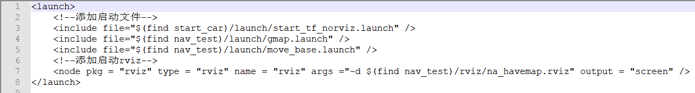
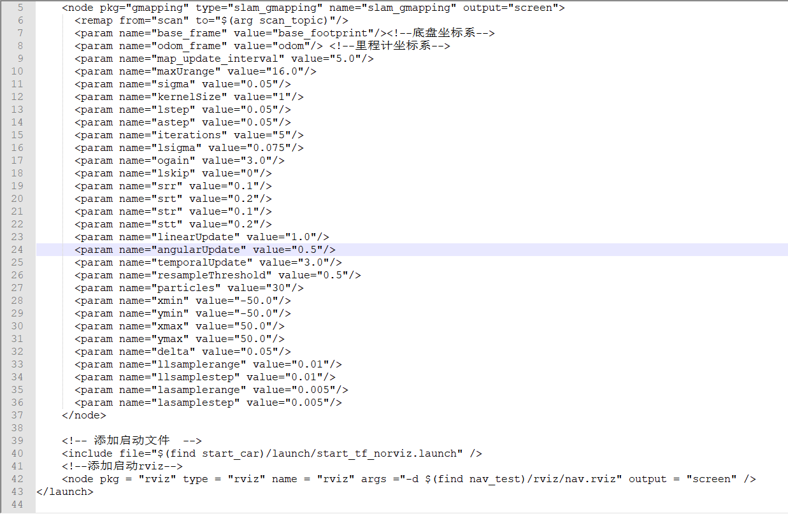
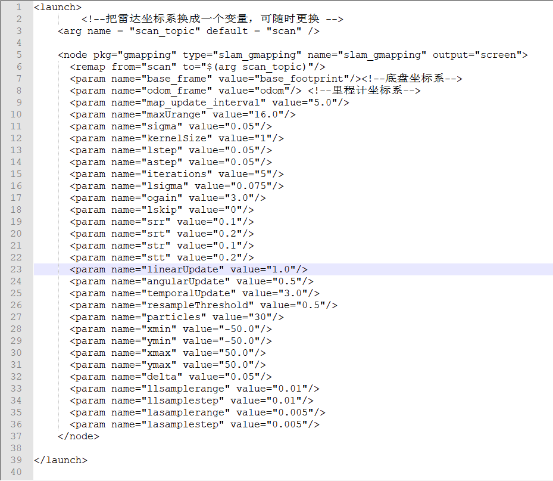

---lab
date: 2025-12-21
author: CCChiJi
category: 软件
tags: ROS
---

# 自主导航式建图

也就是需要在建图(gmapping)同时导航(move_base)，那么也就很清楚明了了

## 1. auto_slam.launch实现

在nav_test功能包的launch文件夹下新建auto_slam.launch文件
```bash
sudo vi auto_slam.launch
```

内容参考以下(可直接复制):
```XML
<launch>
	<!--添加启动文件，无rviz版本-->
	<include file="$(find start_car)/launch/start_tf_norviz.launch" />
    <!--添加建图文件，无rviz版本-->
	<include file="$(find nav_test)/launch/gmap.launch" />
    <!--添加导航文件-->
	<include file="$(find nav_test)/launch/move_base.launch" />
	<!--添加启动rviz-->
	<node pkg = "rviz" type = "rviz" name = "rviz" args ="-d $(find nav_test)/rviz/na_havemap.rviz" output = "screen" />
</launch>
```



!!! note "说明"
    - 然后只用启动这一个文件就可以一边建图一边导航了，不需要提前建好地图
    - 这个文件中rviz的配置就是上一个导航时做的配置
    - 值得注意的是这里的gampping文件是新建的没有启动rviz的gampping文件，只是在原来gmap_test.launch中删除了rviz和启动的部分

对比两个文件内容:

**gmap_test.launch:**



**gmap.launch:**



删除了一开始的启动(因为auto_slam.launch要启动，这里再启动一次会造成崩溃，因此启动部分删除)和rviz部分

启动流程:

1. cd到工作空间根目录
2. `source ./devel/setup.bash`刷新环境变量
3. `roslaunch nav_test auto_slam.launch`运行该文件
