---lab
date: 2025-12-3
author: CCChiJi
category: 软件
tags: ROS
---

# Ubuntu20.04安装ROS1

!!! tip "tips"
    所有指令的输入不需要全部敲，只用输入前几个字母再按Tab就会自动补齐或列出可选项

## Ubuntu20.04桌面安装

### 1. 换源

使用MobaXterm远程连接上树莓派以后

输入指令
```bash
sudo vim /etc/apt/sources.list
```

会弹出以下内容

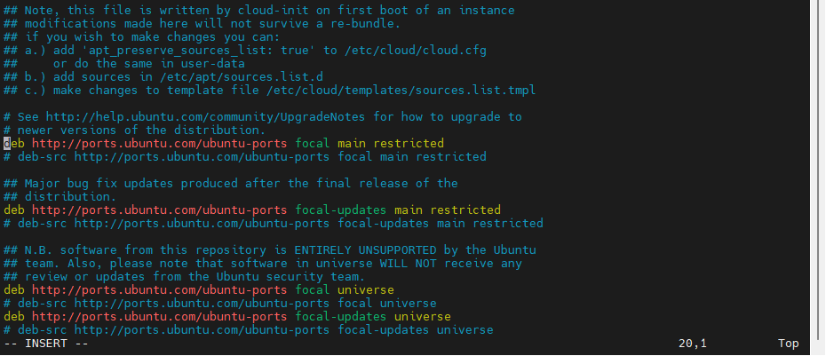

按<kbd>i</kbd>进入输入模式

将原来的源 *（前面 **没有加 #** 的）* 前面加上“#”注释掉

在最下面粘贴上国内的源

!!! tip ""
    我使用的是中科大源，清华源我在使用的时候后面会一直显示无法解包，具体原因不清楚

中科大源：

```bash
deb https://mirrors.ustc.edu.cn/ubuntu-ports/ focal main restricted universe multiverse
deb-src https://mirrors.ustc.edu.cn/ubuntu-ports/ focal main main restricted universe multiverse
deb https://mirrors.ustc.edu.cn/ubuntu-ports/ focal-updates main restricted universe multiverse
deb-src https://mirrors.ustc.edu.cn/ubuntu-ports/ focal-updates main restricted universe multiverse
deb https://mirrors.ustc.edu.cn/ubuntu-ports/ focal-backports main restricted universe multiverse
deb-src https://mirrors.ustc.edu.cn/ubuntu-ports/ focal-backports main restricted universe multiverse
deb https://mirrors.ustc.edu.cn/ubuntu-ports/ focal-security main restricted universe multiverse
deb-src https://mirrors.ustc.edu.cn/ubuntu-ports/ focal-security main restricted universe multiverse
# deb https://mirrors.ustc.edu.cn/ubuntu-ports/ focal-proposed main restricted universe multiverse
# deb-src https://mirrors.ustc.edu.cn/ubuntu-ports/ focal-proposed main restricted universe multiverse
```

清华源：

```bash
########   Ubuntu20.04LTS 清华镜像源   ###############
# 默认注释了源码镜像以提高 apt update 速度，如有需要可自行取消注释
deb https://mirrors.tuna.tsinghua.edu.cn/ubuntu/ focal main restricted universe multiverse
# deb-src https://mirrors.tuna.tsinghua.edu.cn/ubuntu/ focal main restricted universe multiverse
deb https://mirrors.tuna.tsinghua.edu.cn/ubuntu/ focal-updates main restricted universe multiverse
# deb-src https://mirrors.tuna.tsinghua.edu.cn/ubuntu/ focal-updates main restricted universe multiverse
deb https://mirrors.tuna.tsinghua.edu.cn/ubuntu/ focal-backports main restricted universe multiverse
# deb-src https://mirrors.tuna.tsinghua.edu.cn/ubuntu/ focal-backports main restricted universe multiverse
deb https://mirrors.tuna.tsinghua.edu.cn/ubuntu/ focal-security main restricted universe multiverse
# deb-src https://mirrors.tuna.tsinghua.edu.cn/ubuntu/ focal-security main restricted universe multiverse
 
# 预发布软件源，不建议启用
# deb https://mirrors.tuna.tsinghua.edu.cn/ubuntu/ focal-proposed main restricted universe multiverse
# deb-src https://mirrors.tuna.tsinghua.edu.cn/ubuntu/ focal-proposed main restricted universe multiverse
```

粘贴好后会是如图形式:

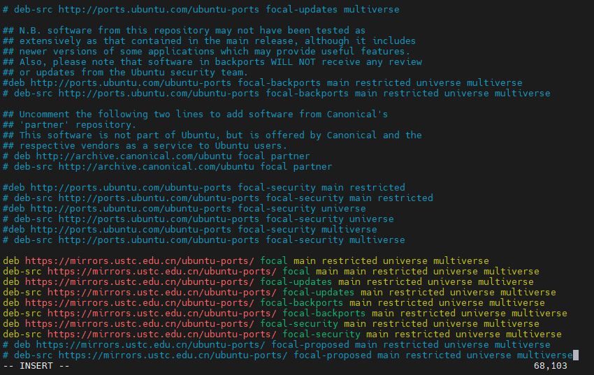

粘贴上后按<kbd>Esc</kbd>
先输入一个冒号 `:` *(英文输入)*

再输入
```bash
wq!
```

按<kbd>Enter</kbd>退出编辑

输入
```bash
sudo apt update
```

这个的速度和自己网速有关

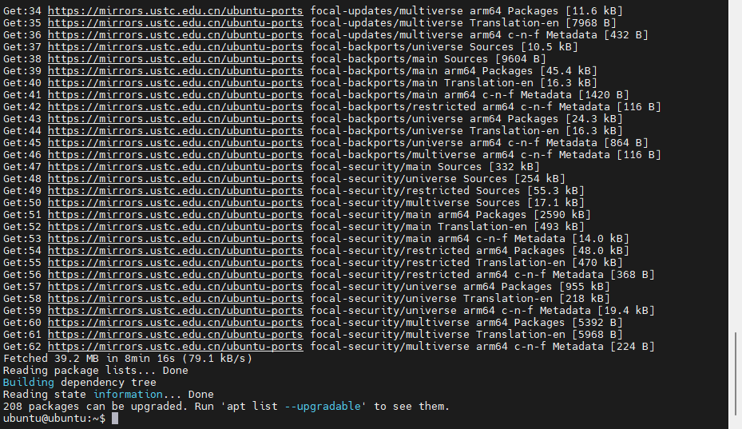

完成后

输入
```bash
sudo apt upgrade
```

或输入，可跳过下面一步 *（以防意外建议一步一步来查看安装是否有问题）*
```bash
sudo apt upgrade -y
```
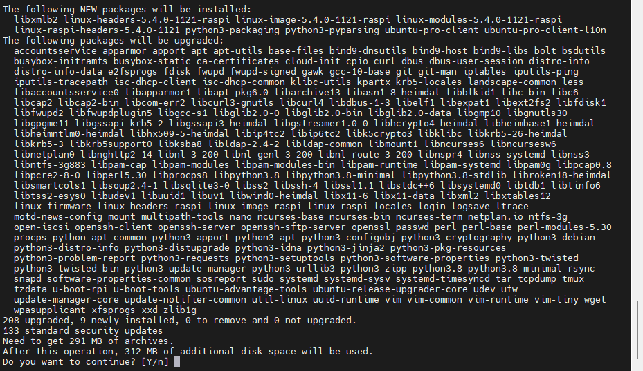

如果是`sudo apt upgrade`，此时需要输入`y/Y`

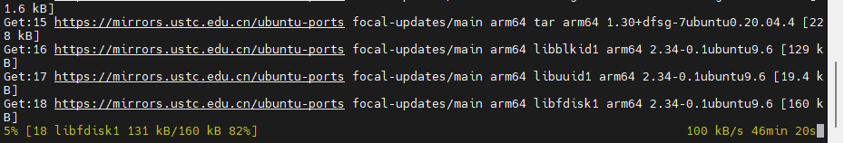

然后就等待更新，更新快慢和自己网速有关

!!! note "注意"
    如果出现断网或别的情况就先<kbd>ctrl</kbd>+<kbd>c</kbd>
    再

    `sudo reboot`

    重启一下
    然后再

    `sudo apt update`

    然后再
    `sudo apt upgrade`

    重新更新

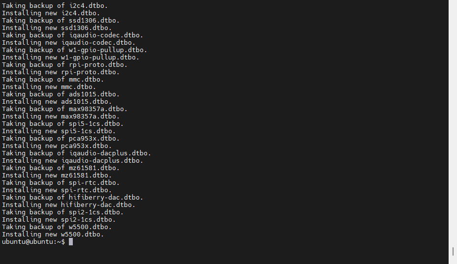

进行到这一步说明换源已完成

### 2. 安装Ubuntu桌面版

输入
```bash
sudo apt install ubuntu-desktop
```

或输入
```bash
sudo apt install ubuntu-desktop -y
```

可跳过下面一步 *（以防意外建议一步一步来查看安装是否有问题）*

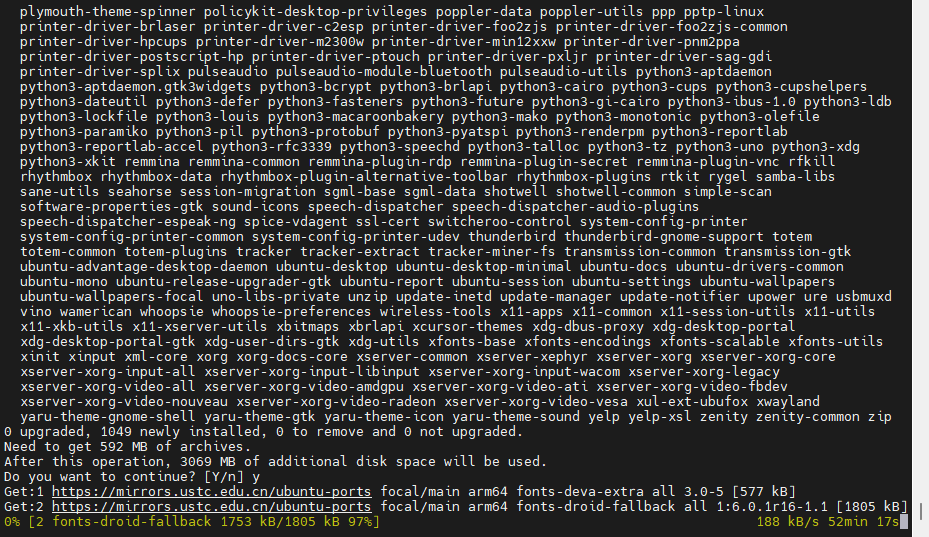

如果是`sudo apt install ubuntu-desktop`，此时需要输入`y/Y`

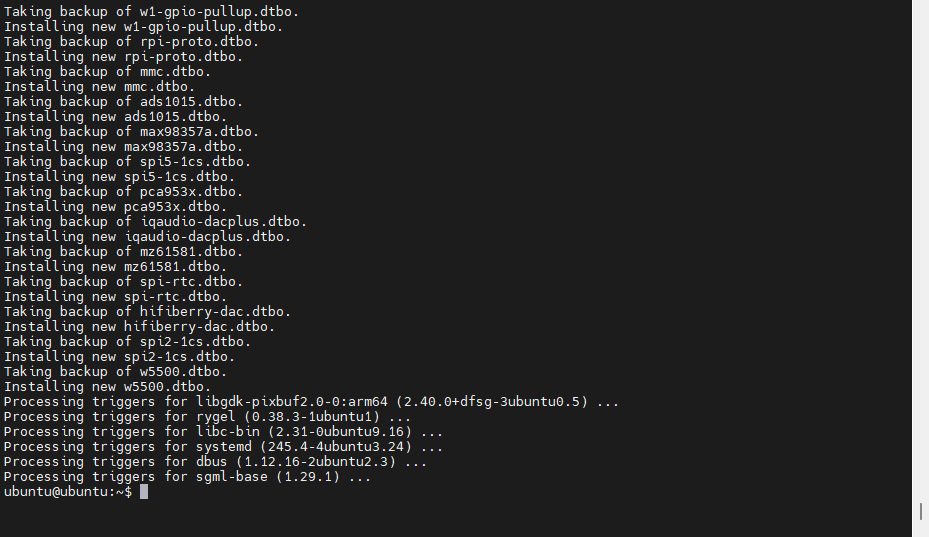

进行到这一步说明安装Ubuntu桌面版已完成

### 3. 安装xrdp

输入
```bash
sudo apt install xrdp
```

或输入
```bash
sudo apt install xrdp -y
```

可跳过下面一步 *（以防意外建议一步一步来查看安装是否有问题）*

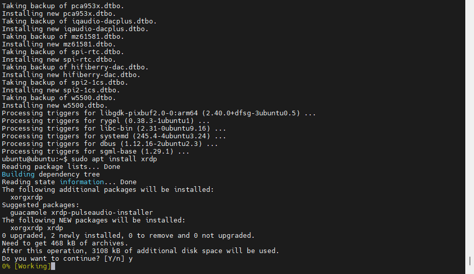

如果是`sudo apt install xrdp`，此时需要输入`y/Y`

完成后输入
```bash
sudo /etc/init.d/xrdp restart
```

输入
```bash
sudo reboot
```

重启一次

重启后输入
```bash
sudo vim /usr/share/lightdm/lightdm.conf.d/50-ubuntu.conf
```

并在里面添加以下内容（按<kbd>i</kbd>进入编辑模式）

```bash
greeter-show-manual-login=true
allow-guest=false
```


添加后按<kbd>Esc</kbd>
先输入一个冒号 `:` *(英文输入)*

再输入
```bash
wq!
```

按<kbd>Enter</kbd>退出编辑

退出后输入
```bash
sudo reboot
```

重启一次

### 4. 个人热点/Wifi情况

打开电脑的远程桌面连接 *(如果是使用网线连接的跳过这里看第5小节)*


登录需要输入ip地址

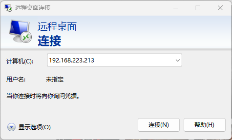

然后就是用户名`ubuntu`和自己设定的密码
进入界面

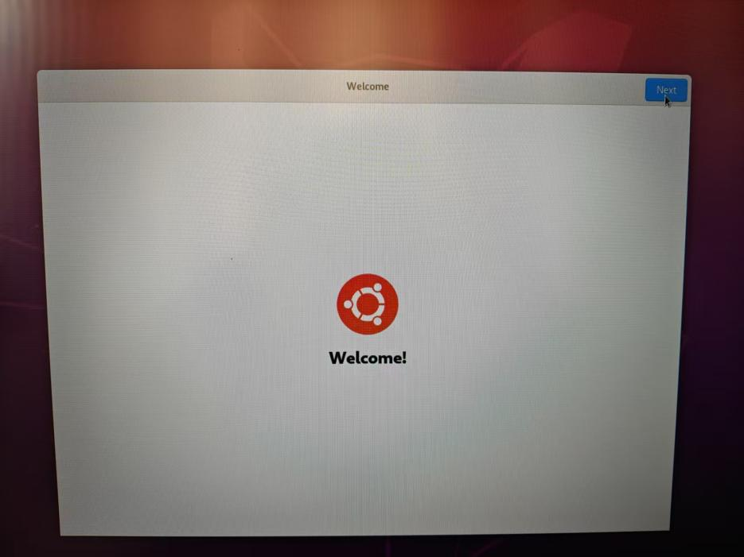

↓

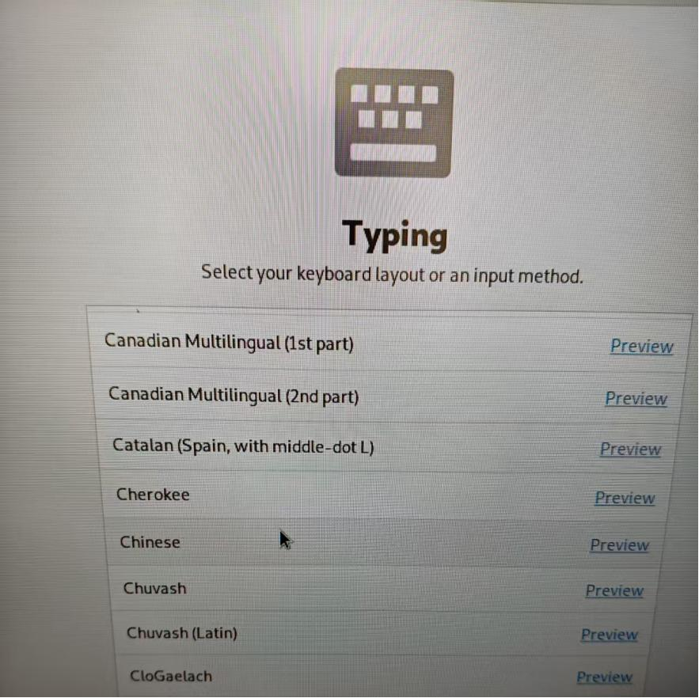

↓
!!! note ""
    如果提醒你更新到22的版本就先不要更新，就用20.04版本的

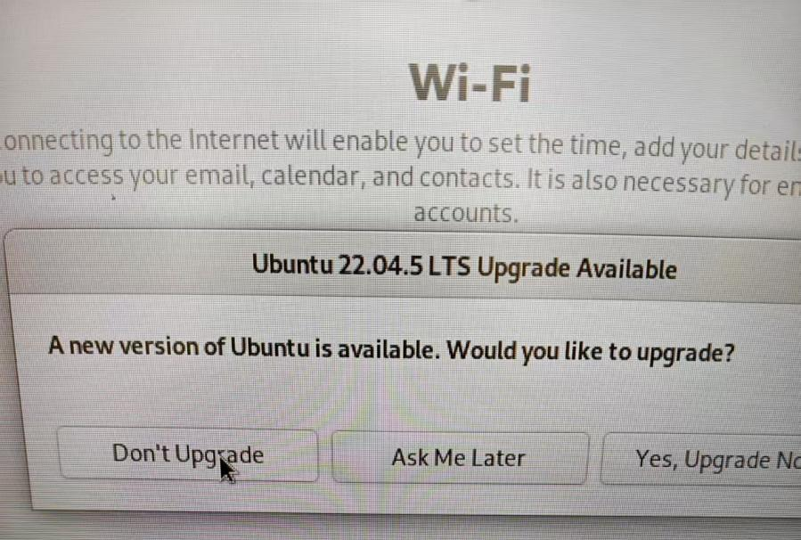

↓

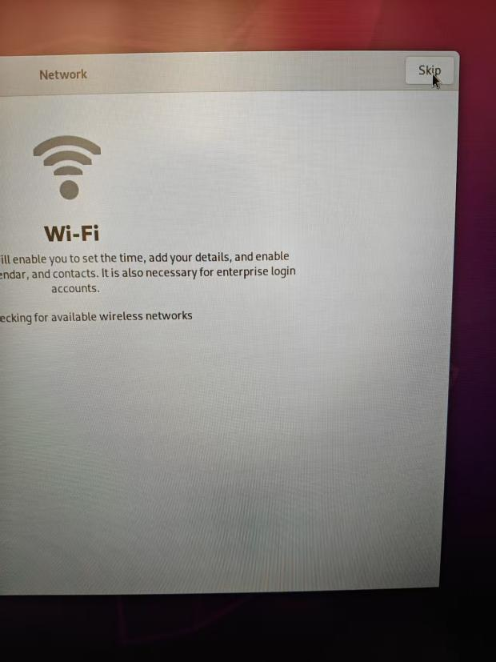

↓

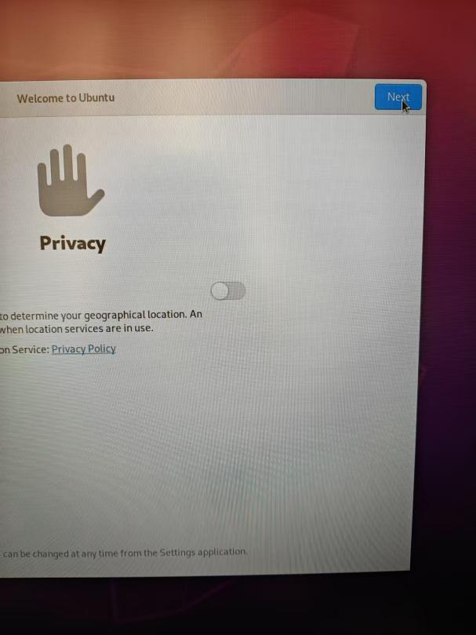

↓


↓
然后就可以点屏幕右上角
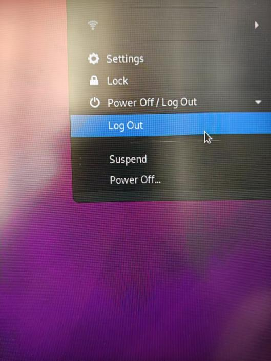

↓

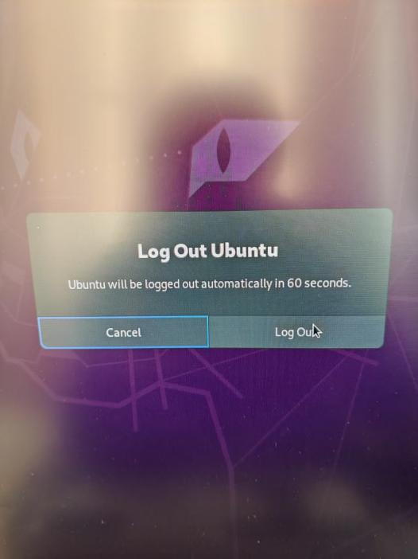

后面安装ROS的操作还是用MobaXterm操作，远程桌面连接我这里用着感觉延迟挺高，看自己情况吧

### 5. 网线连接的情况

给树莓派接上屏幕、键盘、鼠标进入ubuntu桌面

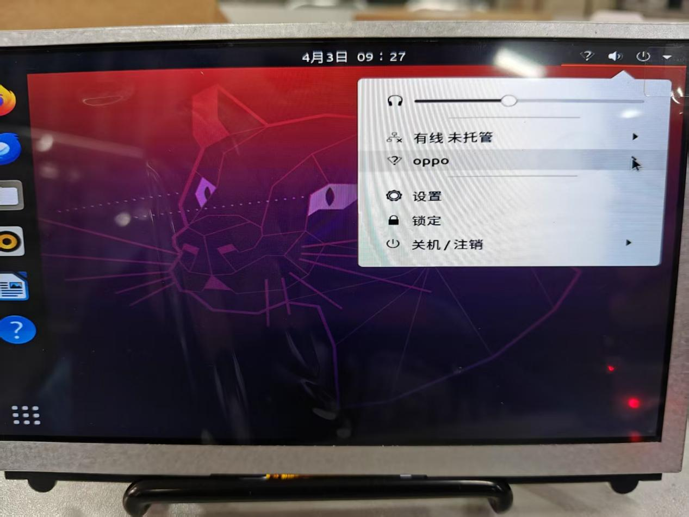

这个位置就会显示wifi的连接（系统一开始默认是英文的，开头会有几个弹窗直接跳过就行）

按以下步骤进行操作:

**1**
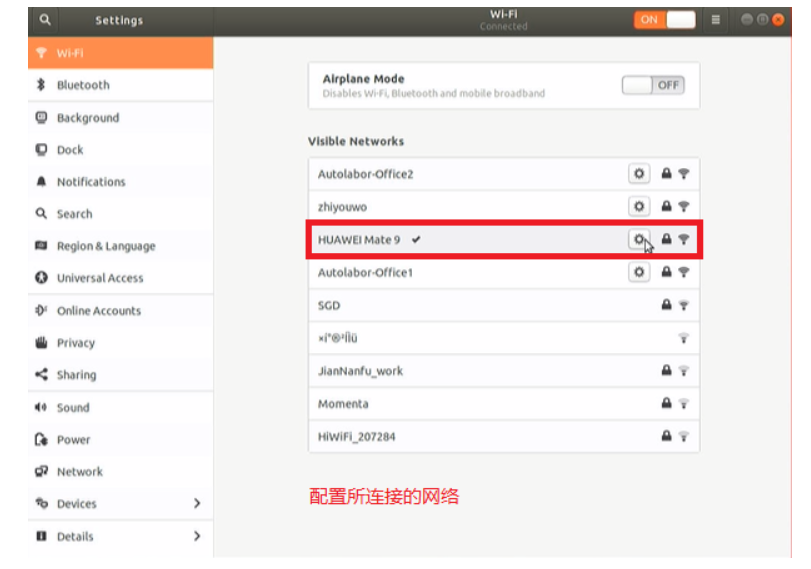

**2**
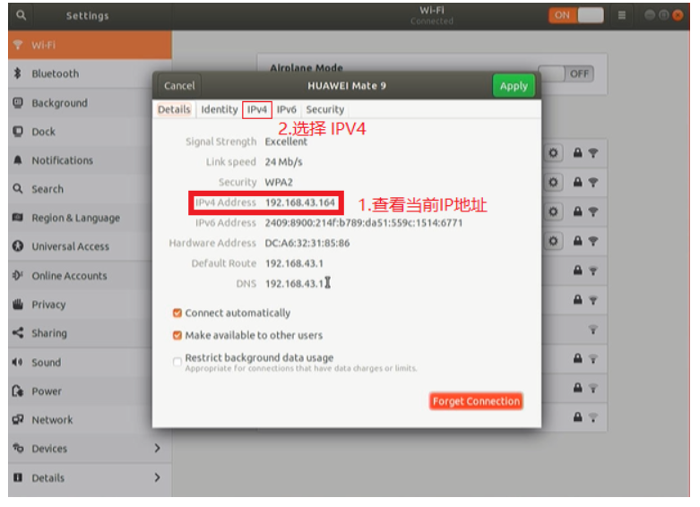

**3** 
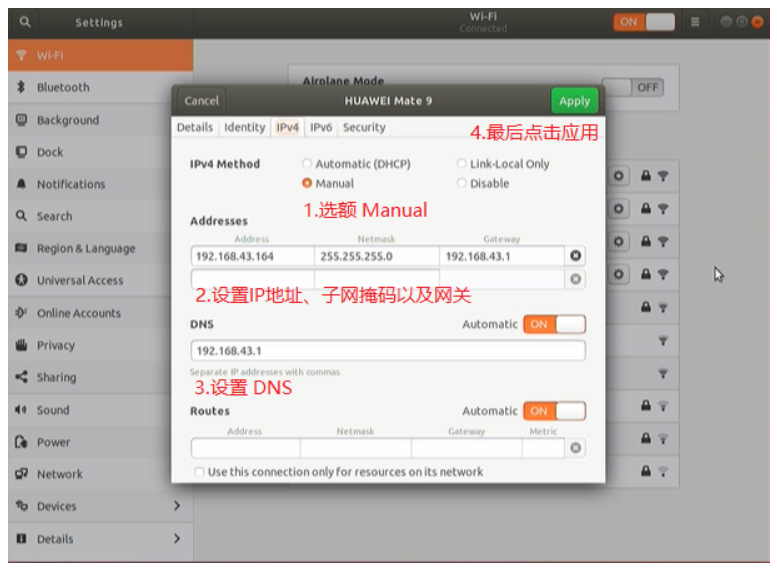

!!! note "注意"
    ip地址不一定要为第三步那样的，但是整体规律要一致，<br>
    DNS和Gateway的ip与Address的区别，Netmask的地址为 **255.255.255.0**

这样树莓派的ip地址就被设置为静态ip（固定）了，如果要用电脑远程连接，只要保持在同一wifi下直接连接就可以

### 6. 系统汉化方法

参考: [系统汉化方法](https://blog.csdn.net/hwh20095000060/article/details/121438836)

## ROS安装

### 1. 设置安装源

使用国内清华源或中科大源，我前面Ubuntu使用的就是中科大源这里也就使用中科大源了

中科大源设置（直接复制）:

终端输入并回车以下内容
```bash
sudo sh -c '. /etc/lsb-release && echo "deb http://mirrors.ustc.edu.cn/ros/ubuntu/ `lsb_release -cs` main" > /etc/apt/sources.list.d/ros-latest.list'
```

清华源设置（直接复制）:

终端输入并回车以下内容
```bash
sudo sh -c '. /etc/lsb-release && echo "deb http://mirrors.tuna.tsinghua.edu.cn/ros/ubuntu/ `lsb_release -cs` main" > /etc/apt/sources.list.d/ros-latest.list'
```
### 2. 设置Key

终端输入并回车以下内容（直接复制）:
```bash
sudo apt-key adv --keyserver 'hkp://keyserver.ubuntu.com:80' --recv-key C1CF6E31E6BADE8868B172B4F42ED6FBAB17C654
```

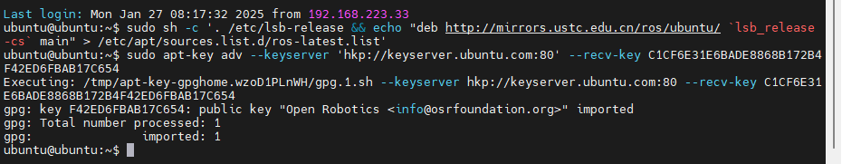

### 3. 安装

终端输入并回车以下内容（直接复制）:

*(更新命令)*

```bash
sudo apt update
```

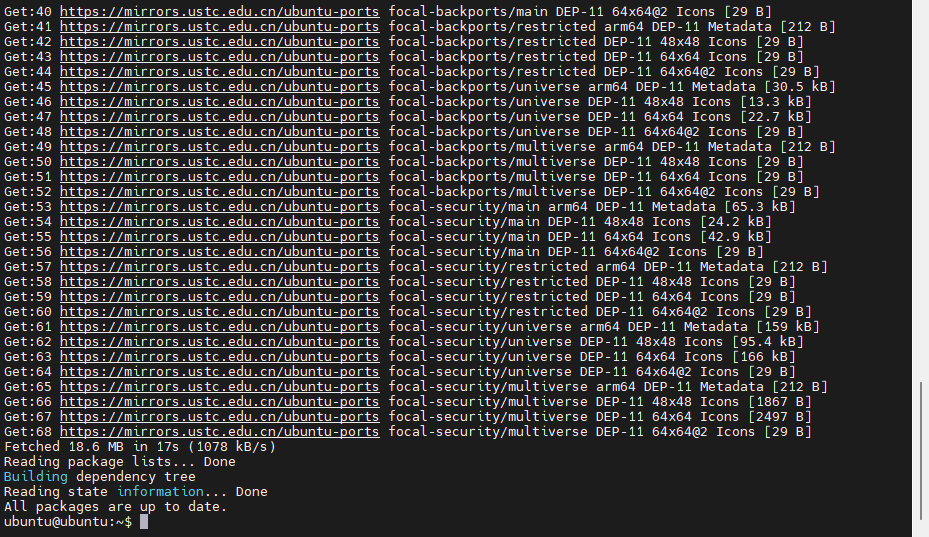

然后终端输入并回车以下内容（直接复制）:

*(安装命令)*

```bash
sudo apt install ros-noetic-desktop-full
```
!!! note "注意"
    由于网络原因，导致连接超时，可能会安装失败，可以多次重复调用 **更新命令** 和 **安装命令**，直至成功

### 4. 设置环境变量

设置环境变量是为了方便每次打开新终端可以直接使用，不需要再换为root模式

终端输入并回车以下内容（直接复制）:
```bash
echo "source /opt/ros/noetic/setup.bash" >> ~/.bashrc
```

然后再刷新一下环境变量，命令如下

终端输入并回车以下内容（直接复制）:
```bash
source ~/.bashrc
```

### 5. 安装构建依赖工具

终端输入并回车以下内容（直接复制）:
```bash
sudo apt install python3-rosdep python3-rosinstall python3-rosinstall-generator python3-wstool build-essential
```

### 6. 初始化rosdep

第一步：

终端输入并回车以下内容（直接复制）:
```bash
sudo rosdep init
```

第二步：

终端输入并回车以下内容（直接复制）:
```bash
rosdep update
```

!!! note "注意"
    由于网络原因可能出现读取超时的报错，只需要重新执行第二步，直到完全初始化完成

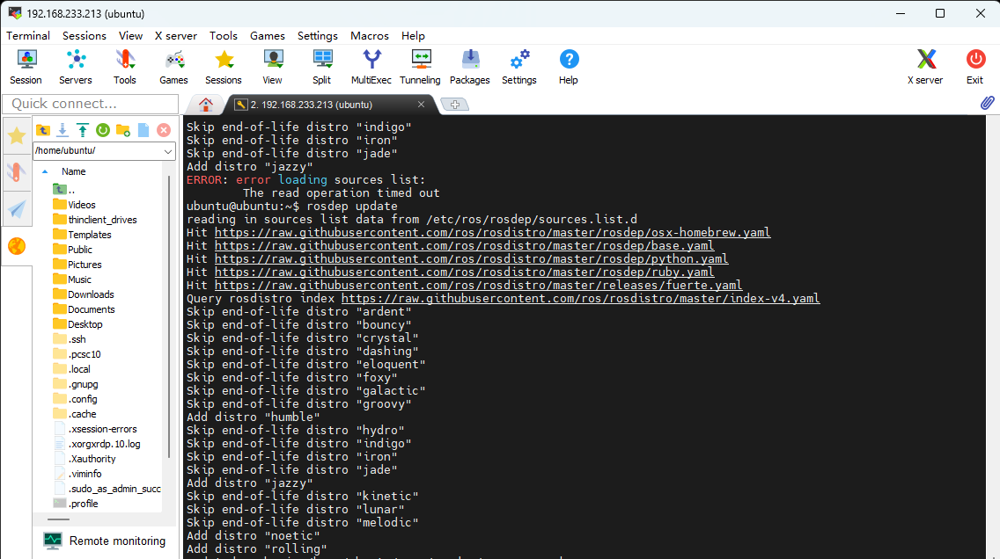

### 6.1 rosdep意外解决参考

可能会出现一些问题，参考如下：

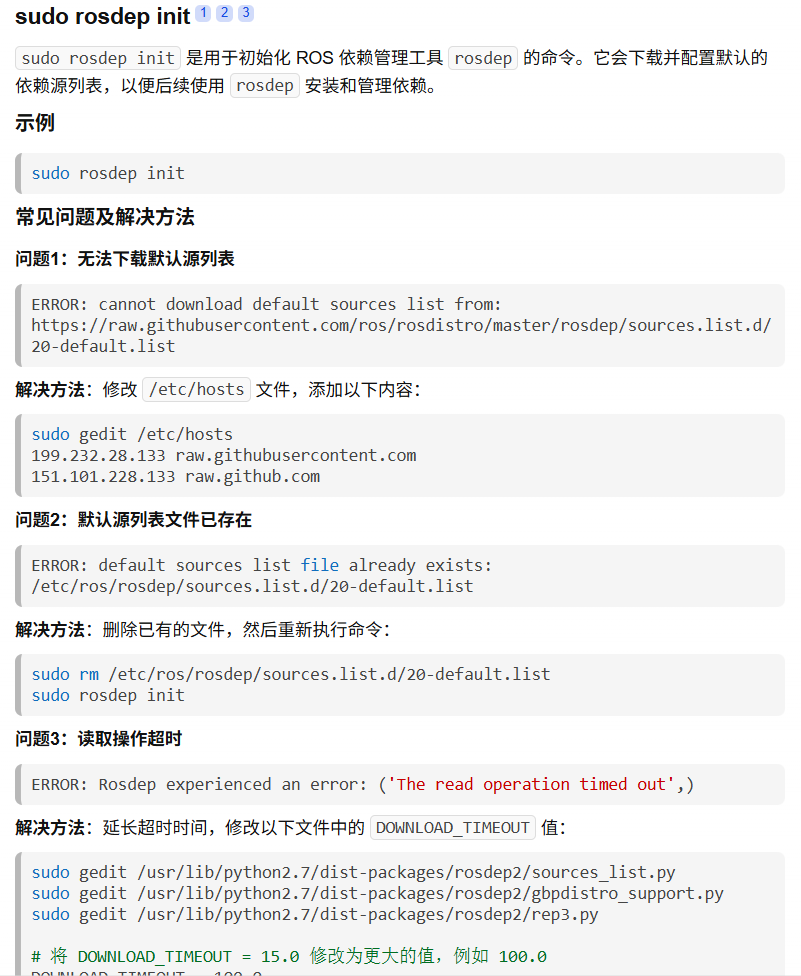

### 7. 测试ROS1

以上步骤都完成后即可测试ROS1

终端输入（直接复制）
```bash
roscore
```

后打开一个新的终端

输入（直接复制）
```bash
rosrun turtlesim turtlesim_node
```

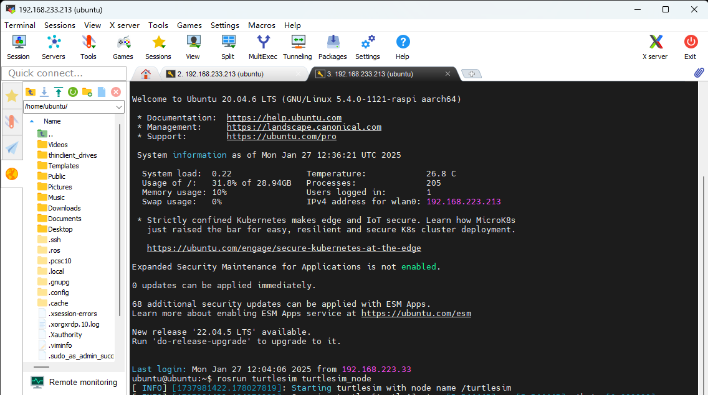

回车后屏幕会出现一个新窗口是一个小海龟

再打开一个新终端输入（直接复制）
```bash
rosrun turtlesim turtle_teleop_key
```

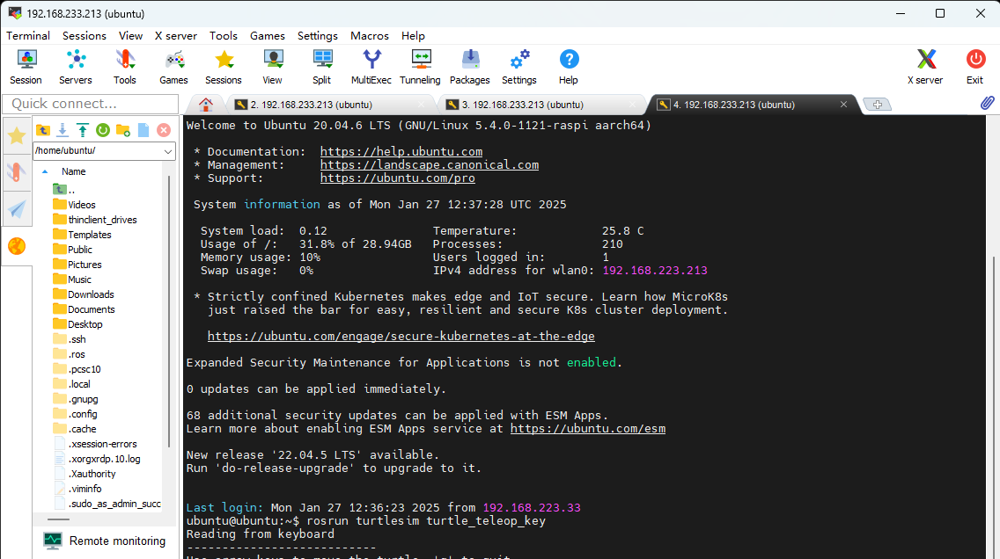

回车后将鼠标停留在当前终端，使用键盘的上下左右键（不是WASD）可以控制小海龟运动

!!! success "完成"
    如果小海龟按照你的控制正常运动说明ROS1已完成安装且功能正常