---lab
date: 2025-12-3
author: CCChiJi
category: 软件
tags: ROS
---

# Arduino部分的工作

!!! note ""
    应该是要事先了解一下Arduino的使用以及代码中的常用基础函数，但是这里仅说明主要步骤，不做其他扩展

    代码中有不懂的地方直接复制问AI即可

该部分代码资料位于

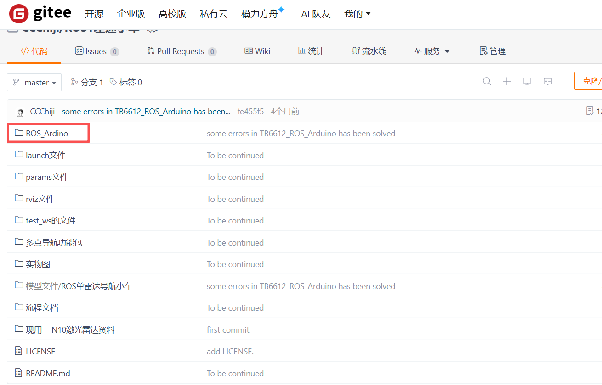

## 1. 程序入口部分

ros_arduino_bridge/ros_arduino_firmware/src/libraries/ROSArduinoBridge

下的 **RosArduinoBridge.ino** 是Arduino端程序的主入口

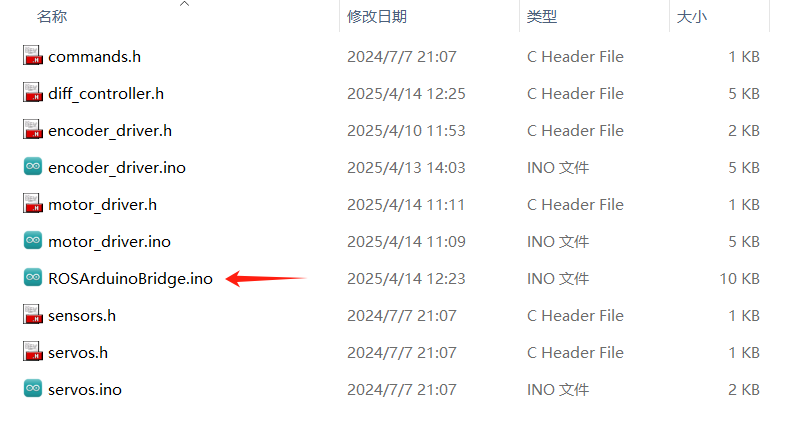

源码默认禁用基座控制器，启用舵机，需要修改启用基座控制器，禁用舵机（本方案目前不使用舵机）<br>
修改部分:

开启基座控制器:

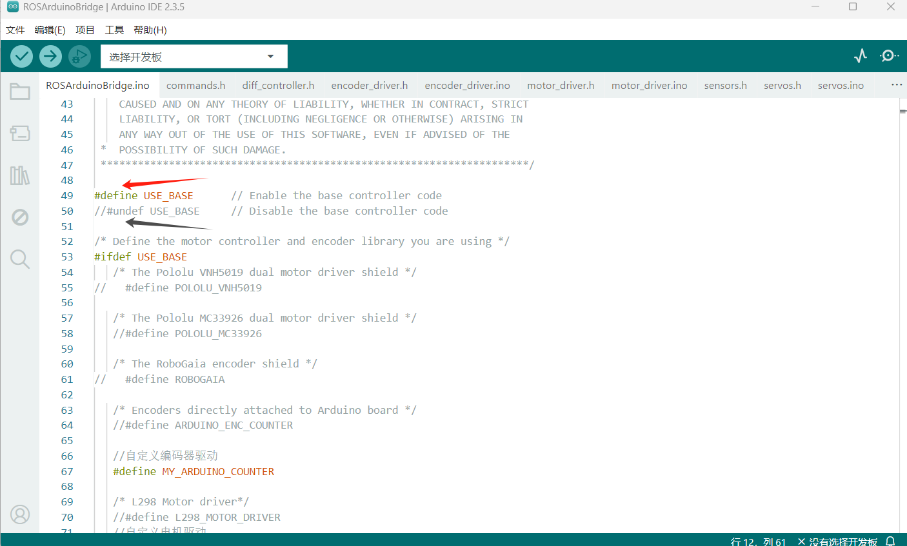

禁用舵机:

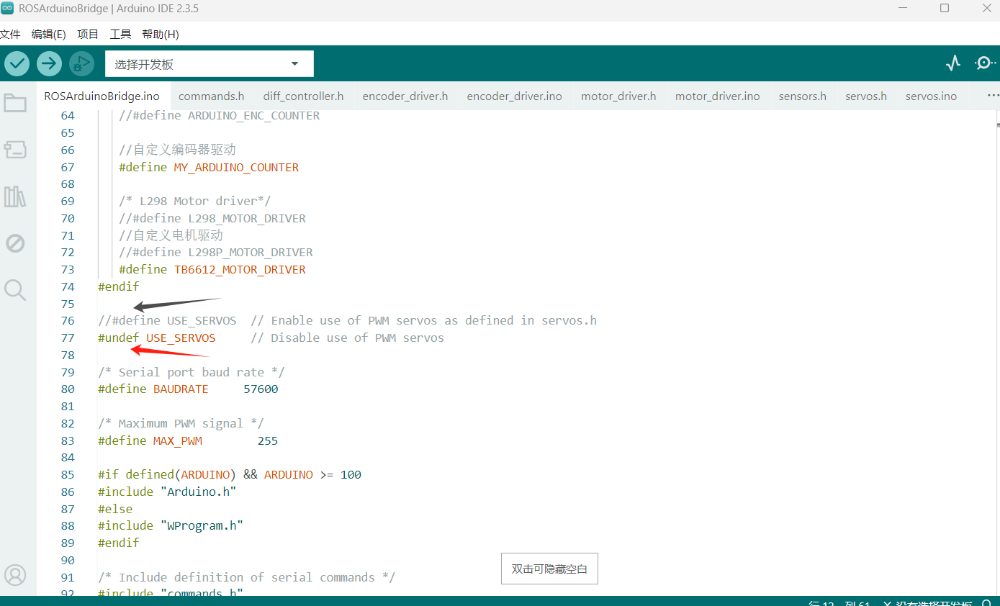

### 1.1 指令集

由于后续调试需要对Arduino发送指令查看情况，Arduino所能接收的上位机指令为以下内容:

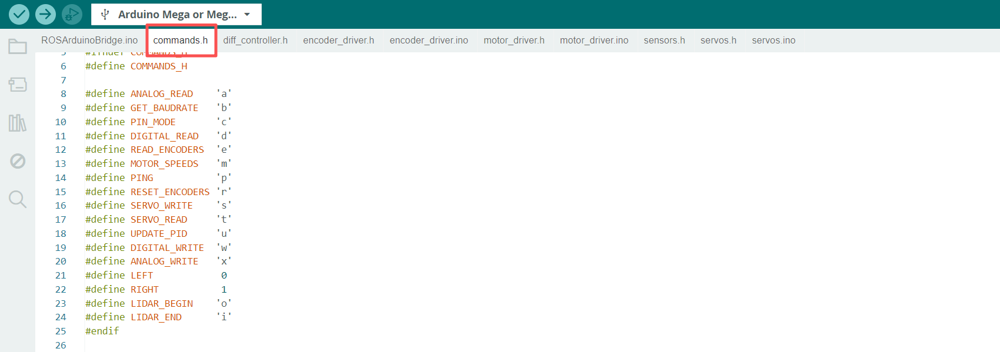

### 1.2 硬件接线

接线方式如图

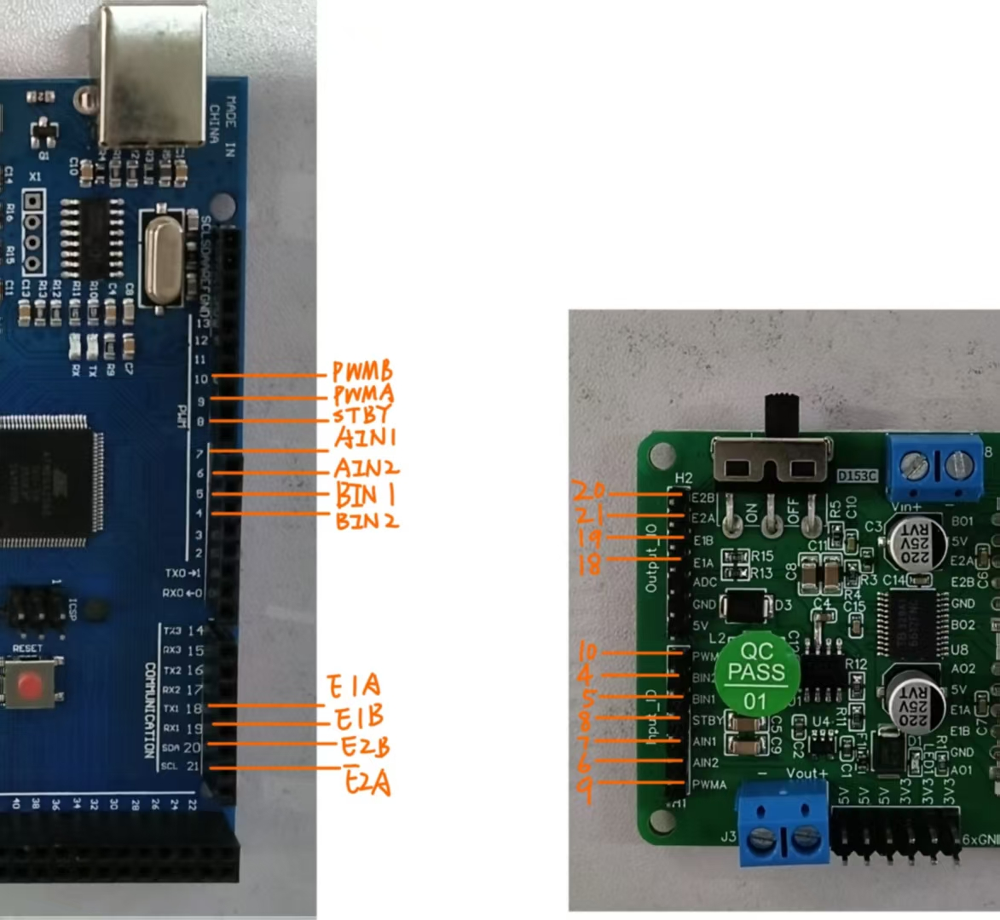

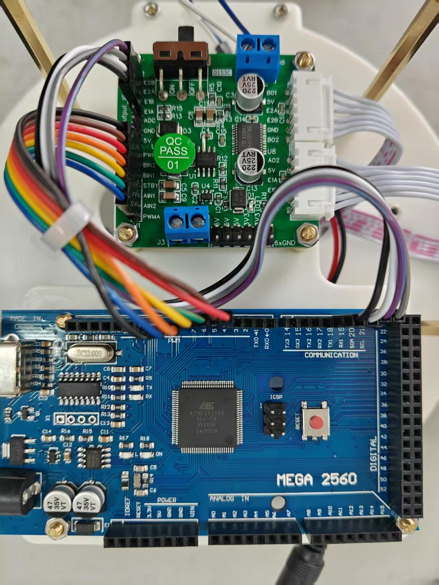

!!! note ""
    其中TB6612的STBY可以直接接在5V上，即默认使能电机，不通过程序控制电机

## 2. 添加自定义编码器驱动

在RosArduinoBridge.ino中增加自定义的编码器驱动

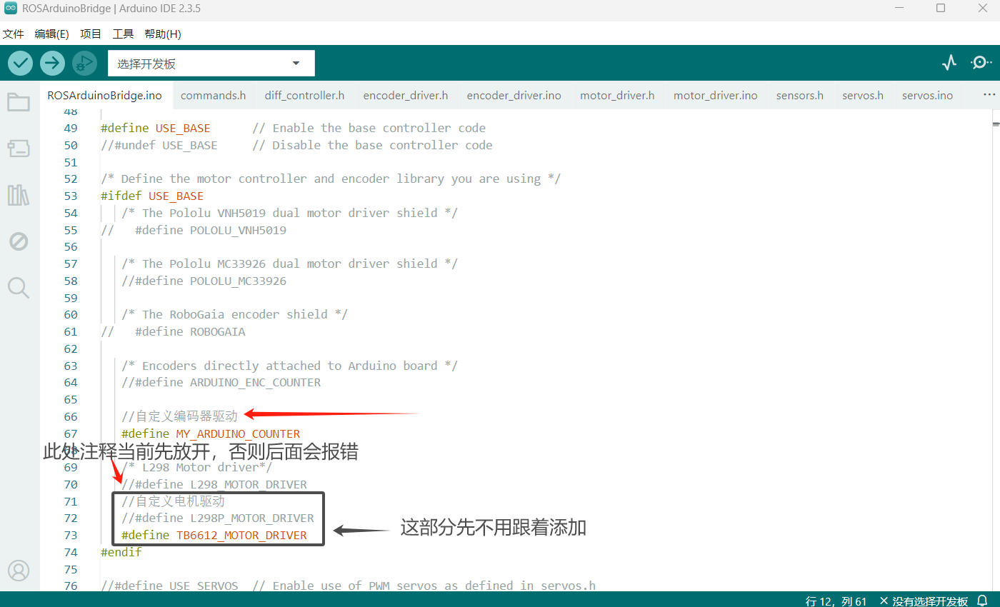

### 2.1 编码器头文件

在encoder_driver.h中添加如下部分的代码
```c
#elif defined MY_ARDUINO_COUNTER
  //定义引脚
  #define LEFT_A 21 //E2A---中断口2
  #define LEFT_B 20 //E2B---中断口3
  #define RIGHT_A 18 //E1A---中断口5
  #define RIGHT_B 19 //E1B---中断口4
  #define STBY_E 8//STBY
  //声明函数
  //1.设置引脚操作模式并添加中断
  void initEncoder();
  //2.为中断引脚添加中断事件
  void leftEncoderEventA();
  void leftEncoderEventB();
  void rightEncoderEventA();
  void rightEncoderEventB();
```

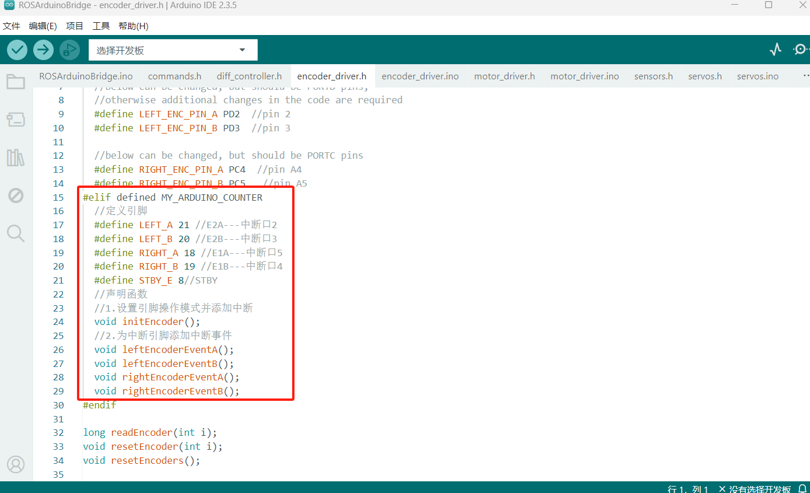

### 2.2 修改编码器源代码

在encoder_driver.ino中添加如下部分代码（建议直接查看我的文件）
```c
#elif defined MY_ARDUINO_COUNTER
//实现左右电机的脉冲计数
//1.定义左右轮的计数器
  volatile long left_count = 0L;//左轮计数器
  volatile long right_count = 0L;//右轮计数器
//2.设置引脚的操作模式并添加中断事件 
  void initEncoder(){
    pinMode(LEFT_A, INPUT); //2
    pinMode(LEFT_B, INPUT); //3
    pinMode(RIGHT_A, INPUT);//5
    pinMode(RIGHT_B, INPUT);//4
    pinMode(STBY_E, OUTPUT);

    digitalWrite(STBY_E , 1);
    
    attachInterrupt(2, leftEncoderEventA, CHANGE);
    attachInterrupt(3, leftEncoderEventB, CHANGE);
    attachInterrupt(5, rightEncoderEventA, CHANGE);
    attachInterrupt(4, rightEncoderEventB, CHANGE);
  }
//3.编写中断回调函数
//-------------------------------------------------左轮
  void leftEncoderEventA(){
    if(digitalRead(LEFT_A) == HIGH){
      if(digitalRead(LEFT_B) == HIGH){
        left_count--;
      } else {
        left_count++;
      }
    } else {
      if(digitalRead(LEFT_B) == LOW){
        left_count--;
      } else {
        left_count++;
      }
    }
  }

  void leftEncoderEventB(){
    if(digitalRead(LEFT_B) == HIGH){
      if(digitalRead(LEFT_A) == LOW){
        left_count--;
      } else {
        left_count++;
      }
    } else {
      if(digitalRead(LEFT_A) == HIGH){
        left_count--;
      } else {
        left_count++;
      }
    }
  }
//-------------------------------------------------右轮
  void rightEncoderEventA(){
    if(digitalRead(RIGHT_A) == HIGH){
      if(digitalRead(RIGHT_B) == HIGH){
        right_count--;
      } else {
        right_count++;
      }
    } else {
      if(digitalRead(RIGHT_B) == LOW){
        right_count--;
      } else {
        right_count++;
      }
    }
  }
  
  void rightEncoderEventB(){
    if(digitalRead(RIGHT_B) == HIGH){
      if(digitalRead(RIGHT_A) == LOW){
        right_count--;
      } else {
        right_count++;
      }
    } else {
      if(digitalRead(RIGHT_A) == HIGH){
        right_count--;
      } else {
        right_count++;
      }
    }
  }
  /* Wrap the encoder reading function */
  //i的取值是 LEFT 或 RIGHT ，是左右轮的标记
  long readEncoder(int i) {
    if (i == LEFT) return left_count;
    else return -right_count; // It's just because my right encoder get reverse value so if yours is normal, don't add "-"
  }
```

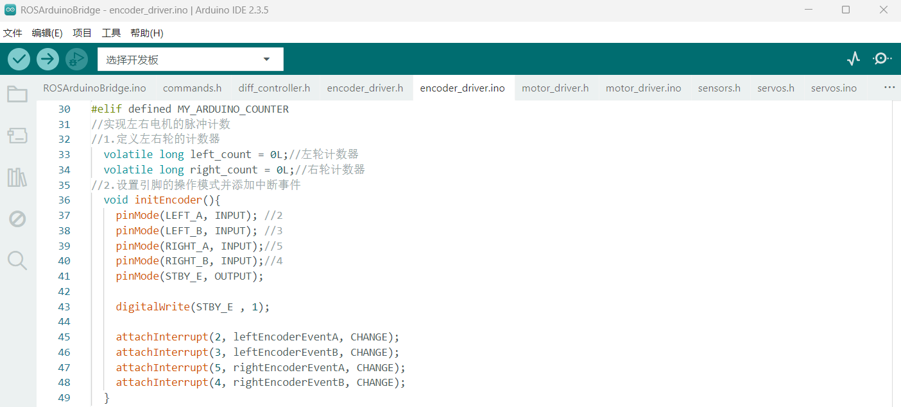
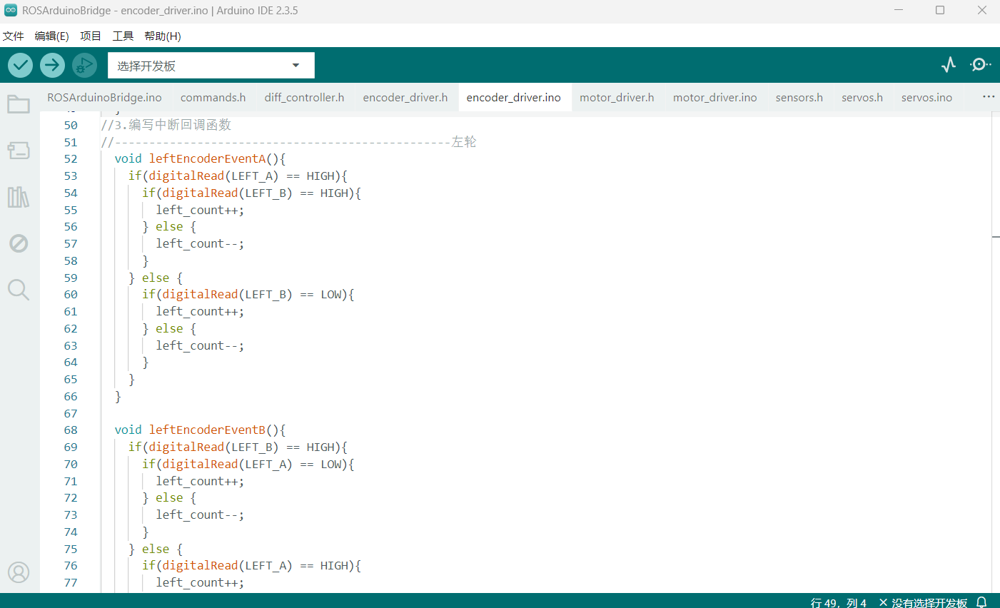
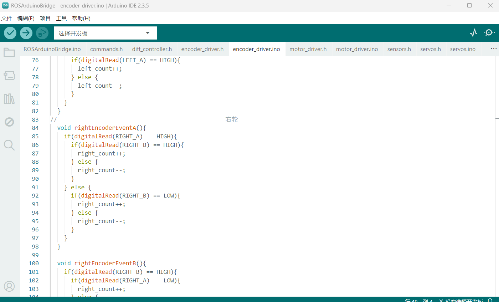
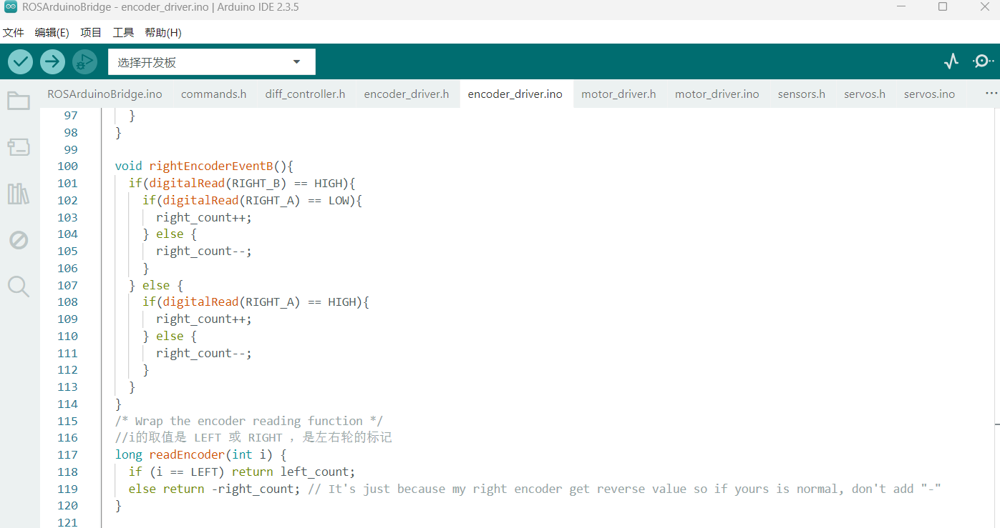

`return -right_count`是因为我使用的是差速轮，如果以左轮为准的话，向前走时右轮编码器和左轮相反

### 2.3 编码器计数验证

!!! tip ""
    要验证最好搭建实体组装完成，如果没有搭建好可以先接好电机和编码器使用

以上代码编写完成后，可按以下步骤验证编码器代码正确性

1. 先编译 符号"✓"，再上传到开发板 符号"→"

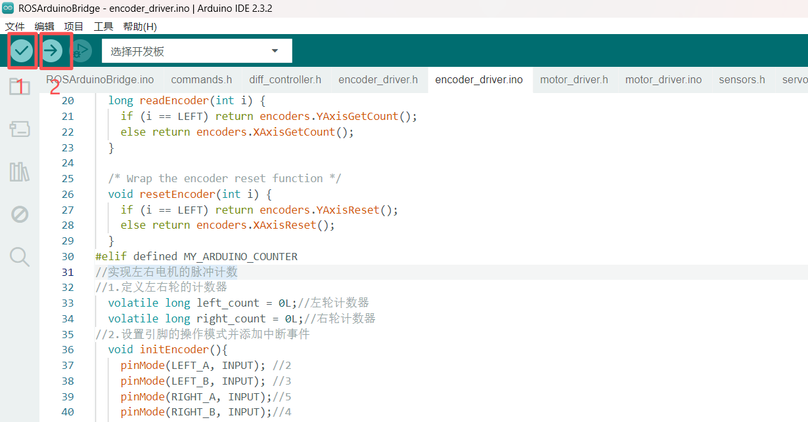

2. 打开串口监视器，按照图中配置，输入"e"，如果正常则会返回左右轮的编码器计数，然后就可以转动轮子再输入指令"e"查看编码器计数情况

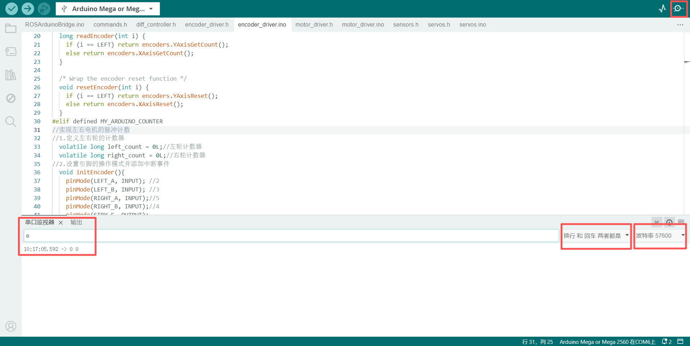

编码器部分的程序是四倍频计数，因此若正转一圈则返回的值应该是4000左右，反转则为-4000左右，关于倍频计数的原理这里只简单说明公式：<br>
**一圈的脉冲数** = **一圈的编码器线数（这里假设为11，商家一般都会给参数说明）** X **倍频数（这里是4）** X **电机减速比（这里是90）** 得出来约等于3960<br>
简单理解为AB相编码器主要构成为A相与B相，每一相每转过单位的角度就发出一个脉冲信号(一圈可以发出N个脉冲信号)，<br>A相、B相为相互延迟1/4周期的脉冲输出，根据延迟关系可以区别正反转，而且通过取A相、B相的上升和下降沿可以进行单频或2倍频或4倍频测速

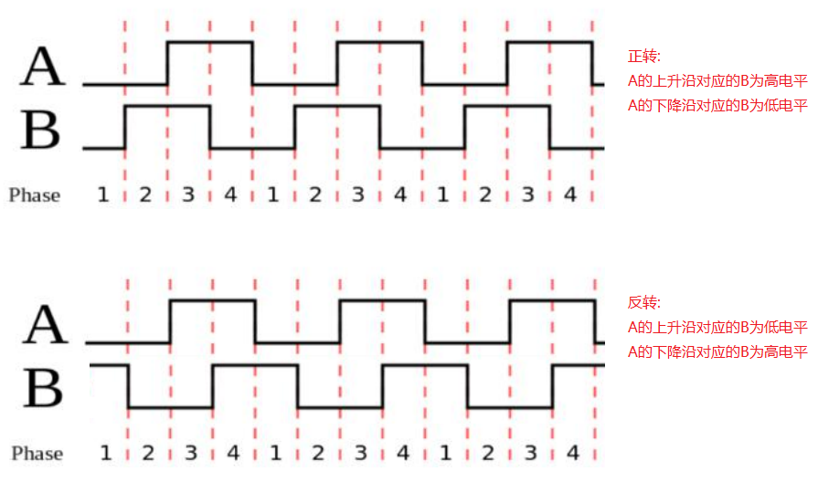

## 3. 添加自定义电机驱动

### 3.1 修改电机驱动头文件

在motor_driver.h中添加如下代码
```c
#elif defined TB6612_MOTOR_DRIVER
  #define BIN1 5
  #define BIN2 4
  #define PWMB 10//左
  #define AIN1 7
  #define AIN2 6
  #define PWMA 9//右
  #define STBY 8
```

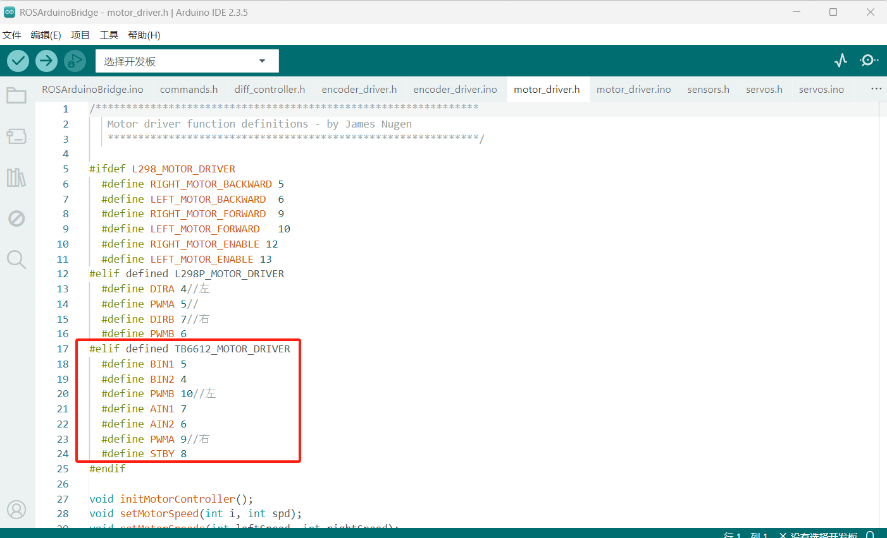

### 3.2 修改电机驱动源文件

在motor_driver.ino中添加如下部分代码（建议直接查看我的文件）
```c
#elif defined TB6612_MOTOR_DRIVER
//1.初始化函数
void initMotorController()
{
  pinMode(BIN1 , OUTPUT);
  pinMode(BIN2 , OUTPUT);
  pinMode(PWMB , OUTPUT);
  pinMode(AIN1 , OUTPUT);
  pinMode(AIN2 , OUTPUT);
  pinMode(PWMA , OUTPUT);

  //pinMode(STBY , OUTPUT);

  //使能电机
  //digitalWrite(STBY , 1);
}
//2.设置单个电机转速
void setMotorSpeed(int i, int spd)
{
  unsigned char reverse = 0;//定义反转变量
  
  if (spd < 0)
  {
    spd = -spd;
    reverse = 1;
  }
  if (spd > 255){
    spd = 255;
  }
  
  if (i == LEFT) //左电机
  {
    if(reverse == 0) 
    {
      //正转
      digitalWrite(BIN1 , 0);
      digitalWrite(BIN2 , 1);
      analogWrite(PWMB,spd);
    }
    else if (reverse == 1) 
    {
      //反转
      digitalWrite(BIN1 , 1);
      digitalWrite(BIN2 , 0);
      analogWrite(PWMB,spd);
    }
  }
  else//右电机
  {
    if(reverse == 0) 
    {
      //正转
      digitalWrite(AIN1 , 0);
      digitalWrite(AIN2 , 1);
      analogWrite(PWMA , spd);
    }
     else if (reverse == 1) 
    {
      //反转
      digitalWrite(AIN1 , 1);
      digitalWrite(AIN2 , 0);
      analogWrite(PWMA , spd);
    }
  }
}
//3.设置两个电机的转速
void setMotorSpeeds(int leftSpeed, int rightSpeed)
{
  setMotorSpeed(LEFT, leftSpeed);
  setMotorSpeed(RIGHT, rightSpeed);
}
```


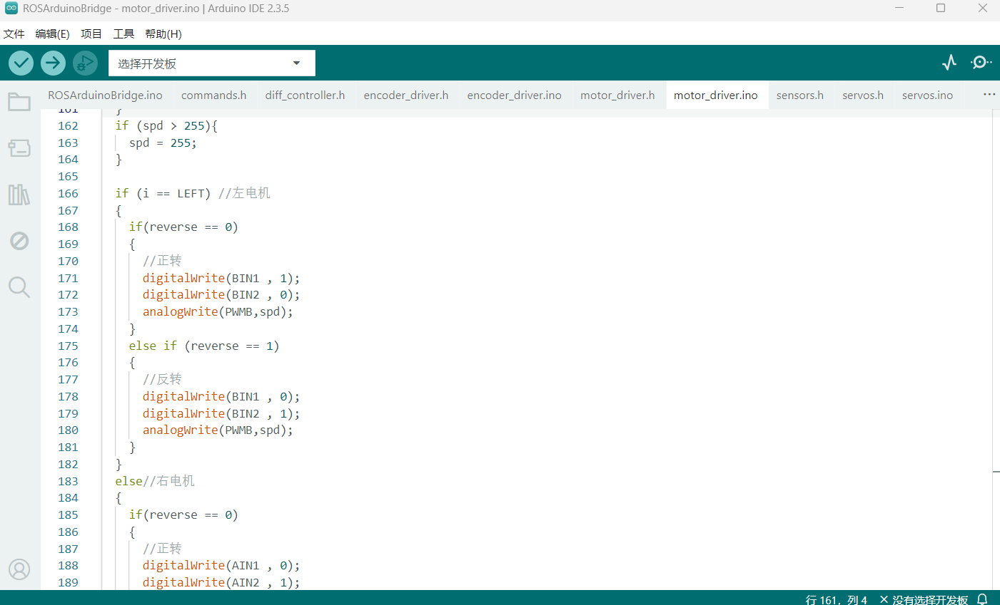
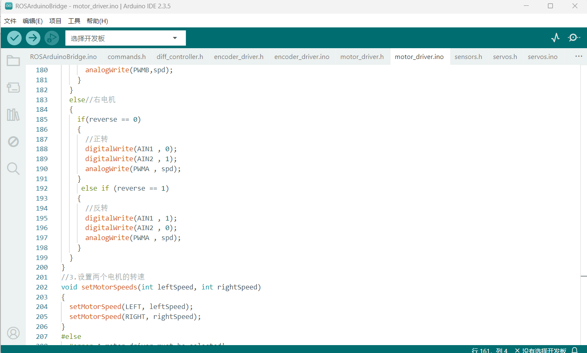

## 4. PID

### 4.1 调试PID

调试PID需要把当前的PWM值输出出来，PID部分的代码在diff_controller.h中

!!! warning "特别注意"
    添加输出代码，这是用于调试的输出调试完成后一定要记得注释或者删除

在
```c
//目标值-当前值
Perror = p->TargetTicksPerFrame - input;
```

下一行添加串口输出代码
```c
Serial.println(input);
```

!!! warning "再次强调"
    添加输出代码，这是用于调试的输出调试完成后一定要记得注释或者删除

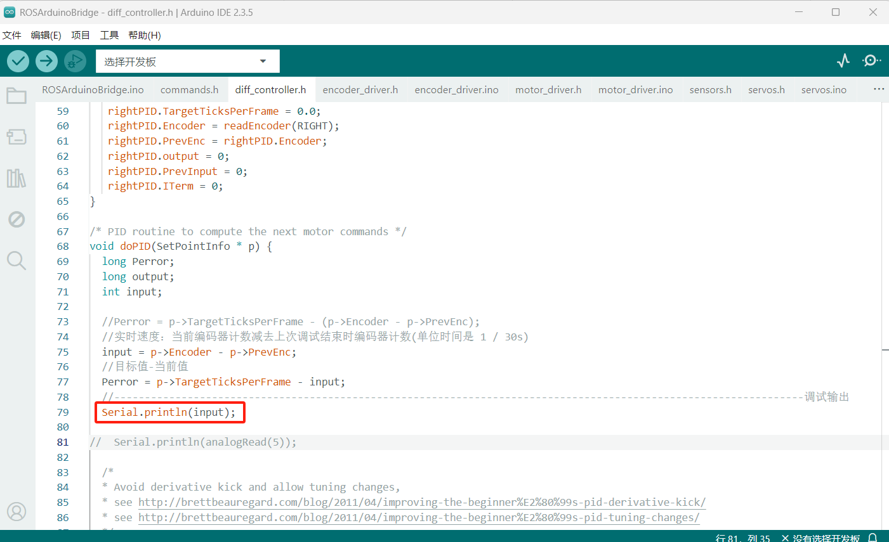

### 4.2 增加调试间隔

为了方便调试时观察，增加调试时的时间

可以将这里的2000ms（2s）的间隔先注释掉使用自定义的调试间隔

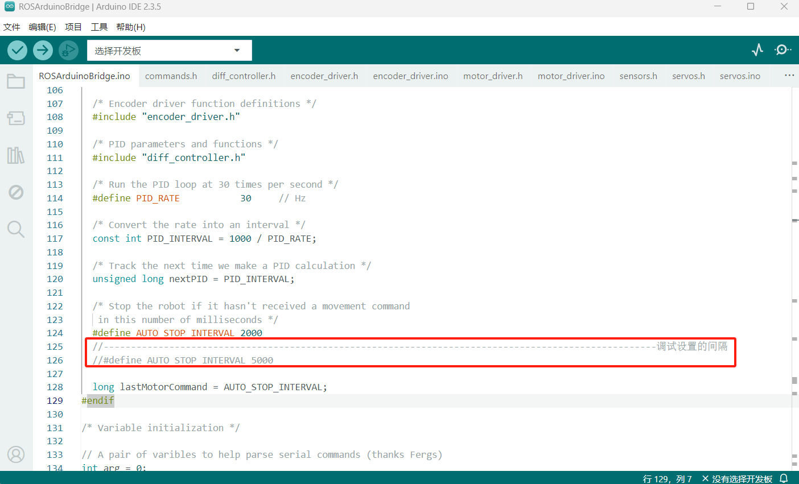

### 4.3 单独调试一侧轮子的PID

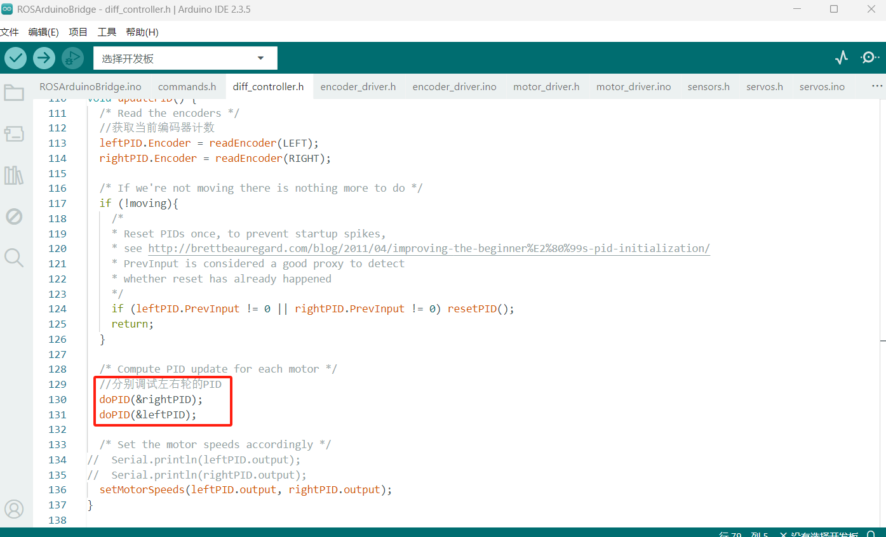

!!! note ""
    - 可以注释掉一侧的PID调试，单独调试一边
    - 需要注意的是，两个轮子各自使用一套PID应该能达到最好的效果，但是这里仅做学习两个轮子使用同一套PID，有需要可以仿照文件中PID的部分给另一侧单独写一套PID

可以先把D和I都给0，调P，P调好了以后再调D然后再调I

!!! warning ""
    代码中的ko不用管


调试步骤:

1. 更改参数值，上传到Arduino中
2. 打开串口绘图仪
3. 发送速度指令，速度给定的代码格式为“m 100 0”（意思为 左侧速度100 右侧速度0）

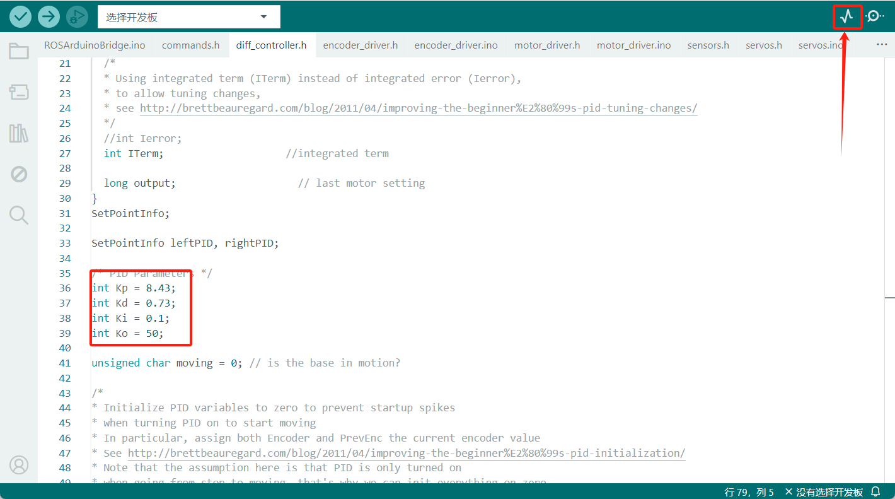
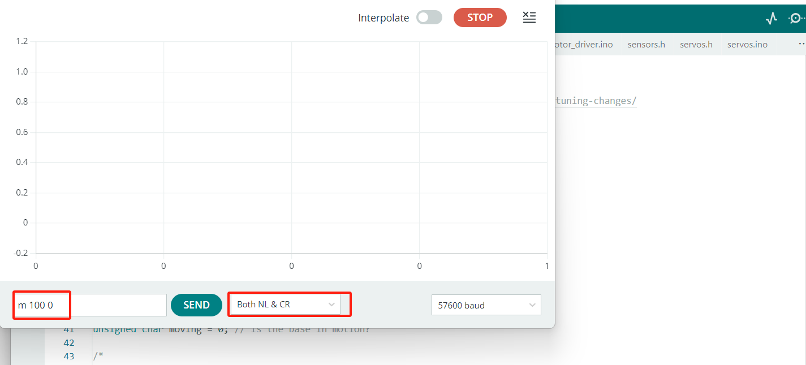

每一次更改参数值再次调试之前先输入“m 0 0”将电机速度重置