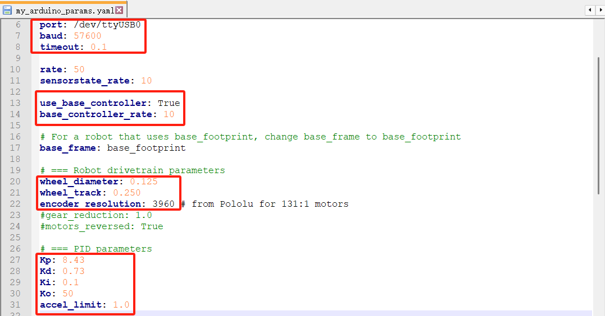
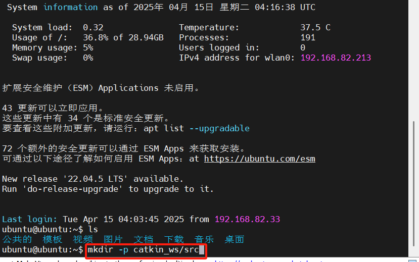
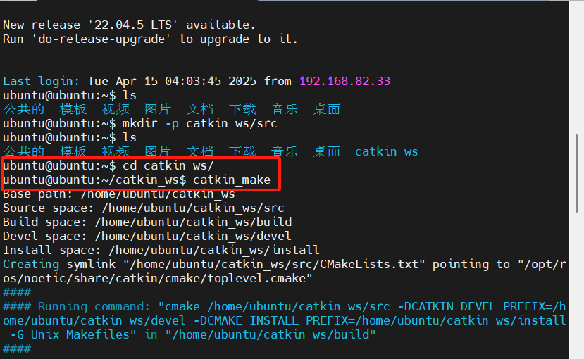
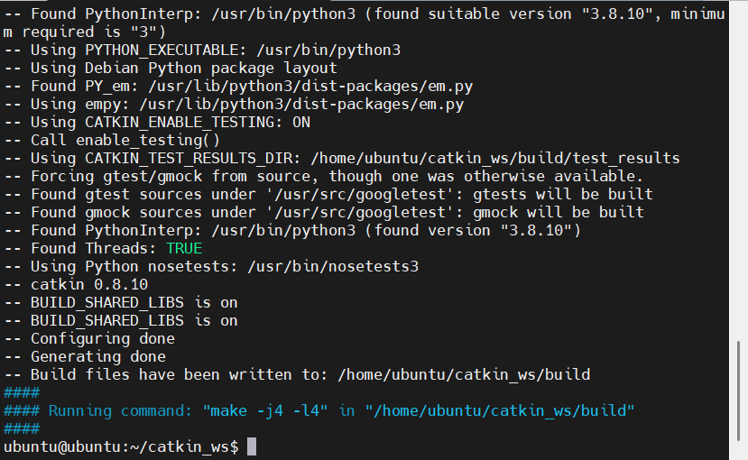
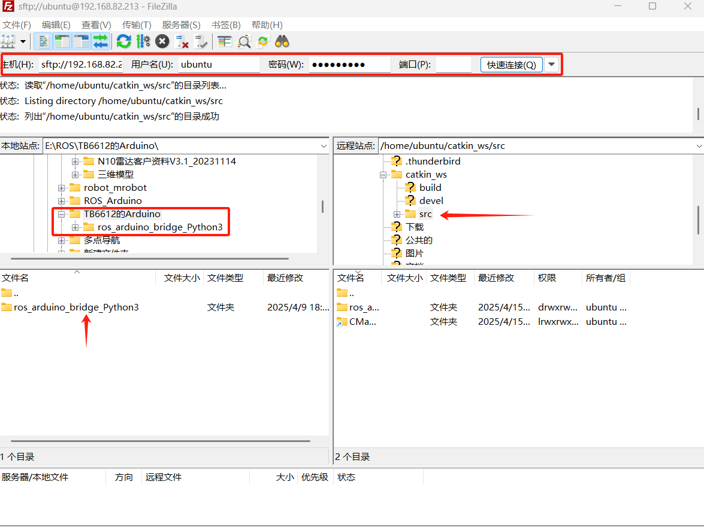
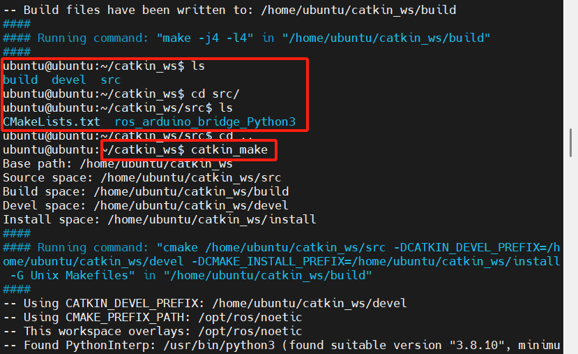
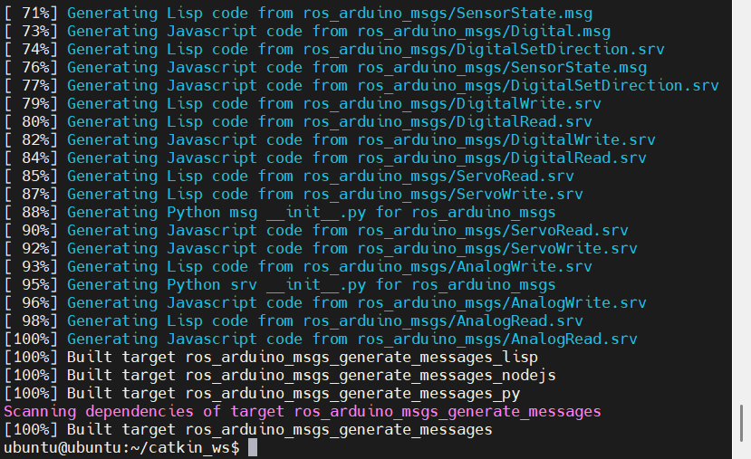

---lab
date: 2025-12-9
author: CCChiJi
category: 软件
tags: ROS
---

# 功能包的上传

!!! tip "tips"
    - 个人推荐使用FileZilla软件进行上传
    - 所有指令的输入不需要全部敲，只用输入前几个字母再按Tab就会自动补齐或列出可选项

## 1. ros_arduino_bridge功能包的上传

!!! note ""
    雷达功能包上传也按此方式

功能包位于:


内部有两个子文件夹，上面的是当时用TB6612时用的


### 1.1 修改ros_arduino_bridge中的配置项

配置项文件位置:

ros_arduino_bridge_Python3 -> ros_arduino_python -> config -> my_arduino_params.yaml



!!! note "参数解释"
    图中画框的部分

    - 第一个框中为：
        - 接口名称
        - 波特率
        - 超时时间
    - 第二个框中为：
        - 是否使用基座控制器（默认为False，改为True）
        - 发布频率
    - 第三个框中为：
        - 轮胎的直径（单位：m）
        - 两个轮胎的轮间距（单位：m）
        - 编码器精度（一圈的脉冲数*倍频*减速比）
    - 第四个框中为：
        - P
        - D
        - I
        
    （这里改成在Arduino端的diff_controller.h中调好的PID参数）

改完后保存

树莓派端启动的主要是ros_arduino_python中的arduino.launch文件

里面主要运行的是arduino_node.py

## 文件上传

### 2.1 树莓派端工作空间创建

图为使用MobaXterm远程SSH

工作空间其实就是文件夹，创建指令为
```bash
mkdir -p 文件夹名
```

可拓展创建子文件夹
```bash
mkdir -p 文件夹名/子文件夹名
```

这里以`catkin_ws`为例，工作空间必须需要一个名为`src`的子文件夹



创建完成后进入工作空间的根目录编译一下

编译指令
```bash
catkin_make
```



!!! note "图中个别指令解释"
    - ls
        - 列出当前文件夹内的所有文件
    - cd
        - 跳转到目标位置内，即cd后的文件夹位置内



编译完成

### 2.2 上传



!!! note "图中个别指令解释"
    - 图中最上面是树莓派端的ip，用户名，密码
    - 端口写22点击快速连接进入创建的工作空间中的src/目录（功能包应该在src目录下）
    - 电脑这边选中整个功能包：ros_arduino_bridge_Python3右键选择上传
  
上传完成后回到工作空间根目录再编译一次

!!! warning "特别注意！"
    编译一定要在工作空间根目录下进行



!!! note "图中个别指令解释"
    - cd ..
        - 跳转到上一级目录



编译不报错即可

然后
```bash
cd src
```

跳转到src文件夹下执行
```bash
chmod -R 777 ros_arduino_bridge_Python3
```

意思是给ros_arduino_bridge_Python3功能包中所有文件添加可执行权限

不报错即可