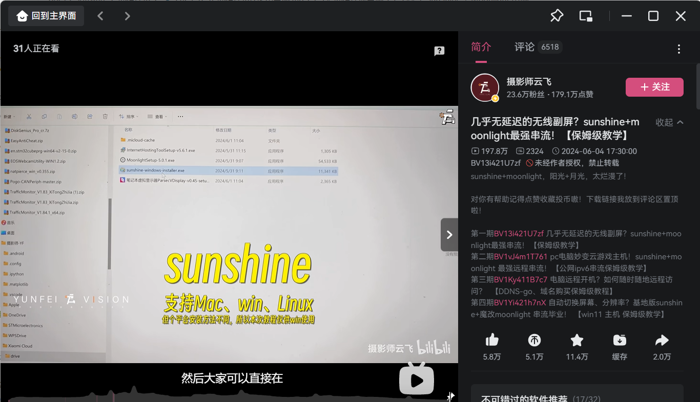

---lab
date: 2025-12-6
author: CCChiJi
category: 软件
tags: 远程连接
---

# 远程控制电脑

电脑好重阿😫 背来背去好麻烦😫 还累😫

有以下两种方法

## 1. SunShine + Moonlight 串流

参考视频教程: [几乎无延迟的无线副屏？sunshine+moonlight最强串流！【保姆级教学】](https://www.bilibili.com/video/BV13i421U7zf?vd_source=c1308a5cc560b058ffebc8672e161712)

!!! tip "tips"
    - 该方法个人使用发现，电脑和远控设备要处于同一个局域网下
    - 按理说校园网也可以，但实际测试不行，疑似有内网隔离，目前不清楚具体原因

## 2. UU远程

电脑和远程控制都下载 **UU远程** ，按照指引操作即可

官网: [UU远程](https://uuyc.163.com/)

!!! tip "tips"
    - 使用UU远程时要确保电脑和远控设备都联网了（不用在同一网络也可以）
    - 如果笔记本电脑是把屏幕盖着的，会显示离线无法远控
    - 对网络有一定要求

